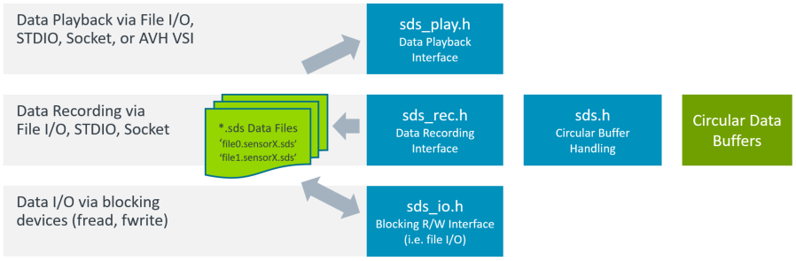

# SDS Framework

The **Synchronous Data Stream (SDS) Framework** implements a data stream management, provides methods and helper tools for developing and optimizing embedded applications that integrate DSP and ML algorithms. This framework may be used stand-alone, but also in combination with [**CMSIS-Stream**](https://github.com/ARM-software/CMSIS-Stream) that allows to combine algorihms using a compute graph.

## Overview 

- Implements a flexible data stream management for sensor and audio data interfaces
   - Supports data streams from multiple interfaces including provisions for time drifts. 

- Provides methods to **record real-world data** for analysis and development
  - Input to Digital Signal Processing (DSP) development tools such as filter designers
  - Input to Machine Learning (ML) model classification, training, and performance optimization
  - Verify execution of DSP algorithm on Cortex-M targets with off-line tools

- **Playback real-world data** for algorithm validation using Arm Virtual Hardware
  - Input to Digital Signal Processing (DSP) development tools such as filter designers
  - Input to Machine Learning (ML) model classification, training, and performance optimization 
  - Verify execution of DSP algorithm on Cortex-M targets with off-line tools

- Defines binary data format with [YAML metadata file](./schema/README.md).

- [Python-based utilities](./utilities/README.md) for recording, playback, visualization, and data conversion

Refer to ["ML Developers Guide for Cortex-M Processors and Ethos-U NPU" - "Tool Support" - "SDS Framework Usage"](https://developer.arm.com/documentation/109267/0100/Tool-Support-for-the-Arm-Ethos-U-NPU/SDS-Framework-Usage) for more information.

## Interfaces

The [SDS Framework interfaces](./sds/README.md) implement the SDS streaming interfaces via different methods. The functions of the **sds.h Circular Buffer Handling** may be used at any level of a Compute Graph to provide inputs or capture outputs of an DSP or ML algorithm.

## Repository top-level structure

Directory                         | Description
----------------------------------|-------------------------------
[examples](./examples)            | Example implementations for various evaluation boards
[documentation](./documentation/) | User documentation of the SDS Framework
[schema](./schema)                | Schema for SDS File Format
[sds](./sds)                      | Interfaces of the SDS Framework for Cortex-M devices
[utilities](./utilities)          | Python scripts for processing of SDS binary data files

## License Terms

The SDS Framework is licensed under [Apache License 2.0](LICENSE).
