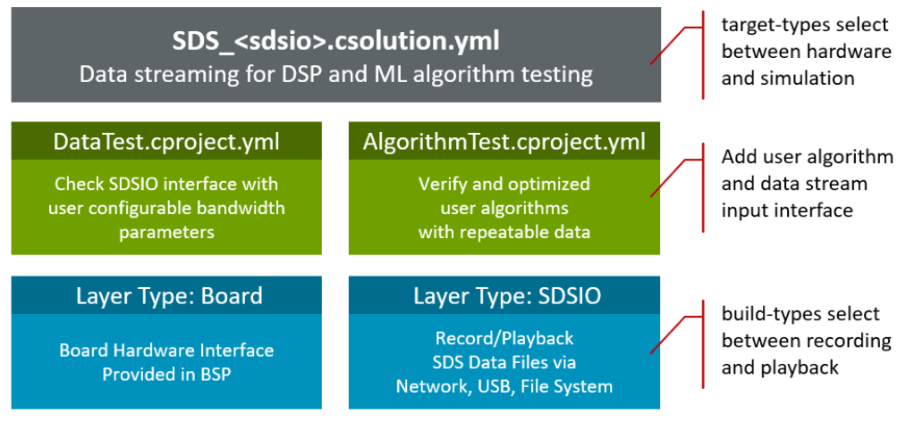
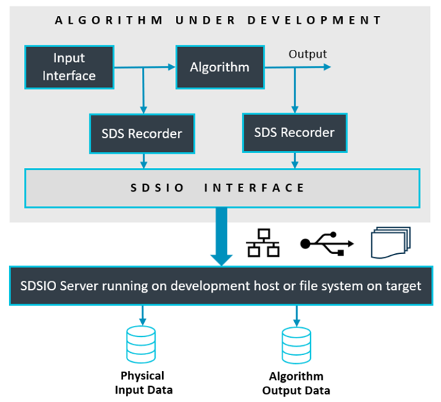

# SDS Template Examples

<!-- markdownlint-disable MD013 -->
<!-- markdownlint-disable MD036 -->

The [SDS template examples](https://github.com/ARM-software/SDS-Framework/tree/main/examples) are a test framework for DSP and ML algorithms. It allows recording and playback of  real-world data streams using physical hardware or on simulation models using [(Arm Virtual Hardware - FVP)](https://github.com/ARM-software/AVH) to an user algorithm under test. The real-world data streams are captured in SDS data files. This enables multiple uses cases:

- Validate and Optimize Algorithms using playback. This allows to repeat test cases with the same data streams.
- The captured data streams can be labeled and used as training data set for AI Models in MLOps systems.

The templates are implemented as [CMSIS-Toolbox Reference Applications](https://open-cmsis-pack.github.io/cmsis-toolbox/ReferenceApplications/) that are hardware agnostic and require a board layer with drivers for the specific target hardware.

The templates differ in the SDSIO interface that is used for SDS data file access:

- [SDS_FileSystem](https://github.com/ARM-software/SDS-Framework/blob/main/examples/filesystem/SDS_FileSystem.csolution.yml) uses the [MDK-Middleware](https://www.keil.arm.com/packs/mdk-middleware-keil) FileSystem component for SDS file I/O.
- [SDS_Network](https://github.com/ARM-software/SDS-Framework/blob/main/examples/network/SDS_Network.csolution.yml) uses the [MDK-Middleware](https://www.keil.arm.com/packs/mdk-middleware-keil) Network component to connect to the [SDSIO Server](utilities.md#sdsio-server).
- [SDS_USB](https://github.com/ARM-software/SDS-Framework/blob/main/examples/usb/SDS_USB.csolution.yml) uses the [MDK-Middleware](https://www.keil.arm.com/packs/mdk-middleware-keil) USB Device component to connect to the [SDSIO Server](utilities.md#sdsio-server).

With a custom SDSIO interface alternative file I/O configurations are possible.

## SDS Template Structure

The structure of an SDS template is shown below. Two projects select between data communication test and user algorithm test. Two target-types allow to deploy the test application on hardware (evaluation board) or AVH FVP (simulation model).

A standard board layer that is provided in several BSP provides the hardware interface. The SDSIO layer uses for communication the MDK-Middleware or on AVH FVP target a virtual simulation interface (VSI).



The build-types `DebugRec` or `ReleaseRec` configure the template to record SDS data files. This allows recording of the input data stream and the algorithm data stream using physical input peripherals on hardware.



The build-types `DebugPlay` or `ReleasePlay` configure the template to playback SDS data files. This allows playback of the input data stream while also recording the algorithm data stream. The test application can run on hardware (evaluation board) or AVH FVP (simulation model). As the input data stream can be repeated it allows to verify and optimize the algorithm while capturing the output data stream.


## Working with SDS Templates

The SDS templates are implemented as [CMSIS-Toolbox Reference Applications](https://open-cmsis-pack.github.io/cmsis-toolbox/ReferenceApplications/) 
that use the [MDK-Middleware](https://www.keil.arm.com/packs/mdk-middleware-keil) with [CMSIS-Driver](https://arm-software.github.io/CMSIS_6/latest/Driver/index.html) interfaces. These Reference Applications are hardware agnostic and need to be extended with a compatible [board layer](https://open-cmsis-pack.github.io/cmsis-toolbox/ReferenceApplications/#board-layer) to run on a specific hardware target.

Several [Board Support Packs (BSP)](https://www.keil.arm.com/packs/) contain board layers that support the required interfaces. Refer to the *Overview* page of the pack to check the *Provided connection API Interface* of the layers. When such a board layer is not available, it is possible to [create a compatible board layer](https://open-cmsis-pack.github.io/cmsis-toolbox/ReferenceApplications/#structure).

### Available SDS Templates

The SDS templates are provided as part of the [SDS pack](https://www.keil.arm.com/packs/sds-arm) and maintained as part of its GitHub repository.

SDS Template     | Description
:----------------|:-------------
[SDS_FileSystem](https://github.com/ARM-software/SDS-Framework/blob/main/examples/filesystem/SDS_FileSystem.csolution.yml)   | Data streaming for DSP/ML algorithm testing using File System in target
[SDS_Network](https://github.com/ARM-software/SDS-Framework/blob/main/examples/network/SDS_Network.csolution.yml) | Data streaming for DSP/ML algorithm testing using Ethernet connection to Host
[SDS_USB](https://github.com/ARM-software/SDS-Framework/blob/main/examples/usb/SDS_USB.csolution.yml) | Data streaming for DSP/ML algorithm testing using USB Device connection to Host

This section gives a generic overview on how to access, configure and build an SDS template for your target hardware.

### Using VS Code

This section explains how to use MDK-Middleware with the [Arm CMSIS Solution](https://marketplace.visualstudio.com/items?itemName=Arm.cmsis-csolution) for VS Code. This extension is for example part of [Keil Studio](https://www.keil.arm.com/).

An SDS Template example can be selected in the [Create a new solution](https://developer.arm.com/documentation/108029/latest/Arm-CMSIS-Solution-extension/Create-a-solution) dialog for boards with layers in the BSP.


Once the *csolution project* is loaded the VS Code IDE presents you with a dialog that lets you select a compatible software layer and a compiler toolchain that is available on your computer.


> **Notes:**
>
> - The **Add Software Layer** dialog only appears when the BSP contains a board layer with compatible API Interfaces (see next section).
> - ST board layers are configured for the Arm Compiler (AC6) using STM32CubeMX.  However, it is easy to reconfigure for different compilers. The steps are provided in the BSP overview.

### API Interfaces

The SDS template examples are hardware agnostic but require API Interfaces that are expressed using the *csolution project* [connections:](https://open-cmsis-pack.github.io/cmsis-toolbox/YML-Input-Format#connections) node. The various reference applications consume the following API Interfaces. These [interfaces should be provided by the board layer](https://open-cmsis-pack.github.io/cmsis-toolbox/ReferenceApplications/#connections) that is part of the Board Support Pack (BSP).

Consumed API Interface      | Description
:---------------------------|:----------------
**File System**             | .
CMSIS_MCI                   | [CMSIS-Driver MCI](https://arm-software.github.io/CMSIS_6/latest/Driver/group__mci__interface__gr.html) Interface to memory.
STDIN, STDOUT               | Standard I/O for user input/output via UART.
**Network**                 | .
CMSIS_ETH                   | [CMSIS-Driver Ethernet](https://arm-software.github.io/CMSIS_6/latest/Driver/group__eth__interface__gr.html) MAC/PHY Interface.
CMSIS_VIO                   | [CMSIS-Driver VIO](https://arm-software.github.io/CMSIS_6/latest/Driver/group__vio__interface__gr.html) connected to LEDs and button
STDOUT                      | Standard I/O connected for printf messages.
**USB Device**              | .
CMSIS_USB_Device            | [CMSIS-Driver USB Device](https://arm-software.github.io/CMSIS_6/latest/Driver/group__usbd__interface__gr.html) Interface.
CMSIS_VIO                   | [CMSIS-Driver VIO](https://arm-software.github.io/CMSIS_6/latest/Driver/group__vio__interface__gr.html) connected to LEDs and button
CMSIS_USART                 | [CMSIS-Driver USART](https://arm-software.github.io/CMSIS_6/latest/Driver/group__usart__interface__gr.html) for VirtualCOM project.

### Compile for Board

The MDK-Middleware Reference Applications are typically bundles of several similar projects. Use the command `CMSIS:Manage Solution Settings` to choose a one project that you want to explore.


### Compile for Custom Hardware

The steps to add a custom hardware configuration are:

- Open the `*.csolution.yml` file and add a new `target-type`.

    ```yml
    target-types:
    - type: MyHardware
      device: STM32U535CBTx
      variables:
        - Board-Layer: $SolutionDir()$\MyHardware\Board.clayer.yml
    ```

- Add a board layer that implements the API interfaces described above.

!!! Note
    You may copy an existing board layer as starting point. But typically these board layers support a range of reference applications and contain driver API interfaces that may be removed.

### Integrate User Algorithm

In each SDS templates these files require changes to interface with the DSP and ML algorithm that is tested:

- `algorithm/sds_algorithm_config.h` configures the block size of data streams.
- `algorithm/sds_algorithm_user.c` is the interface to the DSP/ML algorithm under test.
- `algorithm/sds_data_in_user.c` is the interface to the physical data source.

## Example Projects

Configured SDS template examples are provided in a separate [GitHub repository](https://github.com/Arm-Examples/sds-examples) and show the usage of the SDS-Framework.

