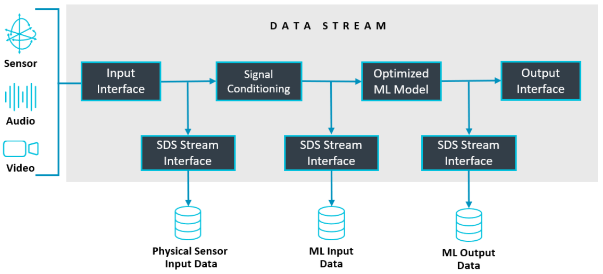
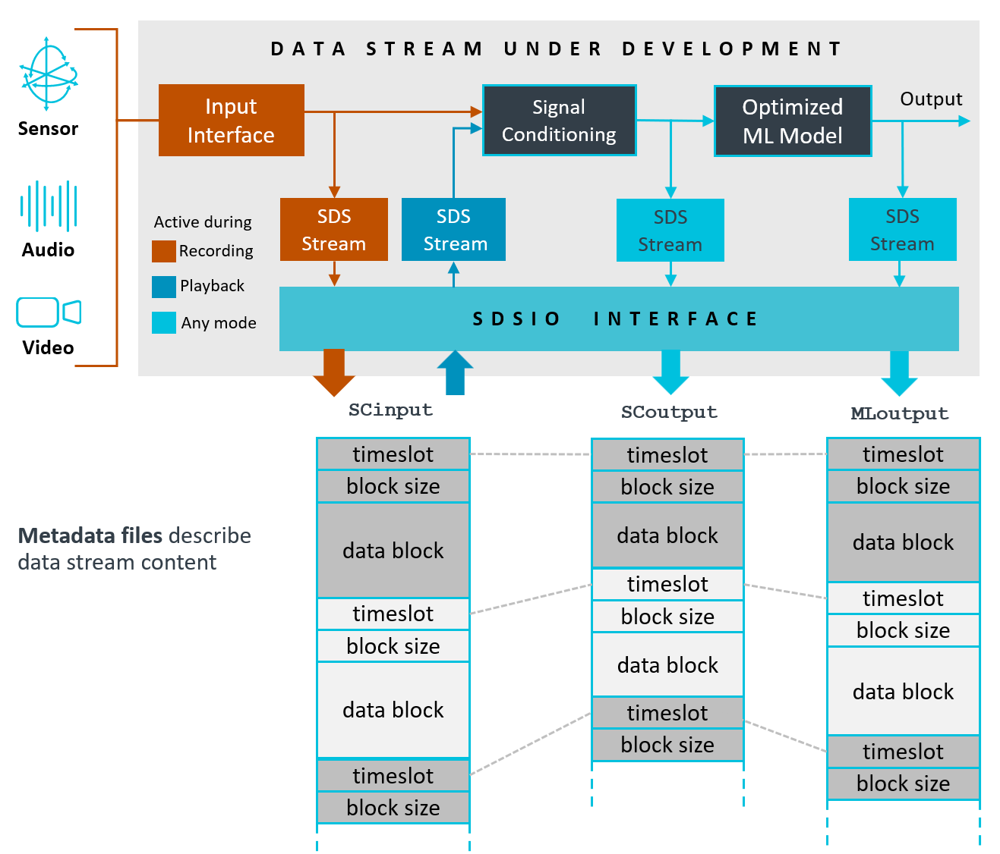
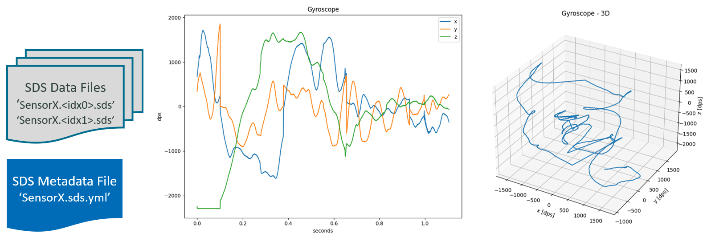

# Overview

<!-- markdownlint-disable MD013 -->
<!-- markdownlint-disable MD036 -->

The Synchronous Data Stream (SDS) Framework implements data stream management and provides methods and utilities for developing and optimizing embedded
applications that use DSP, ML, or Edge AI algorithms. The SDS-Framework allows you to simultaneously capture multiple data streams from
different sources (sensors, audio, and video inputs) or the results of algorithms in real time directly on target hardware.
These data streams are stored in files.

The captured data streams are useful in various steps of the development cycle, for example to:

- Validate physical input signals from sensors or output of algorithms.
- Provide input data to Digital Signal Processing (DSP) development tools such as filter designers.
- Provide input data to ML/AI development systems for model classification, training, and performance optimization.
- Provide input data for simulation using Arm Virtual Hardware (AVH-FVP) models for testing and validation.

## Data Capturing and Playback

The following diagram shows the workflow for recording (physical data capture) and playback (regression testing). SDS supports recording and playback on target hardware, and playback on the [FVP simulation model](https://github.com/Arm-software/avh).

The [**SDSIO Interface**](sdsio.md) is integrated into the target application and runs on the microcontroller.
It enables data streaming into SDS data files via various interfaces such as USB, Ethernet, RTT, UART or File System.
The I/O implementation included in SDS utilizes the [MDK-Middleware](https://www.keil.arm.com/packs/mdk-middleware-keil/overview/),
however custom interfaces to other middleware or different communication channels can also be used.

The [**SDSIO-Server**](utilities.md#sdsio-server) running on a host computer captures the recorded data stream and stores it in SDS data files.
Each recording creates one set of SDS data files that are identified by a sequential number.
The SDS data files are in binary format and may be described using a [YAML metadata file](https://github.com/ARM-software/SDS-Framework/tree/main/schema).
With this information, other tools can utilize the content of the SDS data files as shown in the picture below.

On target hardware or in a FVP simulation environment, the [**SDSIO Interface**](sdsio.md#layer-sdsio_fvp) streams the SDS data files back to the algorithm under test. With this interface, the algorithm receives
the same data stream as captured on physical hardware. The setup can therefore be used for validation, performance optimization, and can run in CI environments for test automation.

## SDS Recording Performance

The following section lists the communication speeds that can be achieved on different targets with various interfaces.

!!! Note
    - Performance measurements were obtained using the [DataTest](https://arm-software.github.io/SDS-Framework/main/template.html#using-datatest) project, which validates captured data streams on the available interfaces.
    - SDS data files were verified using the [SDS-Check](https://arm-software.github.io/SDS-Framework/main/utilities.html#sds-check) utility.
    - In addition to transfer performance, CPU idle time was measured to estimate the processing capacity available while communication was active.
    - When using playback, the transfer performance is not critical, as the algorithm will only be executed when data is available.

[Using the USB](sdsio.md#layer-sdsio_usb) or [Network](sdsio.md#layer-sdsio_network) interface on different target hardware:

| Interface                                     | USB                    | Network                |
|-----------------------------------------------|------------------------|------------------------|
| Alif Semiconductor DevKit-E8      (@ 400 MHz) | 20 MB/s (55% idle)     | 8 MB/s (66% idle)      |
| STMicroelectronics STM32N6570-DK  (@ 600 MHz) | 13 MB/s (55% idle)     |                        |
| STMicroelectronics B-U585I-IOT02A (@ 160 MHz) | 1.1 MB/s (86% idle)    |                        |

[Using the RTT](sdsio.md#layer-sdsio_rtt) interface on the STM32F769I-EVAL board (with maximum SWD clock 12 MHz that is imposed by hardware) with different debug adapters:

- ST-Link (SWD clock: 10 MHz): 130 kB/s
- ULINKplus (SWD clock: 10 MHz): 250 kB/s
- J-Link Pro (SWD clock: auto): 800 kB/s

[Using the FileSystem](sdsio.md#layer-sdsio_fs) on the STM32H7B3_DK board with CPU running at 280 MHz, SDMMC with 4-bit bus: 5 MB/s