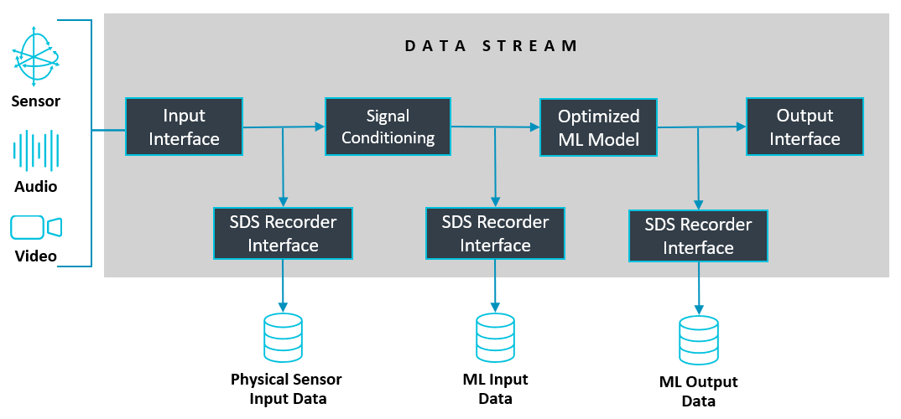
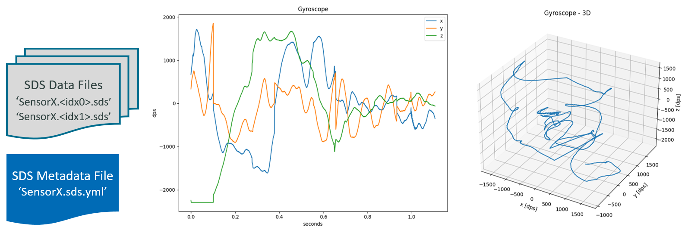

# Overview

<!-- markdownlint-disable MD013 -->
<!-- markdownlint-disable MD036 -->

The Synchronous Data Stream (SDS) Framework implements a data stream management, provides methods and utilities for developing and optimizing embedded applications that use DSP, ML, or Edge AI algorithms. The SDS-Framework allows you to capture simultaneously multiple data streams from different sources (sensors, audio, and video inputs) or the results of algorithms in real-time directly in target hardware. These data streams are stored in files.

The captured data streams are useful in various steps of the development cycle, for example to:

- Validate physical input signals from sensors or output of algorithms.
- Provide input data to Digital Signal Processing (DSP) development tools such as filter designers.
- Provide input data to ML/AI development systems for model classification, training, and performance optimization.
- Provide input data for simulation using Arm Virtual Hardware (AVH-FVP) models for testing and validation.

## Data Capturing and Playback

The following diagram shows the data capturing in a microcontroller system using a network communication and the playback in simulation using [Arm Virtual Hardware - Fixed Virtual Platform](https://github.com/Arm-software/AVH).

The [**SDS Recorder or Playback Interface**](sds_interface.md) is integrated into the target application and runs on the microcontroller. It enables data streaming into SDS data files via various interfaces such as Ethernet, UART, USB, or File System. The I/O implementation included in SDS utilizes the [MDK-Middleware](https://www.keil.arm.com/packs/mdk-middleware-keil/overview/), however custom interfaces to other middleware or different communication channels can also be used.

The [**SDSIO Server**](utilities.md#sdsio-server) running on a host computer captures the recorded data stream and stores it in SDS data files. Each recording creates one set of SDS data files that are indicated by a sequential number. The SDS data files are in binary format and may be described using a [YAML metadata file](https://github.com/ARM-software/SDS-Framework/tree/main/schema). With this information, other tools can utilize the content of the SDS data files as shown in the picture below.

In a simulation environment, the **SDS Playback Interface** streams the SDS data files back to the algorithm under test. With this interface, the algorithm receives the same data stream as in the physical hardware. The setup can therefore be used for validation, performance optimizations, and runs even in CI environments for test automation.
