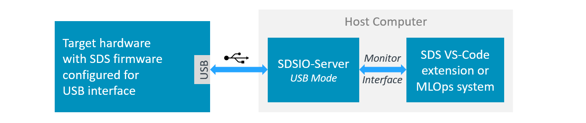
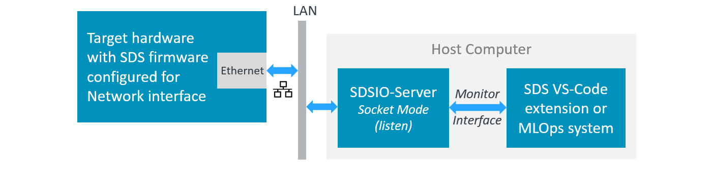
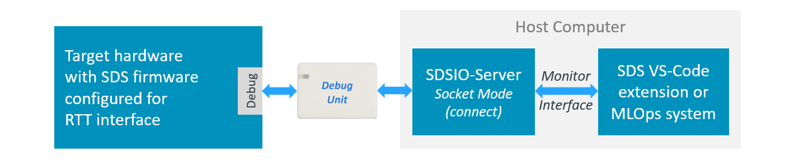

# SDSIO Interface

The SDSIO components offer flexible SDS communication interfaces. You may choose between these interface components that are stored in the folders: `./sds/sdsio/client`, `./sds/sdsio/fs` or `./sds/sdsio/vsi`. You may use one of the following CMSIS software components for integration of the SDSIO interface into the target system:

```yml
  - component: SDS:IO:Socket                     # IoT Socket Interface (Ethernet or WiFi)
  - component: SDS:IO:USB&MDK USB                # USB Interface
  - component: SDS:IO:RTT                        # RTT Interface
  - component: SDS:IO:Serial&CMSIS USART         # USART Interface
  - component: SDS:IO:File System&MDK FS         # Memory card
  - component: SDS:IO:VSI                        # VSI Simulation interface of an AVH FVP
  - component: SDS:IO:Custom                     # Source code template for custom implementation
```

To simplify usage further, pre-configured SDS interface layers in *csolution project format* are available. These connect via various interfaces to the SDSIO-Server, which provides read/write access to SDS data files. The following SDS interface layers are available in the pack [`ARM::SDS`](https://www.keil.arm.com/packs/sds-arm):

- [Ethernet Interface](#layer-sdsio_network) using the MDK-Middleware Network component.
- [USB Bulk Interface](#layer-sdsio_usb) using the MDK-Middleware USB component.
- [RTT Interface](#layer-sdsio_rtt) using the SEGGER RTT component.
- [Memory Card Interface](#layer-sdsio_fs) using the MDK-Middleware File System component.
- [VSI Interface](#layer-sdsio_fvp) using the ARM FVP simulation VSI interface.

## Layer: sdsio_usb

The [`layer/sdsio/usb/sdsio_usb.clayer.yml`](https://github.com/ARM-software/SDS-Framework/tree/main/layer/sdsio/usb) is configured for recording and playback via the USB interface. It uses the [MDK-Middleware](https://www.keil.arm.com/packs/mdk-middleware-keil) USB Device component and connects to a host computer through a USB interface.



### Using USB Interface

To access [SDS data files](theory.md#sds-data-files), configure the `*.sdsio.yml` file with the [`interface - usb:`](utilities.md#usb) node and start the [SDSIO-Server](utilities.md#sdsio-server) on the host computer with:

```bash
>python sdsio-server.py -c myproject.sdsio.yml
Press 'Ctrl+C' or 'X' to exit.
Working directory: ...\SDS_data.
SDSIO configuration YAML: ...\myproject.sdsio.yml.
SDSIO command input: R=Record, P=playback, S/s=stop, T/t=reset, X/x=exit, A-H=set flags 0-7, a-h=clear flags 0-7.
SDSIO-Client USB device connected.
```

## Layer: sdsio_network

The [`layer/sdsio/network/sdsio_network.clayer.yml`](https://github.com/ARM-software/SDS-Framework/tree/main/layer/sdsio/network) is configured for recording and playback via the Ethernet interface. It uses the  [MDK-Middleware](https://www.keil.arm.com/packs/mdk-middleware-keil) Network component. Both the target hardware and the SDSIO-Server are connected to a local LAN.



!!! Note
    - The target device and the host computer must be connected to the same network. With a standard network installation, the DHCP server assigns IP addresses automatically.
    - On **Windows**, a firewall may restrict socket connections. To allow the SDSIO-Server through the Windows Defender Firewall:
        - Open **Windows Security - Firewall & network protection - Allow an app through firewall**.
        - Click **Change settings**, then allow your Python runtime (`python.exe`) on the network profile you use (usually Private).
        - On a managed corporate PC, Group Policy or endpoint security may still block connections. Your IT administrator may need to whitelist the IP address and port.

### Using Network Interface

To access [SDS data files](theory.md#sds-data-files), configure the `*.sdsio.yml` file with the [`interface - socket:`](utilities.md#socket) node for Network interface, and start the [SDSIO-Server](utilities.md#sdsio-server) on the host computer with:

```bash
>python sdsio-server.py -c myproject.sdsio.yml
Press 'Ctrl+C' or 'X' to exit.
Working directory: ...\SDS_data.
SDSIO configuration YAML: ...\myproject.sdsio.yml.
SDSIO command input: R=Record, P=playback, S/s=stop, T/t=reset, X/x=exit, A-H=set flags 0-7, a-h=clear flags 0-7.
Socket server listening on 172.20.10.2:5050
```

!!! Note
    The SDSIO Server prints the IP address on which it is listening. The target hardware must connect to this IP address. Configure the target by updating the `SDSIO_SOCKET_SERVER_IP` macro in `./layer/sdsio/network/RTE/SDS/sdsio_client_socket_config.h`.

## Layer: sdsio_rtt

The [`layer/sdsio/rtt/sdsio_rtt.clayer.yml`](https://github.com/ARM-software/SDS-Framework/tree/main/layer/sdsio/rtt) is configured for recording and playback using the SEGGER RTT component for I/O via a debug adapter.



### Using RTT Interface

The SDSIO layer communicates with the host computer via an RTT socket exposed by the
debug probe software. The [SDSIO-Server](https://arm-software.github.io/SDS-Framework/main/utilities.html#sdsio-server)
runs on the host and connects to the debug probe socket using
[socket connect mode](https://arm-software.github.io/SDS-Framework/main/utilities.html#socket-mode).

#### Connect with SEGGER J-Link

Configure `interface:` in the [`*.sdsio.yml` control file](utilities.md#sdsio-control-file-sdsioyml) as shown below:

```yml
sdsio:
  interface:
    socket:
      ipaddr: 127.0.0.1
      port: 19021
      connect: "$$SEGGER_TELNET_ConfigStr=RTTCh;1$$"
      connect-time: 100
```

Then start the SDSIO-Server with:

```bash
python sdsio-server.py -c myproject.sdsio.yml
```

**How it works:**

J-Link exposes RTT data via a TELNET-like TCP socket on `localhost`, port **19021** (default), while a J-Link connection is active (typically during a debug session). After connecting to this TCP socket, the SDSIO-Server (sends within the 100 ms time limit) the [SEGGER TELNET Config String](https://kb.segger.com/J-Link_RTT_TELNET_Channel) that selects the RTT channel. The SDSIO-Server sends this string automatically via `--connect`, and discards any initial response from J-Link during the `--connect-time` window.

#### Connect with pyOCD

pyOCD can expose each RTT channel as a TCP socket server. RTT is configured under the `debugger:` node of the `*.csolution.yml` file as shown below. Refer to [CMSIS-Toolbox - pyOCD - RTT](https://open-cmsis-pack.github.io/cmsis-toolbox/pyOCD-Debugger/#rtt) for further details.

```yml
  target-types:
    - type: MyHardware
      target-set:
        - set:
          images:
            - project-context: DataTest.Debug
          debugger:
            name: CMSIS-DAP@pyOCD
            clock: 10000000
            protocol: swd
            rtt:
              channel:
                - number: 1     # must match SDSIO_RTT_CHANNEL in sdsio_client_rtt_config.h
                  mode: server
                  port: 5100    # any free TCP port on localhost
```

Configure `interface:` in the [`*.sdsio.yml` control file](utilities.md#sdsio-control-file-sdsioyml) as shown below:

```yml
sdsio:
  interface:
    socket:
      ipaddr: 127.0.0.1
      port: 5100       # must match the port configured in *.csolution.yml
      connect:         # no connect string required; channel is configured with `rtt:` node above
```

The CMSIS-Toolbox includes all project configuration in the file `*.cbuild-run.yml`. Once this file is up-to-date, run pyOCD and SDSIO-Server with:

```bash
pyocd run --cbuild-run out/<name>+<target-type>.cbuild-run.yml --eot
python sdsio-server.py -c myproject.sdsio.yml
```

**How it works:**

pyOCD does not required a connect message. Instead the RTT channel configuration is part of the `*.cbuild-run.yml` file that also specifies project files and other hardware related parameters. Refer to [CMSIS-Toolbox - Run and Debug Configuration](https://open-cmsis-pack.github.io/cmsis-toolbox/build-overview/#run-and-debug-configuration) for further information.

## Layer: sdsio_fs

The [`layer/sdsio/filesystem/sdsio_fs.clayer.yml`](https://github.com/ARM-software/SDS-Framework/tree/main/layer/sdsio/filesystem) is configured for recording to a Memory Card. It uses the MDK-Middleware File System component.

## Layer: sdsio_fvp

The [`template/sdsio/fvp/sdsio_fvp.clayer.yml`](https://github.com/ARM-software/SDS-Framework/tree/main/template/sdsio/fvp) targets AVH FVP simulation and is configured for playback from the host computer. It uses the [SDSIO VSI interface](https://arm-software.github.io/AVH/main/simulation/html/group__arm__vsi.html) implemented by the file `vsi/python/arm_vsi3.py`, which is loaded by the FVP simulation model. Since the SDSIO-Server functionality is implemented in `arm_vsi3.py`, no separate SDSIO-Server is required.

### Using FVP Simulation Models

The SDSIO VSI interface can be configured using a [`*.sdsio.yml` control file](utilities.md#sdsio-control-file-sdsioyml).

The VSI3 Python script (`arm_vsi3.py`) locates the control file as follows:

- If the environment variable `SDSIO_FVP` is set, it must be an **absolute path** to either a config file or a directory:
    - **File** — used directly as the config file.
    - **Directory** — searched for a config file in this order: `sdsio.yml`, `sdsio.yaml`, first `*.sdsio.yml` (alphabetical), first `*.sdsio.yaml` (alphabetical).
    - If the path does not exist or is not absolute, the search falls back to the working directory.
- If `SDSIO_FVP` is not set (or falls back), the **simulator working directory** is searched using the same file order: `sdsio.yml`, `sdsio.yaml`, first `*.sdsio.yml` (alphabetical), first `*.sdsio.yaml` (alphabetical).

!!! Tip
    In Keil Studion you may set the [environment variable `SDSIO_FVP`](https://mdk-packs.github.io/vscode-cmsis-solution-docs/zephyr.html#set-environment-variables) using the Settings dialog with id `cmsis-csolution.environmentVariables`.

If a control file is found, the script reads the `sdsio:` root node. If `workdir:` is a relative path, it is interpreted relative to the simulator working directory.

**Console output:**

This is a example console output during simulation

```txt
FVP_Corstone_SSE-300_Ethos-U55 -f Board/Corstone-300/fvp_config.txt -a out/DataTest/SSE-300-U55/Debug/DataTest.hex  

Ethos-U version info:
        Arch:       v1.1.0
        MACs/cc:    128
        Cmd stream: v0
SDSIO VSI interface initialized successfully
==== SDS playback started
==== SDS playback stopped

Info: /OSCI/SystemC: Simulation stopped by user.
Fatal Python error: _Py_GetConfig: the function must be called with the GIL held ...
```

!!! Note
    - It might be required to enable access permissions for the FVP simulation model.
    - The Fatal Python error at exit is a known problem that will be solved in a future version of the FVP simulation models. It has no impact on the actual test results.

**Log File: `sdsio.log`:**

During FVP simulation, an `sdsio.log` file is generated that records all [SDS data file](theory.md#sds-data-files) access operations. This file is located in the folder that is configured the `workdir:` in the `*.sdsio.yml` file.

**Example:**

```txt
Created by ...\Board\Corstone-300\vsi\python\arm_vsi3.py

SDSIO VSI version 3.0.0
SDSIO_FVP environment variable not set.
Working directory: ...\datatest\SDS Recordings.
SDSIO configuration YAML: ...\SDS\datatest.sdsio.yml.
sdsFlags = 0xB0000000.
Playback step 1/1: Test 0.
Playback: Test_In (Test_In.0.sds).
Record:   Test_Out (Test_Out.0.p.sds).
Closed:   Test_In (Test_In.0.sds).
Closed:   Test_Out (Test_Out.0.p.sds).
sdsControl: auto playback terminate.
sdsFlags = 0x30000000.
sdsFlags = 0x70000000.
sdsFlags = 0x30000000.
```

**FVP Model Configuration:**

The FVP model is configured with the file `./Board/Corstone-300/fvp_config.txt` or `./Board/Corstone-320/fvp_config.txt`.
When using an Ethos-U NPU it is important that the MAC configuration matches the settings that were used when generating the ML model.

Refer to [Arm FVP Simulation Models - Model Configuration](https://arm-software.github.io/AVH/main/simulation/html/using.html#Config) for further information.
