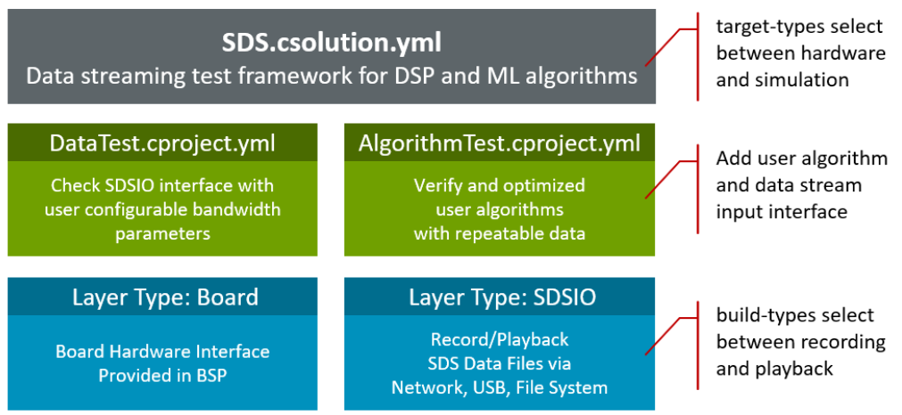
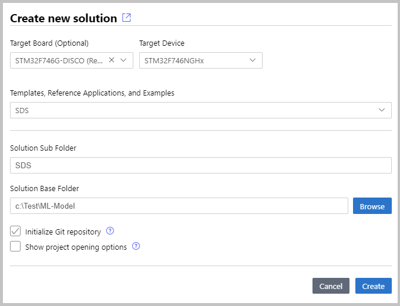
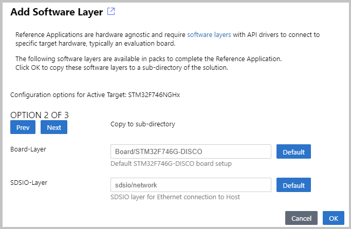
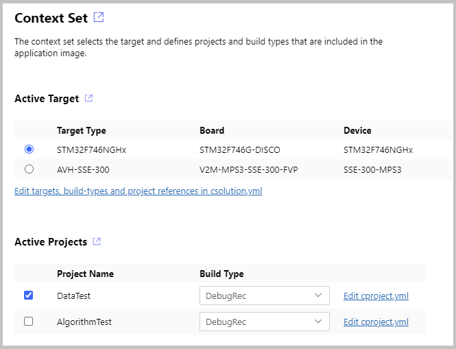

# SDS Template Application

<!-- markdownlint-disable MD013 -->
<!-- markdownlint-disable MD036 -->

The [SDS template application](https://github.com/ARM-software/SDS-Framework/tree/main/template) is a test framework for DSP and ML algorithms. It allows recording and playback of real-world data streams using physical hardware or on simulation models using [(Arm Virtual Hardware - FVP)](https://github.com/ARM-software/AVH) to an user algorithm under test. The real-world data streams are captured in SDS data files. This enables multiple uses cases:

- Validate and Optimize Algorithms using playback. This allows to repeat test cases with the same data streams.
- The captured data streams can be labeled and used as training data set for AI Models in MLOps systems.

The SDS template application is implemented as [CMSIS-Toolbox Reference Application](https://open-cmsis-pack.github.io/cmsis-toolbox/ReferenceApplications/). It is hardware agnostic and requires a `SDSIO-Layer` and a `Board-Layer` with drivers for the specific target hardware.

The `SDSIO-Layer` connects the SDS template application to a communication interface for SDS file I/O operations.
The following [SDSIO interfaces](sdsio.md) are pre-configured:

- [Ethernet Interface](sdsio.md#layer-sdsio_network) using the MDK-Middleware Network component.
- [USB Bulk Interface](sdsio.md#layer-sdsio_usb) using the MDK-Middleware USB component.
- [Memory Card Interface](sdsio.md#layer-sdsio_fs) using the MDK-Middleware File System component.

With a custom SDSIO interface alternative file I/O configurations are possible.

## SDS Template Structure

The structure of the SDS template application is shown below. Two projects select between data communication test and user algorithm test. Two target-types allow to deploy the test application on hardware (evaluation board) or AVH FVP (simulation model).

A standard board layer that is provided in several BSP provides the hardware interface. The SDSIO layer uses for communication the MDK-Middleware or on AVH FVP target a virtual simulation interface (VSI).



The build-types `DebugRec` or `ReleaseRec` configure the template to record SDS data files. This allows recording of the input data stream and the algorithm data stream using physical input peripherals on hardware.


The build-types `DebugPlay` or `ReleasePlay` configure the template to playback SDS data files. This allows playback of the input data stream while also recording the algorithm data stream. The test application can run on hardware (evaluation board) or AVH FVP (simulation model). As the input data stream can be repeated it allows to verify and optimize the algorithm while capturing the output data stream.


## Working with the SDS Template

The SDS template application and [SDSIO interface layers](sdsio.md) are part of the [SDS pack](https://www.keil.arm.com/packs/sds-arm).

Several [Board Support Packs (BSP)](https://www.keil.arm.com/packs/) contain board layers that support the required API interfaces. Refer to the *Overview* page of the pack to check the *Provided connection API Interface* of the layers. The table below lists the required API interfaces that should be provided by the `Board-Layer`.  

Required API Interface      | Description     |
:---------------------------|:----------------|
[**SDSIO File System**](sdsio.md#layer-sdsio_fs)  |  |
CMSIS_MCI                   | [CMSIS-Driver MCI](https://arm-software.github.io/CMSIS_6/latest/Driver/group__mci__interface__gr.html) interface to memory card. |
CMSIS_VIO, STDOUT, STDERR   | For user button and printf output. |
[**SDSIO Network**](sdsio.md#layer-sdsio_network)  |  |
CMSIS_ETH                   | [CMSIS-Driver Ethernet](https://arm-software.github.io/CMSIS_6/latest/Driver/group__eth__interface__gr.html) MAC/PHY interface. |
CMSIS_VIO, STDOUT, STDERR   | For user button and printf output. |
[**SDSIO USB Device**](sdsio.md#layer-sdsio_usb)   |  |
CMSIS_USB_Device            | [CMSIS-Driver USB Device](https://arm-software.github.io/CMSIS_6/latest/Driver/group__usbd__interface__gr.html) interface. |
CMSIS_VIO, STDOUT, STDERR   | For user button and printf output. |

!!! Note
    When such a board layer is not available, it is possible to [create a compatible board layer](https://open-cmsis-pack.github.io/cmsis-toolbox/ReferenceApplications/#structure).

### Using VS Code

This section explains how to use SDS template application with the [Arm CMSIS Solution](https://marketplace.visualstudio.com/items?itemName=Arm.cmsis-csolution) for VS Code. This extension is for example part of [Keil Studio](https://www.keil.arm.com/).

For the example below the [STM32F746G-DISCO](https://www.keil.arm.com/packs/stm32f746g-disco_bsp-keil) board is used that provides interfaces for all SDSIO communication interfaces.

#### Install Required Packs

To make the software components available, install the SDS pack and the pack for the select evaluation board, for example with:

```shell
>cpackget add ARM::SDS
>cpackget add Keil::STM32F746G-DISCO_BSP
```

#### Create New Solution

The SDS template application is selected in the **Create a new solution** <!--- [Create a new solution](https://developer.arm.com/documentation/108029/latest/Arm-CMSIS-Solution-extension/Create-a-solution) --> dialog for boards with layers in the BSP.



Once the *csolution project* is loaded the VS Code IDE presents you with a dialog that lets you select a compatible software layer and a compiler toolchain that is available on your computer.



!!! Note
    - The **Add Software Layer** dialog only appears when the BSP contains a board layer with compatible API Interfaces (see next section).
    - ST board layers are configured for the Arm Compiler (AC6) using STM32CubeMX.  However, it is easy to reconfigure for different compilers. The steps are provided in the BSP overview.

#### Build the Template Application

The SDS template applications contains two targets (evaluation board, AVH FVP simulation model) and two projects:

- **DataTest** is a data communication test between target and SDSIO server or filesystem.
- **AlgorithmTest** allows to add the DSP or ML algorithm that should be tested.

Use the command `CMSIS:Manage Solution Settings` to choose a one project that you want to explore.  Start with the **DataTest** first that should work "out-of-the box" on target hardware.



Once the configuration is selected, use the build command to generate the template application. Then download the application to the selected target.

### Compile for Custom Hardware

The steps to add a custom hardware configuration are:

- Open the `*.csolution.yml` file and add a new `target-type`.

```yml
    target-types:
    - type: MyHardware
      device: STM32U535CBTx
      variables:
        - Board-Layer: $SolutionDir()$\Board\MyHardware\Board.clayer.yml
        - SDSIO-Layer: $SolutionDir()$\layer\usb\sdsio_usb.clayer.yml
```

- Add a board layer that implements the API interfaces described above.

!!! Note
    - You may copy an existing board layer as starting point. But typically these board layers support a range of reference applications and contain driver API interfaces that may be removed.
    - The step above allows also manual configuration without using the VS Code IDE.

## Using DataTest

ToDo, explain:

- how to capture the files (this could be with references to the layers)
- how to verify the correctness using [SDS-Check](utilities.md#sds-check)
- setup playback mode to verify data playback

### Configure Bandwidth for DataTest

The **DataTest** project uses a fixed algorithm to verify the communication interface. With the file `datatest/sds_algorithm_config.h` it is possible to configure bandwidth and interval to match the requirements of the algorithm that should be tested.

## Using AlgorithmTest

ToDo

### Add User Algorithm

In the SDS template application these files require changes to interface with the DSP and ML algorithm that is tested:

- `algorithm/sds_algorithm_config.h` configures the block size of data streams.
- `algorithm/sds_algorithm_user.c` is the interface to the DSP/ML algorithm under test.
- `algorithm/sds_data_in_user.c` is the interface to the physical data source.

## Example Projects

Configured variants of the SDS template application are provided in a separate [GitHub repository github.com/Arm-Examples/sds-examples](https://github.com/Arm-Examples/sds-examples). These examples show the usage of the SDS-Framework with real-world devices and use cases.

### Using Example Projects

ToDo
