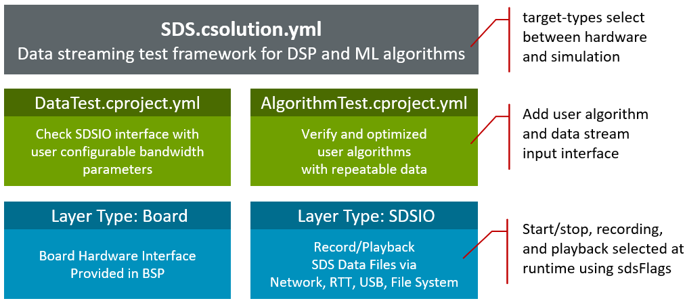
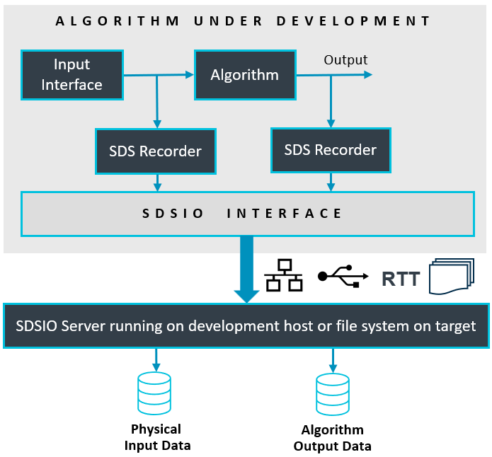
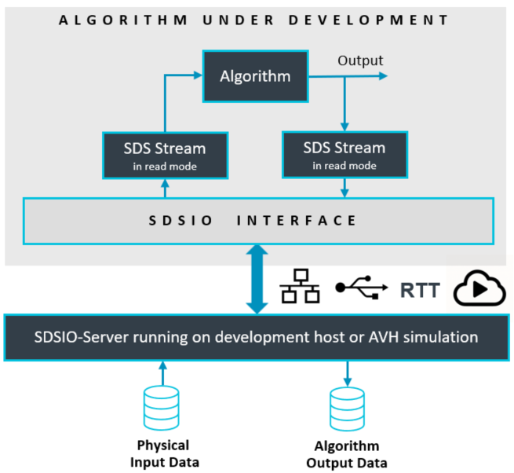
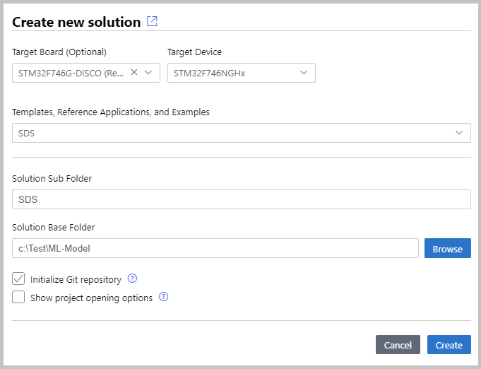
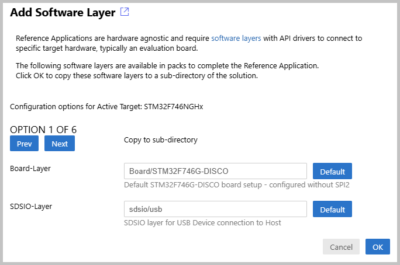
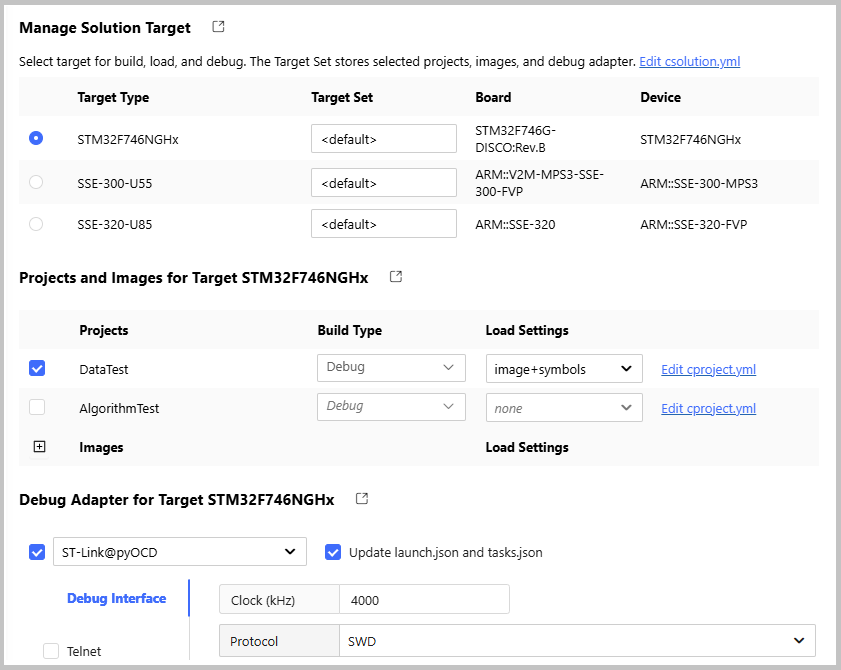

# SDS Template Application

<!-- markdownlint-disable MD013 -->
<!-- markdownlint-disable MD036 -->

The [SDS template application](https://github.com/ARM-software/SDS-Framework/tree/main/template) is a test framework for DSP and ML algorithms. It allows recording and playback of real-world data streams using physical hardware or on simulation models using [(Arm Virtual Hardware - FVP)](https://github.com/ARM-software/AVH) to an user algorithm under test. The real-world data streams are captured in SDS data files. This enables multiple uses cases:

- Validate and Optimize Algorithms using playback. This allows to repeat test cases with the same data streams.
- The captured data streams can be labeled and used as training data set for AI Models in MLOps systems.

The SDS template application is implemented as [CMSIS-Toolbox Reference Application](https://open-cmsis-pack.github.io/cmsis-toolbox/ReferenceApplications/). It is hardware agnostic and requires a `SDSIO-Layer` and a `Board-Layer` with drivers for the specific target hardware.

The `SDSIO-Layer` connects the SDS template application to a communication interface for SDS file I/O operations.
The following [SDSIO interfaces](sdsio.md) are pre-configured:

- [Ethernet Interface](sdsio.md#layer-sdsio_network) using the MDK-Middleware Network component.
- [USB Bulk Interface](sdsio.md#layer-sdsio_usb) using the MDK-Middleware USB component.
- [RTT (Real-Time Transfer)](sdsio.md#layer-sdsio_rtt) using the SEGGER RTT component for I/O via the debug adapter.
- [Memory Card Interface](sdsio.md#layer-sdsio_fs) using the MDK-Middleware File System component.
With a custom SDSIO interface, alternative I/O configurations are possible.

## SDS Template Structure

The structure of the SDS template application is shown below. Two projects let you choose between a data communication test and a user algorithm test. Two target types let you deploy the test application either on hardware (evaluation board) or on an AVH FVP (simulation model).

A standard board layer, provided by several BSPs, implements the hardware interface. For communication, the SDSIO layer uses the MDK-Middleware or (for the AVH FVP target) a virtual simulation interface (VSI).



The `Debug` and `Release` build types differ only in the optimization level and the amount of debug information printed.
Both build types support recording and playback, controlled via `sdsFlags`. The `sdsFlags` value can be modified by the SDS application (using the function `sdsFlagsModify`) or by the SDSIO-Server, making it easy to switch between Record Mode and Playback Mode.

!!! Note
    Implementations using file system support only recording mode.

### Record Mode

Record mode captures the input data stream and the algorithm output data stream simultaneously.



### Playback Mode

Playback mode replays the input data stream while recording the algorithm output data stream at the same time.
The test application can run either on hardware (evaluation board) or on an AVH FVP (simulation model).
Because the input data stream can be repeated, it enables consistent verification and optimization of the algorithm while capturing the resulting output data stream.



## Working with the SDS Template

The SDS template application and [SDSIO interface layers](sdsio.md) are part of the [SDS pack](https://www.keil.arm.com/packs/sds-arm).

Several [Board Support Packs (BSP)](https://www.keil.arm.com/packs/) contain board layers that support the required API interfaces. Refer to the *Overview* page of the pack to check the *Provided connection API Interface* of the layers. The table below lists the required API interfaces that should be provided by the `Board-Layer`.  

Required API Interface      | Description     |
:---------------------------|:----------------|
[**SDSIO File System**](sdsio.md#layer-sdsio_fs)  |  |
CMSIS_MCI                   | [CMSIS-Driver MCI](https://arm-software.github.io/CMSIS_6/latest/Driver/group__mci__interface__gr.html) interface to memory card. |
CMSIS_VIO, STDOUT, STDERR   | For user button and printf output. |
[**SDSIO Network**](sdsio.md#layer-sdsio_network)  |  |
CMSIS_ETH                   | [CMSIS-Driver Ethernet](https://arm-software.github.io/CMSIS_6/latest/Driver/group__eth__interface__gr.html) MAC/PHY interface. |
CMSIS_VIO, STDOUT, STDERR   | For user button and printf output. |
[**SDSIO USB Device**](sdsio.md#layer-sdsio_usb)   |  |
CMSIS_USB_Device            | [CMSIS-Driver USB Device](https://arm-software.github.io/CMSIS_6/latest/Driver/group__usbd__interface__gr.html) interface. |
CMSIS_VIO, STDOUT, STDERR   | For user button and printf output. |

!!! Note
    When such a board layer is not available, it is possible to [create a compatible board layer](https://open-cmsis-pack.github.io/cmsis-toolbox/ReferenceApplications/#structure).

### Using VS Code

This section explains how to use SDS template application with the [Arm CMSIS Solution](https://marketplace.visualstudio.com/items?itemName=Arm.cmsis-csolution) for VS Code. This extension is for example part of [Keil Studio](https://www.keil.arm.com/).

For the example below the [STM32F746G-DISCO](https://www.keil.arm.com/packs/stm32f746g-disco_bsp-keil) board is used that provides interfaces for all SDSIO communication interfaces.

#### Install Required Packs

To make the software components available, install the SDS pack and the pack for the select evaluation board, for example with:

```shell
>cpackget add ARM::SDS
>cpackget add Keil::STM32F746G-DISCO_BSP
```

#### Create New Solution

The SDS template application is selected in the **Create a new solution** <!--- [Create a new solution](https://developer.arm.com/documentation/108029/latest/Arm-CMSIS-Solution-extension/Create-a-solution) --> dialog for boards with layers in the BSP.



Once the *csolution project* is loaded the VS Code IDE presents you with a dialog that lets you select a compatible software layer and a compiler toolchain that is available on your computer.



!!! Note
    - The **Add Software Layer** dialog only appears when the BSP contains a board layer with compatible API Interfaces (see next section).
    - ST board layers are configured for the Arm Compiler (AC6) using STM32CubeMX.  However, it is easy to reconfigure for different compilers. The steps are provided in the BSP overview.

#### Build the Template Application

The SDS template applications contains two targets (evaluation board, AVH FVP simulation model) and two projects:

- **DataTest** is a data communication test between target and SDSIO-Server or file system.
- **AlgorithmTest** allows to add the DSP or ML algorithm that should be tested.

Use the command `CMSIS:Manage Solution Settings` to choose a one project that you want to explore.  Start with the **DataTest** first that should work "out-of-the box" on target hardware.



Once the configuration is selected, click `Save` and use the build command to generate the template application. Then download the application to the selected target.

### Compile for Custom Hardware

The steps to add a custom hardware configuration are:

- Open the `*.csolution.yml` file and add a new `target-type`.

```yml
    target-types:
    - type: MyHardware
      device: STM32U535CBTx
      variables:
        - Board-Layer: $SolutionDir()$\Board\MyHardware\Board.clayer.yml
        - SDSIO-Layer: $SolutionDir()$\layer\usb\sdsio_usb.clayer.yml
```

- Add a board layer that implements the API interfaces described above.

!!! Note
    - You may copy an existing board layer as starting point. But typically these board layers support a range of reference applications and contain driver API interfaces that may be removed.
    - The step above allows also manual configuration without using the VS Code IDE.

## Using DataTest

The **DataTest** project validates the communication channel.

### Recording/playback on Simulation Model

1. Select the target `AVH-SSE-300` (or `AVH-SSE-320`) with Project `DataTest` and Build Type `Debug` to record/playback SDS data files.
2. Start the [SDSIO-Server](utilities.md#sdsio-server) for selected SDSIO communication interface.
3. [Build and Run](https://github.com/ARM-software/SDS-Framework/tree/main/template/sdsio/fvp/README.md) the application.
4. Use [SDS-Check](utilities.md#sds-check) to verify correctness of the recording.

**Recording**

Activate the recording from the SDSIO-Server by pressing `R` key. To stop the recording press the `S` key.

This run should generate the files `Test_In.0.sds` and `Test_Out.0.sds` in the solution folder. The `DataTest` project is configured to record 1000 data records at an interval of 10 ms.

To verify correctness of the recording using SDS-Check utility use the following commands:
```bash
python sds-check.py -s Test_In.0.sds
python sds-check.py -s Test_Out.0.sds
```

When the project is restarted, new files with different names are created: `Test_In.1.sds` and `Test_Out.1.sds`.

**Playback**

Activate the playback from the SDSIO-Server by pressing the `P` key.

This run should read the `Test_In.0.sds` file and generate the `Test_Out.0.p.sds` file.

To verify correctness of the recording using SDS-Check utility use the following command:
```bash
python sds-check.py -s Test_Out.0.p.sds
```

Compare the output files `Test_Out.0.sds` and `Test_Out.0.p.sds` with any program that can compare binary files. If the communication is correct, the files should be identical.

### Recording/playback on Hardware Target

1. Select the `STM32F746G-DISCO` target with Project `DataTest` and Build Type `Debug` to record/playback SDS data files.
2. Start the [SDSIO-Server](utilities.md#sdsio-server) for selected SDSIO communication interface.
3. Build and Run the application.
4. Use [SDS-Check](utilities.md#sds-check) to verify correctness of the recording.

**Recording**

Activate the recording from the SDSIO-Server by pressing `R` key. To stop the recording press the `S` key.
Alternatively the recording can be started or stopped by pressing the user button on the board.

This run should generate the files `Test_In.0.sds` and `Test_Out.0.sds` in the solution folder. The `DataTest` project is configured to record 1000 data records at an interval of 10 ms.

To verify correctness of the recording using SDS-Check utility use the following commands:
```bash
python sds-check.py -s Test_In.0.sds
python sds-check.py -s Test_Out.0.sds
```

When the project is restarted, new files with different names are created: `Test_In.1.sds` and `Test_Out.1.sds`.

!!! Note
    - The [algorithm for naming](https://arm-software.github.io/SDS-Framework/main/theory.html#filenames) the SDS files determines the names of the subsequent data files.

**Playback**

Activate the playback from the SDSIO-Server by pressing the `P` key.

This run should read the `Test_In.0.sds` file and generate the `Test_Out.0.p.sds` file.

To verify correctness of the recording using SDS-Check utility use the following command:
```bash
python sds-check.py -s Test_Out.0.p.sds
```

Compare the output files `Test_Out.0.sds` and `Test_Out.0.p.sds` with any program that can compare binary files. If the communication is correct, the files should be identical.

### Configure Bandwidth for DataTest

The **DataTest** project uses a fixed algorithm to verify the communication interface. With the file `datatest/algorithm_config.h` it is possible to configure bandwidth and interval to match the requirements of the algorithm that should be tested.

## Using AlgorithmTest

The project **AlgorithmTest** allows to add custom algorithms for testing. It is prepared for recording and playback of SDS data files.

### Add User Algorithm

In the SDS template application these files require changes to interface with the DSP and ML algorithm that is tested:

- `algorithm/algorithm_config.h` configures the block size of data streams.
- `algorithm/algorithm_user.c` is the interface to the DSP/ML algorithm under test.
- `algorithm/data_in_user.c` is the interface to the physical data source.

## Example Projects

Configured variants of the SDS template application are provided in a separate [GitHub repository github.com/Arm-Examples/sds-examples](https://github.com/Arm-Examples/sds-examples). These examples show the usage of the SDS-Framework with real-world devices and use cases.

For details refer to **README.md** files that are included with the example configurations.
