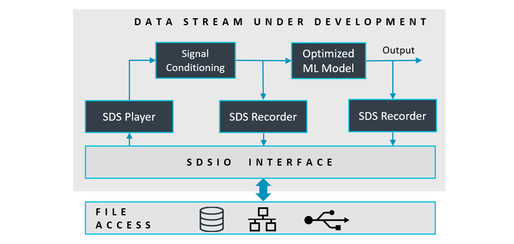
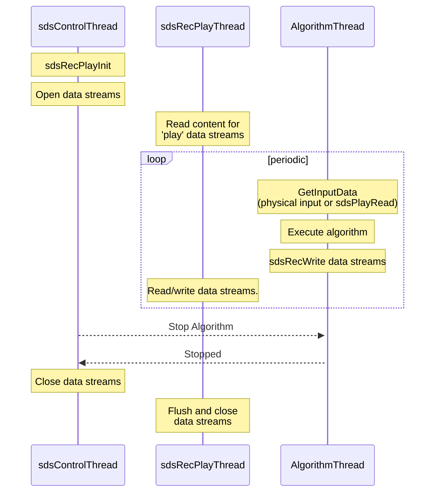
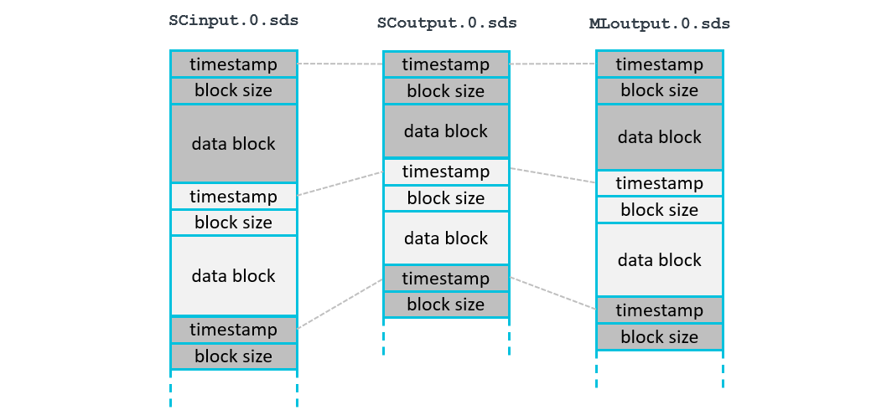
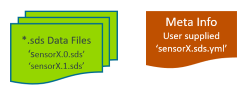
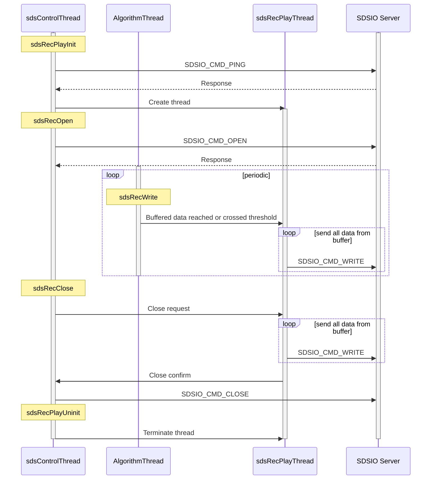
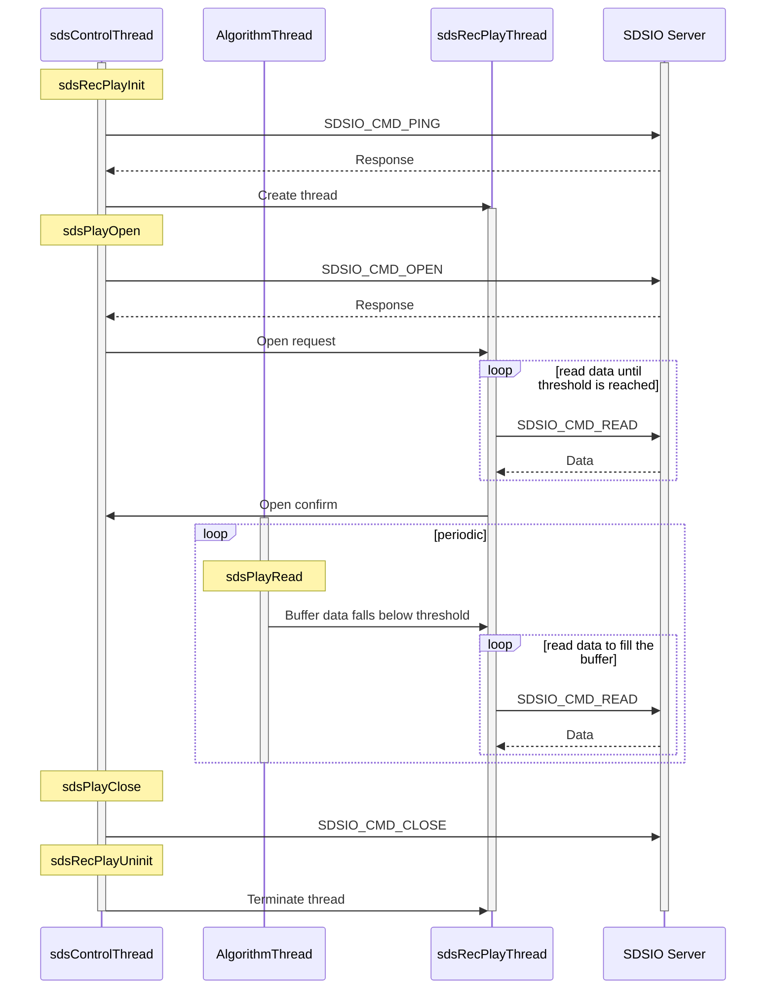

# Theory of Operation

<!-- markdownlint-disable MD013 -->
<!-- markdownlint-disable MD036 -->

The SDS Framework enables to record and playback one or more data streams to an application that is under development as shown in the diagram below. With the SDSIO Interface the data streams are connected to SDS data files. The file storage can be either embedded within the system and accessed by a file system or external on a host computer and accessed by a communication interface such as Ethernet or USB.

The DSP or ML algorithms that are tested operate on blocks and are executed periodically. This documentation uses these terms:

- **Data Block**: is a set of input or output data which is processed in one step by a DSP or ML compute note.
- **Block size**: is the number of bytes of a data block.
- **Interval**: is the periodic time interval at which the compute node executes.



The core of the SDS-Framework is a circular buffer handling (`sds_buffer.c/h`) that is controlled by the Recorder/Player interface functions (`sds_rec_play.c/h`). This circular buffer is the queue for the file I/O communication (`sdsio_x.c / sdsio.h`). Using the Recorder/Player functions, the data stream under development may read and write data streams as shown in the diagram above.


## Usage

The following diagram shows the usage of the SDS Recorder and Player functions (executed in `sdsRecPlayThread`).  The `sdsControlThread` controls the overall execution. `AlgorithmThread` is the thread that executes Signal Conditioning (SC) and ML Model.



## SDS Data Files

Each data stream is stored in a separate SDS data file. In the diagram below `SCinput.0.sds` is the input to Signal Conditioning, `SCoutput.0.sds` is the output of Signal Conditioning, and `MLoutput.0.sds` is the output of the ML Model. Each execution of the algorithm is represented in a data block with a `timestamp`. The `timestamp` allows to correlate the blocks of different streams. In the above example, all blocks of one algorithm execution have the same timestamp value.



- Each call to the function `sdsRecWrite` writes one data block.
- Each call to the function `sdsPlayRead` reads one data block.

### Filenames

SDS data files use the naming format `<name>.<file-index>.sds`. `<name>` is the base name specified by the user, and `<file-index>` is a sequential number that starts at 0.

**Recording (sdsRecOpen):**

The `sdsRecOpen` function takes `<name>` as input. When connected to a file system (e.g., the [SDSIO-Server](utilities.md#sdsio-server)), it scans for existing files with names matching the pattern `<name>.<file-index>.sds`, starting at index 0. It uses the first available index that does not **yet** exist to create a new file for recording.

Example:

If files `SensorX.0.sds` through `SensorX.10.sds` exist, the next file created will be `SensorX.11.sds`.

**Playback (sdsPlayOpen):**

The `sdsPlayOpen` function also takes `<name>` as input and determines which file to play based on the contents of a corresponding index file, `<name>.index.txt`. The following procedure outlines how sdsPlayOpen determines the playback file:

1. The function checks if `<name>.index.txt` exists and contains a valid number.
     - If it exists and contains a valid index (e.g., 3), that number is used as the `<file-index>`.
     - If the file does not exist or contains an invalid value, the index defaults to `0`.
2. The file `<name>.<file-index>.sds` is then opened for playback.
    - If the file exists, it is opened for playback. The index file `<name>.index.txt` is updated to` <file-index> + 1` for the next call to sdsPlayOpen.
    - If the file does not exist, playback fails and the index file is created or reset to 0.

This mechanism enables automatic sequential playback, while still allowing the user to select the initial playback index by editing the index file.

Example:

If `SensorX.index.txt` contains the value 2, the `sdsPlayOpen` function will attempt to open the file `SensorX.2.sds`.

- If the file exists, it is played and the index file is updated to 3 for the next playback.
- If the file does not exist, playback fails and the index file is reset to 0.

### Timestamp

The timestamp is a 32-bit unsigned value and is used for:

- Alignment of different data streams that have the same timestamp value.
- Order of the SDS data files captured during execution.
- Combining multiple SDS file records with the same timestamp value.

The same timestamp connects different SDS file records. It is therefore useful to
use the same timestamp for the recording of one iteration of a DSP or ML algorithm.
In most cases the granularity of an RTOS tick (typically 1ms) is a good choice for a timestamp resolution.

### File Format

The **SDS Framework** uses a binary data file format to store the individual data streams. It supports the recording and playback of multiple data streams that may have jitters.  Therefore each stream contains timestamp information that allows to correlate the data streams as it is for example required in a sensor fusion application.

The binary data format (stored in `*.<n>.sds` data files) has a record structure with a variable size. Each record has the following format:

1. **timestamp**: record timestamp in tick-frequency (32-bit unsigned integer, little endian)
2. **data size**: number of data bytes in the record (32-bit unsigned integer, little endian)
3. **binary data**: SDS stream (little endian, no padding) as described with the `*.sds.yml` file.

### YAML Metadata Format

The content of each data stream may be described in a [YAML](https://en.wikipedia.org/wiki/YAML) metadata file that is created by the user. The following section defines the YAML format of this metadata file. The file `schema/sds.schema.json` is a schema description of the SDS Format Description.

`sds:`                               | Start of the SDS format description
:------------------------------------|---------------------------------------------------
&nbsp;&nbsp;&nbsp; `name:`           | Name of the Synchronous Data Stream (required)
&nbsp;&nbsp;&nbsp; `description:`    | Additional descriptive text (optional)
&nbsp;&nbsp;&nbsp; `frequency:`      | Capture frequency of the SDS (required)
&nbsp;&nbsp;&nbsp; `tick-frequency:` | Tick frequency of the timestamp value (optional); default: 1000
&nbsp;&nbsp;&nbsp; `content:`        | List of values captured (required, see below)

`content:`                           | List of values captured (in the order of the data file)
:------------------------------------|---------------------------------------------------
`- value:`                           | Name of the value (required)
&nbsp;&nbsp;&nbsp; `type:`           | Data type of the value (required)
&nbsp;&nbsp;&nbsp; `offset:`         | Offset of the value (optional); default: 0
&nbsp;&nbsp;&nbsp; `scale:`          | Scale factor of the value (optional); default: 1.0
&nbsp;&nbsp;&nbsp; `unit:`           | Physical unit of the value (optional)
&nbsp;&nbsp;&nbsp; `image:`          | Image stream metadata (optional, see below)

`image:`                             | [Image metadata](#image-metadata-format) for one `content` entry
:------------------------------------|---------------------------------------------------
&nbsp;&nbsp;&nbsp; `pixel_format:`   | Pixel format identifier (required)
&nbsp;&nbsp;&nbsp; `width:`          | Number of pixels per row (required, integer >= 1)
&nbsp;&nbsp;&nbsp; `height:`         | Number of rows (required, integer >= 1)
&nbsp;&nbsp;&nbsp; `stride_bytes:`   | Bytes per row for single-plane formats (optional)
&nbsp;&nbsp;&nbsp; `planes:`         | Per-plane stride for multi-plane formats (optional, 2..3 entries)

`planes:`                            | Per-plane metadata entry
:------------------------------------|---------------------------------------------------
`- stride_bytes:`                    | Bytes per row for this plane (required, integer >= 1)

For `image`, exactly one of `stride_bytes` or `planes` must be provided.

**Example**

This example defines a data stream with the name "sensorX" that contains the values of a gyroscope, temperature sensor, and additional raw data (that are not further described).



The binary data that are coming form these sensors are stored in data files with the following file format: `<sensor-name>.<file-index>.sds`. In this example the files names could be:

```yml
   sensorX.0.sds   # capture 0
   sensorX.1.sds   # capture 1
```

The following `sensorX.sds.yml` provides the format description of the SDS `sensorX` binary data files and may be used by data conversion utilities and data viewers.

```yml
sds:                   # describes a synchronous data stream
  name: sensorX        # user defined name
  description: Gyroscope stream with 1KHz, plus additional user data
  frequency: 1000
  content:
  - value: x           # Value name is 'x'
    type:  uint16_t    # stored using a 16-bit unsigned int
    scale: 0.2         # value is scaled by 0.2
    unit: dps          # base unit of the value
  - value: y
    type: uint16_t
    scale: 0.2
    unit: dps
  - value: z
    type: uint16_t
    unit: dps          # scale 1.0 is default
  - value: temp
    type: float
    unit: degree Celsius
  - value: raw
    type: uint16_t     # raw data, no scale or unit given
  - value: flag
    type: uint32_t:1   # a single bit stored in a 32-bit int
```

#### Image Metadata Format

The `pixel_format` values listed in `sds.schema.json` map to the following template files located in the folder `schema\image_format` and Linux V4L2 references:

`pixel_format:` | Template file | V4L2 reference page
:---------------------|:--------------|:------------------
`RAW8` | `RAW8.sds.yml` | [Luma-Only formats](https://www.kernel.org/doc/html/latest/userspace-api/media/v4l/pixfmt-yuv-luma.html) *(GREY family)*
`RAW10` | `RAW10.sds.yml` | [10-bit Bayer (expanded to 16-bit)](https://www.kernel.org/doc/html/latest/userspace-api/media/v4l/pixfmt-srggb10.html)
`RGB565` | `RGB565.sds.yml` | [RGB formats](https://www.kernel.org/doc/html/latest/userspace-api/media/v4l/pixfmt-rgb.html)
`RGB888` | `RGB888.sds.yml` | [RGB formats](https://www.kernel.org/doc/html/latest/userspace-api/media/v4l/pixfmt-rgb.html) *(RGB24)*
`NV12` | `NV12.sds.yml` | [Planar YUV formats](https://www.kernel.org/doc/html/latest/userspace-api/media/v4l/pixfmt-yuv-planar.html)
`NV21` | `NV21.sds.yml` | [Planar YUV formats](https://www.kernel.org/doc/html/latest/userspace-api/media/v4l/pixfmt-yuv-planar.html)
`I420` | `I420.sds.yml` | [Planar YUV formats](https://www.kernel.org/doc/html/latest/userspace-api/media/v4l/pixfmt-yuv-planar.html) *(YUV420 / YU12 family)*
`NV16` | `NV16.sds.yml` | [Planar YUV formats](https://www.kernel.org/doc/html/latest/userspace-api/media/v4l/pixfmt-yuv-planar.html)
`NV61` | `NV61.sds.yml` | [Planar YUV formats](https://www.kernel.org/doc/html/latest/userspace-api/media/v4l/pixfmt-yuv-planar.html)
`YUYV` | `YUYV.sds.yml` | [Packed YUV formats](https://www.kernel.org/doc/html/latest/userspace-api/media/v4l/pixfmt-packed-yuv.html)
`UYVY` | `UYVY.sds.yml` | [Packed YUV formats](https://www.kernel.org/doc/html/latest/userspace-api/media/v4l/pixfmt-packed-yuv.html)
`YUV422P` | `YUV422P.sds.yml` | [Planar YUV formats](https://www.kernel.org/doc/html/latest/userspace-api/media/v4l/pixfmt-yuv-planar.html)
`YUV444` | `YUV444.sds.yml` | [Packed YUV formats](https://www.kernel.org/doc/html/latest/userspace-api/media/v4l/pixfmt-packed-yuv.html) *(packed 4:4:4)*
`YUV444P` | `YUV444P.sds.yml` | [Planar YUV formats](https://www.kernel.org/doc/html/latest/userspace-api/media/v4l/pixfmt-yuv-planar.html) *(YUV444M family)*

!!! Note:
    - When RAW10 is packed (4 pixels in 5 bytes), use [10-bit packed Bayer formats](https://www.kernel.org/doc/html/latest/userspace-api/media/v4l/pixfmt-srggb10p.html).

## Code Example

The following code snippets show the usage of the **Recorder Interface**. In this case an accelerometer data stream is recorded.

```c
#include "sds_rec_play.h"

// variable definitions
struct {                          // sensor data stream format
  uint16_t x;
  uint16_t y;
  uint16_t z;
} accelerometer [30];             // number of samples in one data stream record

sdsRecPlayId_t *accel_id;         // data stream id
uint8_t accel_buf[(sizeof(accelerometer)*2)+0x800];      // data stream buffer for circular buffer handling
int32_t n;                        // number of bytes written to data stream
     :
// *** function calls ***
   sdsRecPlayInit(NULL);          // init SDS Recorder/Player  
     :
   // open data stream for recording
   accel_id = sdsRecOpen("Accel", accel_buf, sizeof(accel_buf));
     :
   // write data in accelerometer buffer with timestamp from RTOS kernel.
   timestamp = osKernelGetTickCount();
   n = sdsRecWrite(accel_id, timestamp, accelerometer, sizeof(accelerometer));
   if (n != sizeof(accelerometer)) {
     ... // unexpected size returned, error handling
   }
     :
  sdsRecClose (accel_id);         // close data stream
```

## Buffer Size

The size of the data stream buffer depends on several factors such as:

- the communication interface technology that may impose specific buffer size requirements to maximize data transfer rates.
- the frequency of the algorithm execution. Fast execution speeds may require a larger buffer.

As a guideline, the buffer size should be at least **(2 × block size) + 2 KB**.  
The minimum recommended buffer size is **0x1000 (4 KB)**.

## SDSIO Server Protocol

The SDSIO Server uses a simple protocol for data exchange between a Host computer and the embedded target that integrates an [SDSIO Interface](sdsio.md).  The protocol assumes that the correct communication to the server is already ensured by the underlying technology (TCP/IP or USB) and therefore no extra check is implemented.

The following conventions describe the **command semantic** used in the following documentation:

Symbol     | Description
:----------|:----------------------
\>         | Prefix indicating the direction: Command from target to Host.
<          | Prefix indicating the direction: Response from Host to target.
WORD       | 32-bit value (low byte first).
****       | The field above has exactly one occurrence.
++++       | The field above has a variable length.

**Commands:**

Commands are sent from the embedded target to the Host computer running the SDSIO Server.

ID  | Name               | Description
:--:|:-------------------|:------------------------
1   | SDSIO_CMD_OPEN     | Open an SDS data file
2   | SDSIO_CMD_CLOSE    | Close an SDS data file
3   | SDSIO_CMD_WRITE    | Write to an SDS data file
4   | SDSIO_CMD_READ     | Read from an SDS data file
5   | SDSIO_CMD_PING     | Ping Server

Each Command starts with a Header (4 Words) and optional data with variable length. Depending on the Command, the SDSIO Server replies with a Response that repeats the Header and delivers additional data.

**SDSIO_CMD_OPEN**

The Command ID=1 **SDSIO_CMD_OPEN** opens an SDS data file on the Host computer. `Mode` defines `read` (value=0) or `write` (value=1) operation. `Len of Name` is the size of the string in bytes.

SDS data filenames use the following file format: `<name>.<file-index>.sds`, where `Name` is the base file name of the SDS data file and `<file-index>` is a sequential number maintained by SDSIO Server (for details see section [Filenames](#filenames)).

```txt
| WORD |  WORD  | WORD | WORD *******|++++++|
>  1   |   0    | Mode | Len of Name | Name |
|******|********|******|*************|++++++|
```

The Response ID=1 **SDSIO_CMD_OPEN** provides a `Handle` that is used to identify the file in subsequent commands.

```txt
| WORD |  WORD  | WORD | WORD *******|
<  1   | Handle | Mode | 0           |
|******|********|******|*************|
```

**SDSIO_CMD_CLOSE**

The Command ID=2 **SDSIO_CMD_CLOSE** closes an SDS data file on the Host computer. The `Handle` is the identifier obtained with **SDSIO_CMD_OPEN**. There is no Response from the SDSIO Server on this command.

```txt
| WORD |  WORD  | WORD | WORD |
>  2   | Handle |  0   |  0   |
|******|********|******|******|
```

**SDSIO_CMD_WRITE**

The Command ID=3 **SDSIO_CMD_WRITE** writes data to an SDS data file on the Host computer. The `Handle` is the identifier obtained with **SDSIO_CMD_OPEN**. `Size` is the `Data` size in bytes.  There is no Response from the SDSIO Server on this command.

```txt
| WORD |  WORD  | WORD | WORD |++++++|
>  3   | Handle |  0   | Size | Data |
|******|********|******|******|++++++|
```

**SDSIO_CMD_READ**

The Command ID=4 **SDSIO_CMD_READ** reads data from an SDS data file on the Host computer. The `Handle` is the identifier obtained with **SDSIO_CMD_OPEN**. `Size` are the number of bytes that should be read.

```txt
| WORD |  WORD  | WORD | WORD |
>  4   | Handle | Size |  0   |
|******|********|******|******|
```

The Response ID=4 **SDSIO_CMD_READ** provides the data read from an SDS data file on the Host computer.
`Size` is the `Data` size in bytes that was read and `Status` with nonzero = end of stream, else 0.

```txt
| WORD |  WORD  |  WORD  | WORD |++++++|
<  4   | Handle | Status | Size | Data |
|******|********|********|******|++++++|
```

**SDSIO_CMD_PING**

The Command ID=5 **SDSIO_CMD_PING** verifies if the Server is active and reachable on the Host.

```txt
| WORD | WORD | WORD | WORD |
>  5   |  0   |  0   |  0   |
|******|******|******|******|
```

The Response ID=5 **SDSIO_CMD_PING** returns the `Status` with nonzero = server active, else 0

```txt
| WORD | WORD |  WORD  | WORD |
<  5   |  0   | Status |  0   |
|******|******|********|******|
```

## SDSIO Message Sequence

This is the message sequence of the SDS **DataTest** example using SDSIO Server.
It contains the following threads that execute on the target.

- **Control**: Overall execution Control thread (sdsControlThread)
- **Algorithm**: Algorithm under test thread (AlgorithmThread)
- **Recorder/Playback**: SDS Recorder/Playback thread (sdsRecPlayThread)

The **Server** is the **SDSIO Server** executing on the target system.

**Recording flowchart**



**Playback flowchart**


