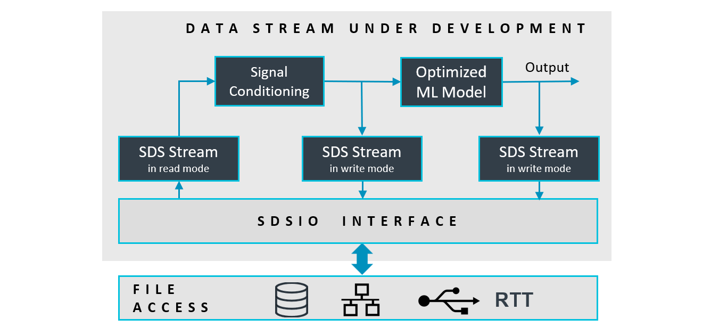
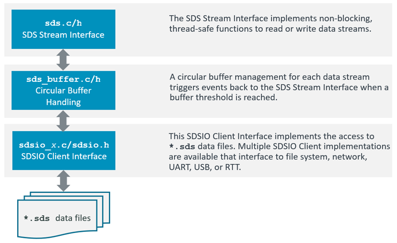
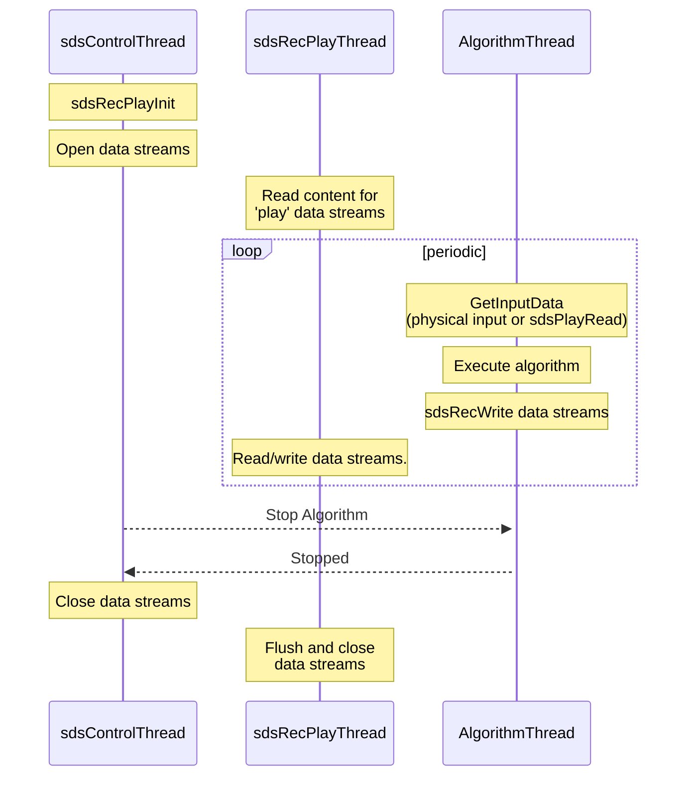
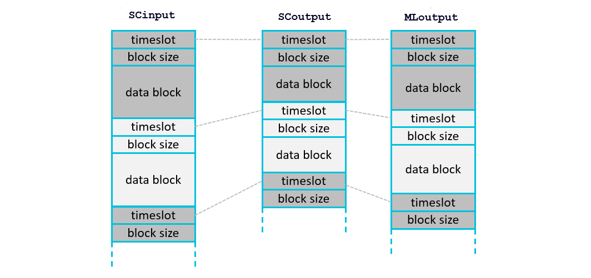
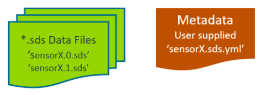
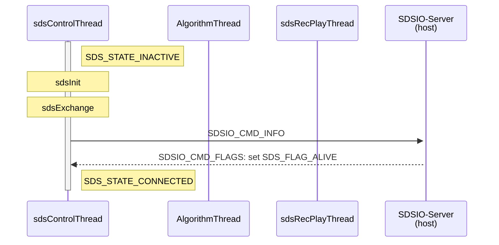
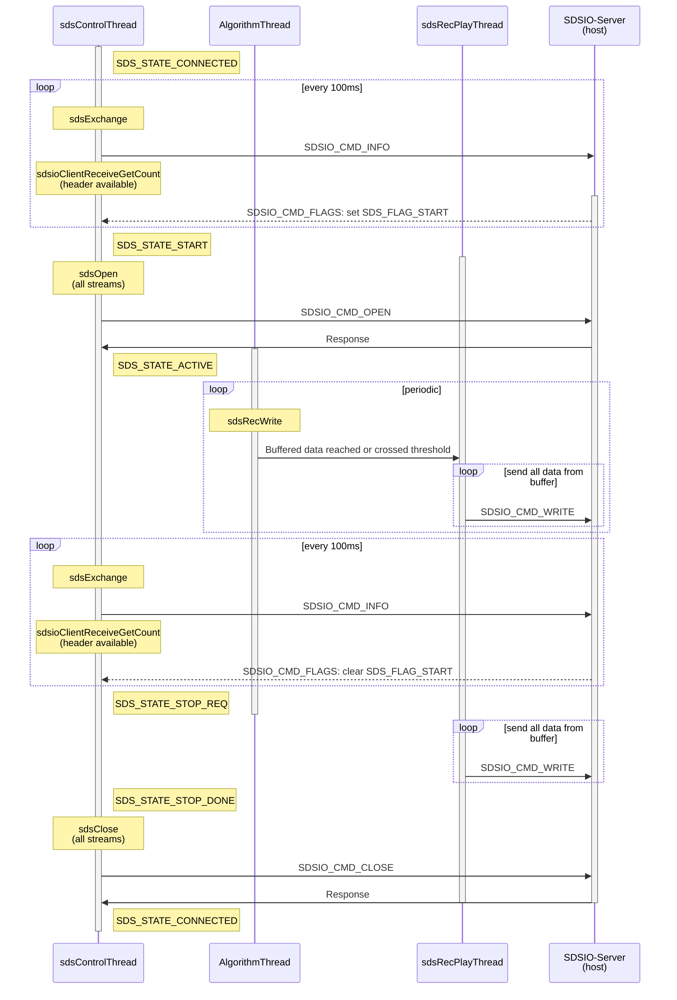
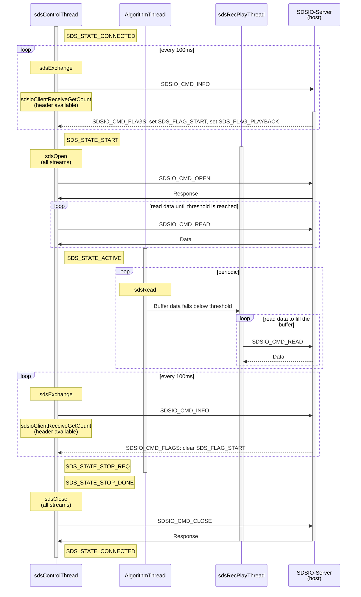

# Theory of Operation

<!-- markdownlint-disable MD013 -->
<!-- markdownlint-disable MD036 -->

The SDS Framework enables to record and playback one or more data streams to an application that is under development as shown in the diagram below. With the SDSIO Interface the data streams are connected to SDS data files. The file storage can be either embedded within the system and accessed by a file system or external on a host computer and accessed by a communication interface such as Ethernet or USB.

The DSP or ML algorithms that are tested operate on blocks and are executed periodically. This documentation uses these terms:

- **Data Block**: is a set of input or output data which is processed in one step by a DSP or ML compute note.
- **Block size**: is the number of bytes of a data block.
- **Interval**: is the periodic time interval at which the compute node executes.



The core of the SDS-Framework is a circular buffer handling (`sds_buffer.c/h`) that is controlled by the Recorder/Player interface functions (`sds_rec_play.c/h`). This circular buffer is the queue for the file I/O communication (`sdsio_x.c / sdsio.h`). Using the Recorder/Player functions, the data stream under development may read and write data streams as shown in the diagram above.



## Usage

The following diagram shows the usage of the SDS Recorder and Player functions (executed in `sdsRecPlayThread`).  The `sdsControlThread` controls the overall execution. `AlgorithmThread` is the thread that executes Signal Conditioning (SC) and ML Model.


```mermaid
sequenceDiagram
    participant sdsControlThread
    participant sdsRecPlayThread
    participant AlgorithmThread
    Note over sdsControlThread: sdsRecPlayInit
    activate sdsRecPlayThread
    Note over sdsControlThread: Open data streams
    Note over sdsRecPlayThread: Read content for<br/>'play' data streams
    activate AlgorithmThread
    loop periodic
        Note over AlgorithmThread: GetInputData<br/>(physical input or sdsPlayRead)
        Note over AlgorithmThread: Execute algorithm
        Note over AlgorithmThread: sdsRecWrite data streams
        Note over sdsRecPlayThread: Read/write data streams.
    end
    sdsControlThread-->>AlgorithmThread: Stop Algorithm
    AlgorithmThread-->>sdsControlThread: Stopped
    Note over sdsControlThread: Close data streams
    Note over sdsRecPlayThread: Flush and close<br/> data streams
```

## SDS Data Files

Each data stream is stored in a separate SDS data file. In the diagram below `SCinput.0.sds` is the input to Signal Conditioning, `SCoutput.0.sds` is the output of Signal Conditioning, and `MLoutput.0.sds` is the output of the ML Model. Each execution of the algorithm is represented in a data block with a `timestamp`. The `timestamp` allows to correlate the blocks of different streams. In the above example, all blocks of one algorithm execution have the same timestamp value.



- Each call to the function `sdsRecWrite` writes one data block.
- Each call to the function `sdsPlayRead` reads one data block.

### Filenames

SDS data files use the naming format `<name>.<file-index>.sds`. `<name>` is the base name specified by the user, and `<file-index>` is a sequential number that starts at 0.

**Recording (sdsRecOpen):**

The `sdsRecOpen` function takes `<name>` as input. When connected to a file system (e.g., the [SDSIO-Server](utilities.md#sdsio-server)), it scans for existing files with names matching the pattern `<name>.<file-index>.sds`, starting at index 0. It uses the first available index that does not **yet** exist to create a new file for recording.

Example:

If files `SensorX.0.sds` through `SensorX.10.sds` exist, the next file created will be `SensorX.11.sds`.

**Playback (sdsPlayOpen):**

The `sdsPlayOpen` function also takes `<name>` as input and determines which file to play based on the contents of a corresponding index file, `<name>.index.txt`. The following procedure outlines how sdsPlayOpen determines the playback file:

1. The function checks if `<name>.index.txt` exists and contains a valid number.
     - If it exists and contains a valid index (e.g., 3), that number is used as the `<file-index>`.
     - If the file does not exist or contains an invalid value, the index defaults to `0`.
2. The file `<name>.<file-index>.sds` is then opened for playback.
    - If the file exists, it is opened for playback. The index file `<name>.index.txt` is updated to` <file-index> + 1` for the next call to sdsPlayOpen.
    - If the file does not exist, playback fails and the index file is created or reset to 0.

This mechanism enables automatic sequential playback, while still allowing the user to select the initial playback index by editing the index file.

Example:

If `SensorX.index.txt` contains the value 2, the `sdsPlayOpen` function will attempt to open the file `SensorX.2.sds`.

- If the file exists, it is played and the index file is updated to 3 for the next playback.
- If the file does not exist, playback fails and the index file is reset to 0.

### Timestamp

The timestamp is a 32-bit unsigned value and is used for:

- Alignment of different data streams that have the same timestamp value.
- Order of the SDS data files captured during execution.
- Combining multiple SDS file records with the same timestamp value.

The same timestamp connects different SDS file records. It is therefore useful to
use the same timestamp for the recording of one iteration of a DSP or ML algorithm.
In most cases the granularity of an RTOS tick (typically 1ms) is a good choice for a timestamp resolution.

### File Format

The **SDS Framework** uses a binary data file format to store the individual data streams. It supports the recording and playback of multiple data streams that may have jitters.  Therefore each stream contains timestamp information that allows to correlate the data streams as it is for example required in a sensor fusion application.

The binary data format (stored in `*.<n>.sds` data files) has a record structure with a variable size. Each record has the following format:

1. **timestamp**: record timestamp in tick-frequency (32-bit unsigned integer, little endian)
2. **data size**: number of data bytes in the record (32-bit unsigned integer, little endian)
3. **binary data**: SDS stream (little endian, no padding) as described with the `*.sds.yml` file.

### YAML Metadata Format

The content of each data stream may be described in a [YAML](https://en.wikipedia.org/wiki/YAML) metadata file that is created by the user. The following section defines the YAML format of this metadata file. The file `schema/sds.schema.json` is a schema description of the SDS Format Description.

`sds:`                               | Start of the SDS format description
:------------------------------------|---------------------------------------------------
&nbsp;&nbsp;&nbsp; `name:`           | Name of the Synchronous Data Stream (required)
&nbsp;&nbsp;&nbsp; `description:`    | Additional descriptive text (optional)
&nbsp;&nbsp;&nbsp; `frequency:`      | Capture frequency of the SDS (required)
&nbsp;&nbsp;&nbsp; `tick-frequency:` | Tick frequency of the timestamp value (optional); default: 1000
&nbsp;&nbsp;&nbsp; `content:`        | List of values captured (required, see below)

`content:`                           | List of values captured (in the order of the data file)
:------------------------------------|---------------------------------------------------
`- value:`                           | Name of the value (required)
&nbsp;&nbsp;&nbsp; `type:`           | Data type of the value (required)
&nbsp;&nbsp;&nbsp; `offset:`         | Offset of the value (optional); default: 0
&nbsp;&nbsp;&nbsp; `scale:`          | Scale factor of the value (optional); default: 1.0
&nbsp;&nbsp;&nbsp; `unit:`           | Physical unit of the value (optional)
&nbsp;&nbsp;&nbsp; `image:`          | Image stream metadata (optional, see below)

`image:`                             | [Image metadata](#image-metadata-format) for one `content` entry
:------------------------------------|---------------------------------------------------
&nbsp;&nbsp;&nbsp; `pixel_format:`   | Pixel format identifier (required)
&nbsp;&nbsp;&nbsp; `width:`          | Number of pixels per row (required, integer >= 1)
&nbsp;&nbsp;&nbsp; `height:`         | Number of rows (required, integer >= 1)
&nbsp;&nbsp;&nbsp; `stride_bytes:`   | Bytes per row for single-plane formats (optional)
&nbsp;&nbsp;&nbsp; `planes:`         | Per-plane stride for multi-plane formats (optional, 2..3 entries)

`planes:`                            | Per-plane metadata entry
:------------------------------------|---------------------------------------------------
`- stride_bytes:`                    | Bytes per row for this plane (required, integer >= 1)

For `image`, exactly one of `stride_bytes` or `planes` must be provided.

**Example**

This example defines a data stream with the name "sensorX" that contains the values of a gyroscope, temperature sensor, and additional raw data (that are not further described).



The binary data that are coming form these sensors are stored in data files with the following file format: `<sensor-name>.<file-index>.sds`. In this example the files names could be:

```yml
   sensorX.0.sds   # capture 0
   sensorX.1.sds   # capture 1
```

The following `sensorX.sds.yml` provides the format description of the SDS `sensorX` binary data files and may be used by data conversion utilities and data viewers.

```yml
sds:                   # describes a synchronous data stream
  name: sensorX        # user defined name
  description: Gyroscope stream with 1KHz, plus additional user data
  frequency: 1000
  content:
  - value: x           # Value name is 'x'
    type:  uint16_t    # stored using a 16-bit unsigned int
    scale: 0.2         # value is scaled by 0.2
    unit: dps          # base unit of the value
  - value: y
    type: uint16_t
    scale: 0.2
    unit: dps
  - value: z
    type: uint16_t
    unit: dps          # scale 1.0 is default
  - value: temp
    type: float
    unit: degree Celsius
  - value: raw
    type: uint16_t     # raw data, no scale or unit given
  - value: flag
    type: uint32_t:1   # a single bit stored in a 32-bit int
```

#### Image Metadata Format

The `pixel_format` values listed in `sds.schema.json` map to the following template files located in the folder `schema\image_format` and Linux V4L2 references.

`pixel_format:` | Template file | V4L2 reference page
:---------------------|:--------------|:------------------
`RAW8` | `RAW8.sds.yml` | [Luma-Only formats](https://www.kernel.org/doc/html/latest/userspace-api/media/v4l/pixfmt-yuv-luma.html) *(GREY family)*
`RAW10` | `RAW10.sds.yml` | [10-bit Bayer (expanded to 16-bit)](https://www.kernel.org/doc/html/latest/userspace-api/media/v4l/pixfmt-srggb10.html)
`RGB565` | `RGB565.sds.yml` | [RGB formats](https://www.kernel.org/doc/html/latest/userspace-api/media/v4l/pixfmt-rgb.html)
`RGB888` | `RGB888.sds.yml` | [RGB formats](https://www.kernel.org/doc/html/latest/userspace-api/media/v4l/pixfmt-rgb.html) *(RGB24)*
`NV12` | `NV12.sds.yml` | [Planar YUV formats](https://www.kernel.org/doc/html/latest/userspace-api/media/v4l/pixfmt-yuv-planar.html)
`NV21` | `NV21.sds.yml` | [Planar YUV formats](https://www.kernel.org/doc/html/latest/userspace-api/media/v4l/pixfmt-yuv-planar.html)
`I420` | `I420.sds.yml` | [Planar YUV formats](https://www.kernel.org/doc/html/latest/userspace-api/media/v4l/pixfmt-yuv-planar.html) *(YUV420 / YU12 family)*
`NV16` | `NV16.sds.yml` | [Planar YUV formats](https://www.kernel.org/doc/html/latest/userspace-api/media/v4l/pixfmt-yuv-planar.html)
`NV61` | `NV61.sds.yml` | [Planar YUV formats](https://www.kernel.org/doc/html/latest/userspace-api/media/v4l/pixfmt-yuv-planar.html)
`YUYV` | `YUYV.sds.yml` | [Packed YUV formats](https://www.kernel.org/doc/html/latest/userspace-api/media/v4l/pixfmt-packed-yuv.html)
`UYVY` | `UYVY.sds.yml` | [Packed YUV formats](https://www.kernel.org/doc/html/latest/userspace-api/media/v4l/pixfmt-packed-yuv.html)
`YUV422P` | `YUV422P.sds.yml` | [Planar YUV formats](https://www.kernel.org/doc/html/latest/userspace-api/media/v4l/pixfmt-yuv-planar.html)
`YUV444` | `YUV444.sds.yml` | [Packed YUV formats](https://www.kernel.org/doc/html/latest/userspace-api/media/v4l/pixfmt-packed-yuv.html) *(packed 4:4:4)*
`YUV444P` | `YUV444P.sds.yml` | [Planar YUV formats](https://www.kernel.org/doc/html/latest/userspace-api/media/v4l/pixfmt-yuv-planar.html) *(YUV444M family)*

!!! Note
    - When RAW10 is packed (4 pixels in 5 bytes), use [10-bit packed Bayer formats](https://www.kernel.org/doc/html/latest/userspace-api/media/v4l/pixfmt-srggb10p.html).

## Code Example

The following code snippets show the usage of the **Recorder Interface**. In this case an accelerometer data stream is recorded.

```c
#include "sds_rec_play.h"

// variable definitions
struct {                          // sensor data stream format
  uint16_t x;
  uint16_t y;
  uint16_t z;
} accelerometer [30];             // number of samples in one data stream record

sdsRecPlayId_t *accel_id;         // data stream id
uint8_t accel_buf[(sizeof(accelerometer)*2)+0x800];      // data stream buffer for circular buffer handling
int32_t n;                        // number of bytes written to data stream
     :
// *** function calls ***
   sdsRecPlayInit(NULL);          // init SDS Recorder/Player  
     :
   // open data stream for recording
   accel_id = sdsRecOpen("Accel", accel_buf, sizeof(accel_buf));
     :
   // write data in accelerometer buffer with timestamp from RTOS kernel.
   timestamp = osKernelGetTickCount();
   n = sdsRecWrite(accel_id, timestamp, accelerometer, sizeof(accelerometer));
   if (n != sizeof(accelerometer)) {
     ... // unexpected size returned, error handling
   }
     :
  sdsRecClose (accel_id);         // close data stream
```

## Buffer Size

The size of the data stream buffer depends on several factors such as:

- the communication interface technology that may impose specific buffer size requirements to maximize data transfer rates.
- the frequency of the algorithm execution. Fast execution speeds may require a larger buffer.

As a guideline, the buffer size should be at least **(2 × block size) + 2 KB**.  
The minimum recommended buffer size is **0x1000 (4 KB)**.

## SDSIO Server Firmware Protocol

The SDSIO Server uses a simple protocol for data exchange between a Host computer and the embedded target that integrates an [SDSIO Interface](sdsio.md). The protocol assumes that the correct communication to the server is already ensured by the underlying technology (TCP/IP or USB) and therefore no extra check is implemented.

The following conventions describe the **command semantic** used in the following documentation:

Symbol     | Description
:----------|:----------------------
\>         | Prefix indicating the direction: Command from target firmware to SDSIO-Server on the host computer.
<          | Prefix indicating the direction: Response from SDSIO-Server to target firmware.
WORD       | 32-bit value (low byte first).
****       | The field above has exactly one occurrence.
++++       | The field above has a variable length.

**Commands:**

Commands are sent from the embedded target to the Host computer running the SDSIO Server.

ID  | Name            | Description
:--:|:----------------|:------------------------
1   | SDSIO_CMD_OPEN  | Open an SDS data file
2   | SDSIO_CMD_CLOSE | Close an SDS data file
3   | SDSIO_CMD_WRITE | Write to an SDS data file
4   | SDSIO_CMD_READ  | Read from an SDS data file
5   | SDSIO_CMD_PING  | Ping Server
6   | SDSIO_CMD_FLAGS | SDS control flags update request from Host
7   | SDSIO_CMD_INFO  | Send control information to Host

Each **Command** starts with a **Header (4 Words = 16 bytes)** followed by **optional data** of variable length.
Depending on the Command, the SDSIO Server replies with a **Response** that includes a **Header** with the same ID
as the Command and may contain **additional data**.

!!! Note
    - The SDSIO_CMD_FLAGS Response is not a reply to the SDSIO_CMD_FLAGS Command; rather, it is an asynchronous Response sent by the Host.

**SDSIO_CMD_OPEN**

The Command with ID = **1** (SDSIO_CMD_OPEN) opens an SDS data file on the Host computer.
`Mode` defines `read` (value=0) or `write` (value=1) operation. `Len of Stream Name` is the size of the string in bytes.

SDS data filenames use the following file format: `<stream-name>.<label-name>.sds`, where `stream-name` is the base file name
of the SDS data file and `<label-name>` is a sequential number during recording maintained by SDSIO Server (for details see section [Filenames](#filenames)).

```txt
| WORD |  WORD  | WORD | WORD **************|+++++++++++++|
>  1   |   0    | Mode | Len of Stream Name | Stream Name |
|******|********|******|********************|+++++++++++++|
```

The Response with ID = **1** (SDSIO_CMD_OPEN) provides a `Handle` that is used to identify the file in subsequent Commands.

```txt
| WORD |  WORD  | WORD | WORD *******|
<  1   | Handle | Mode | 0           |
|******|********|******|*************|
```

**SDSIO_CMD_CLOSE**

The Command with ID = **2** (SDSIO_CMD_CLOSE) closes an SDS data file on the Host computer.
The `Handle` is the identifier obtained with **SDSIO_CMD_OPEN**.
There is no Response from the SDSIO Server to this Command.

```txt
| WORD |  WORD  | WORD | WORD |
>  2   | Handle |  0   |  0   |
|******|********|******|******|
```

**SDSIO_CMD_WRITE**

The Command with ID = **3** (SDSIO_CMD_WRITE) writes data to an SDS data file on the Host computer.
The `Handle` is the identifier obtained with **SDSIO_CMD_OPEN**.
`Size` specifies the size of `Data` in bytes.
There is no Response from the SDSIO Server to this Command.

```txt
| WORD |  WORD  | WORD | WORD |++++++|
>  3   | Handle |  0   | Size | Data |
|******|********|******|******|++++++|
```

**SDSIO_CMD_READ**

The Command with ID = **4** (SDSIO_CMD_READ) reads data from an SDS data file on the Host computer.
The `Handle` is the identifier obtained with **SDSIO_CMD_OPEN**.
`Size` specifies the number of bytes to read.

```txt
| WORD |  WORD  | WORD | WORD |
>  4   | Handle | Size |  0   |
|******|********|******|******|
```

The Response with ID = **4** (SDSIO_CMD_READ) provides the data read from an SDS data file on the Host computer.
`Size` specifies the size of `Data` in bytes that was read and `Status` with nonzero = end of stream, else 0.

```txt
| WORD |  WORD  |  WORD  | WORD |++++++|
<  4   | Handle | Status | Size | Data |
|******|********|********|******|++++++|
```

**SDSIO_CMD_PING**

The Command with ID = **5** (SDSIO_CMD_PING) verifies if the Server is active and reachable on the Host.

```txt
| WORD | WORD | WORD | WORD |
>  5   |  0   |  0   |  0   |
|******|******|******|******|
```

The Response with ID = **5** (SDSIO_CMD_PING) returns the Status with nonzero = server active, else 0

```txt
| WORD | WORD |  WORD  | WORD |
<  5   |  0   | Status |  0   |
|******|******|********|******|
```

**SDSIO_CMD_FLAGS**

The asynchronous Response with ID = **6** (SDSIO_CMD_FLAGS) contains the SDS control flags update information from the Host.
This Response can arrive at any time when the Host wants to update the SDS control flags.
It can also precede a Response to any other command (e.g., SDSIO_CMD_OPEN or SDSIO_CMD_READ), but it cannot be sent by the Host
while a Response to another Command is in progress.
`Set Mask` bits to set in sdsFlags.
`Clear Mask` bits to clear in sdsFlags.

```txt
| WORD | WORD     | WORD       | WORD |
<  6   | Set Mask | Clear Mask |  0   |
|******|**********|************|******|
```

**SDSIO_CMD_INFO**

The Command with ID = **7** (SDSIO_CMD_INFO) sends control information (sdsFlags, sdsIdleRate and error information) to the Host. There is no Response from the SDSIO Server to this Command.

- `sdsFlags` is the current value of that global variable.
- `sdsIdleRate` is the current value of that global variable, value 0xFFFFFFFFF indicates that there is no idle rate information.
- `Error Len` specifies the size of the `Error Data`, value 0 indicates that no error occurred.

```txt
| WORD | WORD     | WORD        | WORD      |++++++++++++|
>  7   | sdsFlags | sdsIdleRate | Error Len | Error Data |
|******|**********|*************|***********|++++++++++++|
```

`Error Data` contains the information from `sdsError` global structure and has the following format.

```txt
| WORD   | WORD |++++++++++++++++++++|
| Status | Line | File name (string) |
|********|******|++++++++++++++++++++|
```

## SDSIO Server Monitor Interface

The SDSIO Server provides an additional TCP socket that maybe used by a Monitor program to observe SDS file activity and control sdsFlags.
The monitor interface is enabled with command line option `--mon-port <port>`.

The following conventions describe the **command and message semantic** used in the following documentation:

Symbol     | Description
:----------|:----------------------
\>         | Prefix indicating the direction: Command to SDSIO-Server from Monitor program.
<          | Prefix indicating the direction: Response or asynchronous message from SDSIO-Server.
WORD       | 32-bit value (low byte first).
****       | The field above has exactly one occurrence.
++++       | The field above has a variable length.

**Commands and Messages:**

Commands are sent to the server which replies with a response (depending on command).
Server can also send asynchronous messages at any time when not processing a command.

ID  | Name            | Description
:--:|:----------------|:------------------------
1   | SDSIO_MON_OPEN  | SDS data file was opened (message)
2   | SDSIO_MON_CLOSE | SDS data file was closed (message)
6   | SDSIO_MON_FLAGS | Send an SDS control flags update from the Monitor
7   | SDSIO_MON_INFO  | Information update from the SDSIO-Server (message)

Each **Command or Message** starts with a **Header (4 Words = 16 bytes)** followed by **optional data** of variable length.
Depending on the Command, the SDSIO Server replies with a **Response** that includes a **Header** with the same ID
as the Command and may contain **additional data**.

**SDSIO_MON_OPEN**

The Message with ID = **1** (SDSIO_MON_OPEN) is sent whenever an SDS data file is opened by the SDSIO Server.
`Mode` defines `read` (value=0) or `write` (value=1) operation. `Filename Len` is the size of the string in bytes and `Filename` is the name of the file (including path).

```txt
| WORD | WORD | WORD | WORD | WORD ********|++++++++++|
<  1   |  0   | Mode |  0   | Filename Len | Filename |
|******|******|******|******|**************|++++++++++|
```

**SDSIO_MON_CLOSE**

The Message with ID = **2** (SDSIO_MON_CLOSE) is sent whenever an SDS data file is closed by the SDSIO Server.
`Filename Len` is the size of the string in bytes and `Filename` is the name of the file (including path).

```txt
| WORD | WORD | WORD | WORD | WORD ********|++++++++++|
<  2   |  0   |  0   |  0   | Filename Len | Filename |
|******|******|******|******|**************|++++++++++|
```

**SDSIO_MON_FLAGS**

The Command with ID = **6** (SDSIO_MON_FLAGS) is used to update the SDS control flags in the SDSIO Server. The `Set Mask` specifies the bits to set in `sdsFlags` and the `Clear Mask` specifies the bits to clear in `sdsFlags`. There is no response from the SDSIO Server to this Command.

```txt
| WORD | WORD     | WORD       | WORD |
>  6   | Set Mask | Clear Mask |  0   |
|******|**********|************|******|
```

**SDSIO_MON_INFO**

The Message with ID = **7** (SDSIO_MON_INFO) contains information (sdsFlags, sdsIdleRate and error information) from the SDSIO Server. It is send whenever there is an update of this information in the SDSIO Server and on initial connection to the monitor interface.

- `sdsFlags` is the current value of that global variable.
- `sdsIdleRate` is the current value of that global variable, value 0xFFFFFFFFF indicates that there is no idle rate information.
- `Error Len` specifies the size of the `Error Data`, value 0 indicates that no error occurred.

```txt
| WORD | WORD     | WORD        | WORD      |++++++++++++|
<  7   | sdsFlags | sdsIdleRate | Error Len | Error Data |
|******|**********|*************|***********|++++++++++++|
```

`Error Data` contains the information from `sdsError` global structure and has the following format.

```txt
| WORD   | WORD |++++++++++++++++++++|
| Status | Line | File name (string) |
|********|******|++++++++++++++++++++|
```

## SDSIO Message Sequence

This section describes the states and the message sequence of the SDS framework when using the `SDSIO-Server`.
It contains the following threads that execute on the target.

- **sdsControlThread**: Control thread that organizes the overall execution.
- **AlgorithmThread**: Executes the algorithm under test.
- **sdsRecPlayThread**: Recorder/Playback interface to SDSIO-Server.
- **SDSIO-Server**: SDSIO-Server running on host computer.

!!! Note
    - The command `SDS_CMD_FLAGS` is sent asynchronous by the SDSIO-Server.

States                   | Description
:------------------------|:------------
SDS_STATE_INACTIVE       | Streaming is not active; initiate connection to SDSIO-Server
SDS_STATE_CONNECTED      | Device (client) is connected to SDSIO-Server (host)
SDS_STATE_START          | Request to start streaming, open streams and get ready for read/write operations
SDS_STATE_ACTIVE         | Streaming is active
SDS_STATE_STOP_REQ       | Request to stop streaming and close streams
SDS_STATE_STOP_DONE      | Streaming is stopped
SDS_STATE_END            | Request to end streaming (no more data to send to SDSIO-Server)

The following flowcharts show the state transition in context with the messages that are exchanged with the `SDSIO-Server`.

**Connect flowchart**


```mermaid
sequenceDiagram
    participant sdsControlThread
    activate sdsControlThread

    participant AlgorithmThread
    participant SDSIO as sdsRecPlayThread
    participant Server as SDSIO-Server<br/>(host)

    activate Server
    Note right of sdsControlThread: SDS_STATE_INACTIVE 
    Note over sdsControlThread: sdsInit
    Note over sdsControlThread: sdsExchange
    sdsControlThread->>Server: SDSIO_CMD_INFO
    Server-->>sdsControlThread: SDSIO_CMD_FLAGS: set SDS_FLAG_ALIVE
    Note right of sdsControlThread: SDS_STATE_CONNECTED 
    deactivate sdsControlThread
```

!!! Note
    - When the command `SDS_CMD_FLAGS` sets SDS_FLAG_ALIVE the sdsControlThread transitions into the SDS_STATE_CONNECTED.
    - When `SDSIO_CMD_INFO` is send more than 10 times without a `SDS_CMD_FLAGS` response the sdsControlThread transitions into the SDS_STATE_INACTIVE.

**Recording flowchart**


```mermaid
sequenceDiagram
    participant sdsControlThread
    activate sdsControlThread

    participant AlgorithmThread
    participant SDSIO as sdsRecPlayThread
    participant Server as SDSIO-Server<br/>(host)

    Note right of sdsControlThread: SDS_STATE_CONNECTED 

    loop every 100ms
      Note over sdsControlThread: sdsExchange
      sdsControlThread->>Server: SDSIO_CMD_INFO
      Note over sdsControlThread: sdsioClientReceiveGetCount<br/>(header available) 
    activate Server
      Server-->>sdsControlThread: SDSIO_CMD_FLAGS: set SDS_FLAG_START
    end

    Note right of sdsControlThread: SDS_STATE_START

    activate SDSIO
 
    Note over sdsControlThread: sdsOpen<br/>(all streams)
    sdsControlThread->>Server: SDSIO_CMD_OPEN
    Server->>sdsControlThread: Response

    activate AlgorithmThread

    Note right of sdsControlThread: SDS_STATE_ACTIVE

    loop periodic
        Note over AlgorithmThread: sdsRecWrite
        AlgorithmThread->>SDSIO: Buffered data reached or crossed threshold
        loop send all data from buffer
            SDSIO->>Server: SDSIO_CMD_WRITE
        end
    end

    loop every 100ms
      Note over sdsControlThread: sdsExchange
      sdsControlThread->>Server: SDSIO_CMD_INFO
      Note over sdsControlThread: sdsioClientReceiveGetCount<br/>(header available) 
      Server-->>sdsControlThread: SDSIO_CMD_FLAGS: clear SDS_FLAG_START
    end

    Note right of sdsControlThread: SDS_STATE_STOP_REQ
    deactivate AlgorithmThread
    loop send all data from buffer
        SDSIO->>Server: SDSIO_CMD_WRITE
    end
    Note right of sdsControlThread: SDS_STATE_STOP_DONE

    Note over sdsControlThread: sdsClose<br/>(all streams)
    sdsControlThread->>Server: SDSIO_CMD_CLOSE
    Server->>sdsControlThread: Response
    deactivate SDSIO
    deactivate Server
    Note right of sdsControlThread: SDS_STATE_CONNECTED
    deactivate sdsControlThread
```

**Playback flowchart**


```mermaid
sequenceDiagram
    participant sdsControlThread
    activate sdsControlThread

    participant AlgorithmThread
    participant SDSIO as sdsRecPlayThread
    participant Server as SDSIO-Server<br/>(host)

    Note right of sdsControlThread: SDS_STATE_CONNECTED 

    loop every 100ms
      Note over sdsControlThread: sdsExchange
      sdsControlThread->>Server: SDSIO_CMD_INFO
      Note over sdsControlThread: sdsioClientReceiveGetCount<br/>(header available) 
    activate Server
      Server-->>sdsControlThread: SDSIO_CMD_FLAGS: set SDS_FLAG_START, set SDS_FLAG_PLAYBACK  
    end

    Note right of sdsControlThread: SDS_STATE_START

    activate SDSIO

    Note over sdsControlThread: sdsOpen<br/>(all streams)
    sdsControlThread->>Server: SDSIO_CMD_OPEN
    Server->>sdsControlThread: Response

    loop read data until threshold is reached
        sdsControlThread->>Server: SDSIO_CMD_READ
        Server->>sdsControlThread: Data
    end
  
    activate AlgorithmThread

    Note right of sdsControlThread: SDS_STATE_ACTIVE

    loop periodic
        Note over AlgorithmThread: sdsRead
        AlgorithmThread->>SDSIO: Buffer data falls below threshold
        loop read data to fill the buffer
            SDSIO->>Server: SDSIO_CMD_READ
            Server-->>SDSIO: Data
        end
    end

    loop every 100ms
      Note over sdsControlThread: sdsExchange
      sdsControlThread->>Server: SDSIO_CMD_INFO
      Note over sdsControlThread: sdsioClientReceiveGetCount<br/>(header available) 
      Server-->>sdsControlThread: SDSIO_CMD_FLAGS: clear SDS_FLAG_START
    end

    Note right of sdsControlThread: SDS_STATE_STOP_REQ

    deactivate AlgorithmThread
    Note right of sdsControlThread: SDS_STATE_STOP_DONE

    Note over sdsControlThread: sdsClose<br/>(all streams)
    sdsControlThread->>Server: SDSIO_CMD_CLOSE
    Server->>sdsControlThread: Response
    deactivate SDSIO
    deactivate Server

    Note right of sdsControlThread: SDS_STATE_CONNECTED
    deactivate sdsControlThread
```
