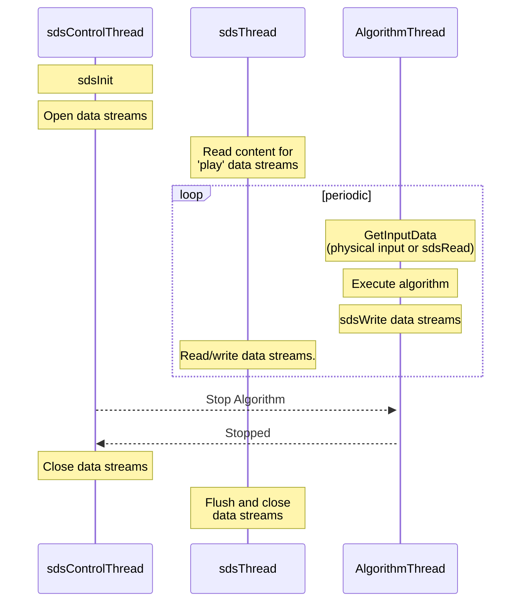
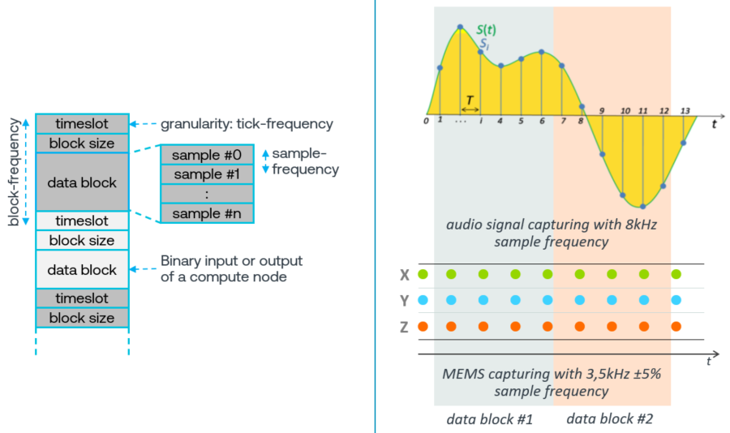
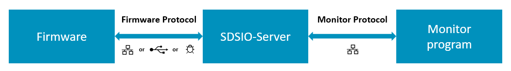
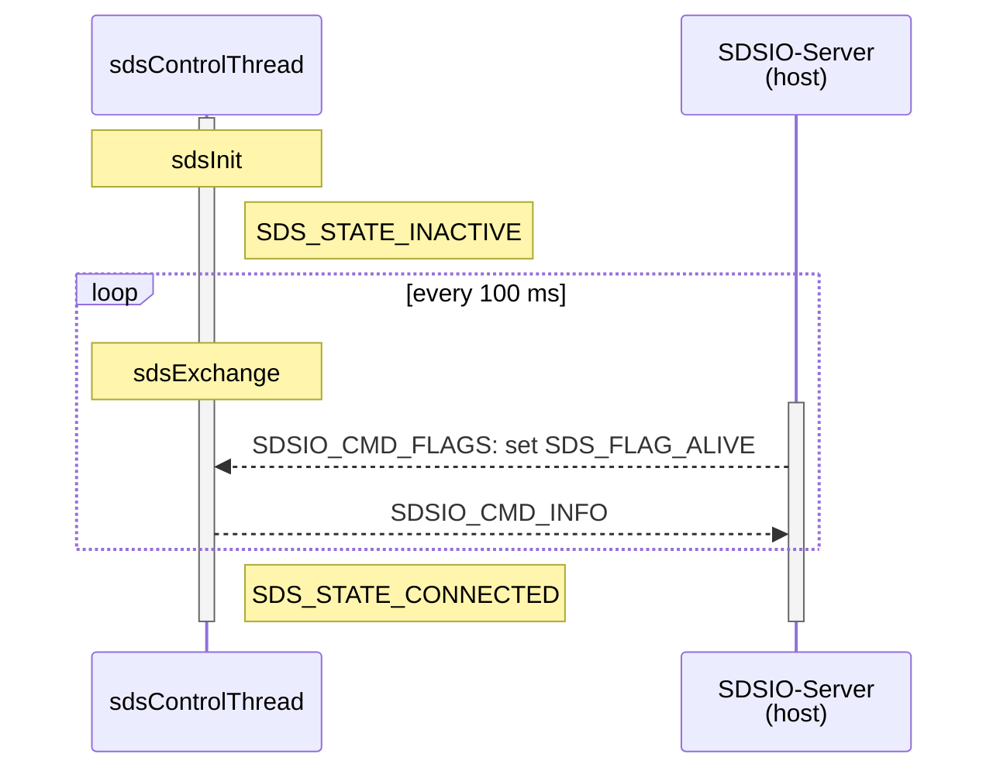
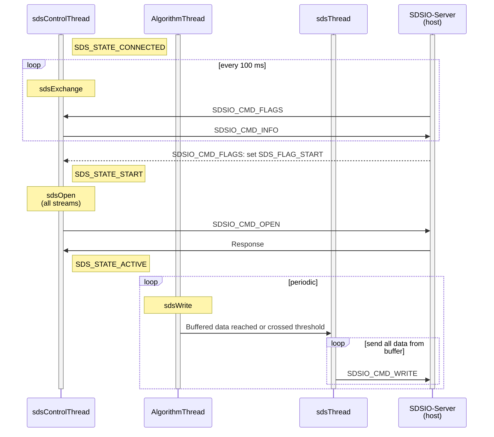
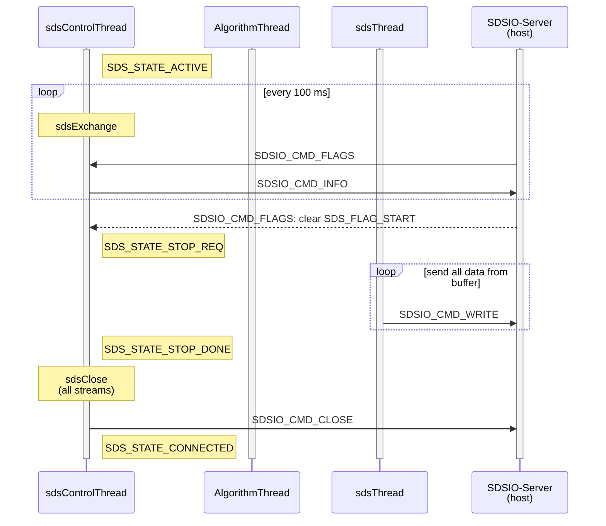
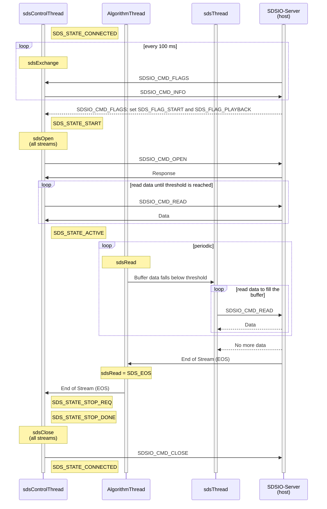

# Theory of Operation

<!-- markdownlint-disable MD013 -->
<!-- markdownlint-disable MD036 -->
<!-- markdownlint-disable MD060 -->

The SDS Framework enables recording and playback of one or more data streams for an application under development, as shown in the diagram below. With the SDSIO interface, the data streams are connected to SDS data files. The file storage can be either embedded within the system and accessed via a file system, or external (on a host computer) and accessed via a communication interface such as Ethernet or USB.

The DSP or ML algorithms under test operate on blocks and are executed periodically. This documentation uses the term **Data Block** to refer to a block of input or output data that is processed in one step by a DSP or ML compute node.


Using the SDS Stream Interface functions (`sds.c/h`), the data stream under development may read and write as shown above. The Stream Interface functions store data streams in a circular buffer (`sds_buffer.c/h`). This circular buffer is the I/O queue for the SDSIO-Client (`sdsio_x.c/h`).


## Usage

The following diagram shows the usage of the SDS Stream Interface functions (executed in `sdsThread`).  The `sdsControlThread` controls the overall execution. `AlgorithmThread` is the thread that executes Signal Conditioning (SC) and the ML Model.

When `AlgorithmThread` starts, it first calls the `InitInputData` function, which initializes the input interfaces
(camera, microphone or sensor interfaces). It then calls `InitAlgorithm`, which is responsible for initializing the ML algorithm.

After initialization, `AlgorithmThread` enters a loop in which it repeatedly calls `GetInputData`. This function provides a block of input data
used for a single inference. The inference itself is executed by the `ExecuteAlgorithm` function.

Two additional functions are also provided:

- `DiscardInputData`: used during playback to discard incoming live input data, since the actual input is read from the SDS file.
- `ResetAlgorithm`: called before each playback run to reset internal states, memory buffers, and results from previous inferences,
  ensuring a clean start for the new playback session.


```mermaid
sequenceDiagram
    participant sdsControlThread
    participant sdsThread
    participant AlgorithmThread
    Note over sdsControlThread: sdsInit
    activate sdsThread
    Note over sdsControlThread: Open data streams
    Note over sdsThread: Read content for<br/>'play' data streams
    activate AlgorithmThread
    loop periodic
        Note over AlgorithmThread: GetInputData<br/>(physical input or sdsRead)
        Note over AlgorithmThread: Execute algorithm
        Note over AlgorithmThread: sdsWrite data streams
        Note over sdsThread: Read/write data streams.
    end
    sdsControlThread-->>AlgorithmThread: Stop Algorithm
    AlgorithmThread-->>sdsControlThread: Stopped
    Note over sdsControlThread: Close data streams
    Note over sdsThread: Flush and close<br/> data streams
```

## SDS Data Files

Each data stream is stored in a separate SDS data file. In the diagram below `SCinput.0.sds` is the input to Signal Conditioning, `SCoutput.0.sds` is the output of Signal Conditioning, and `MLoutput.0.sds` is the output of the ML Model. Each execution of the algorithm is represented by a data block with a `timeslot`. The `timeslot` allows correlating blocks from different streams.

All data blocks of one algorithm execution have the same timeslot value as shown below:


- Each call to the function `sdsWrite` writes one complete data block.
- Each call to the function `sdsRead` reads one complete data block.

### File Format

Each SDS file contains a sequence of variable-size data blocks. Every data block has the following information:

1. **timeslot**: data block timeslot measured at the `tick-frequency` rate (32-bit unsigned integer, little endian).
2. **block size**: number of bytes in the following data block (32-bit unsigned integer, little endian).
3. **data block**: SDS stream content (little endian, no padding) as described by the corresponding `*.sds.yml` [metadata file](#sds-metadata-format).

This structure supports recording and playback of multiple data streams that may have jitter. The timeslot information allows correlating data blocks from different data streams and enables sensor fusion applications where multiple data streams are combined as training input to one machine learning algorithm.

### Filenames

SDS data streams are stored in `*.sds` files with the following naming convention:

```txt
<stream-name>.<label>[.p].sds
```

The `.p` is added when the SDS data stream is recorded during playback.

The `sdsOpen` function takes `<stream-name>` for the stream and the opening mode as input parameters.
Opening a stream in `sdsModeRead` mode is used for playback and opening a stream in `sdsModeWrite` is used for recording.

The [`SDSIO-Server`](utilities.md#sdsio-server) adds `.<label>[.p].sds` to compose a filename as explained below:

**Recording:**

`<label>` is a sequential number starting at 0. The number is incremented until no file exists with the corresponding name, at which point a new file is created.

Each subsequent recording session uses the next `<label>` number in the sequence. If a file with the selected name already exists, it is preserved by renaming it with a `.bak` extension before a new file is created with the original name.

**Playback:**

When a [`*.sdsio.yml` control file](utilities.md#sdsio-control-file-sdsioyml) is used and contains a [`play:`](utilities.md#play) node, the `<label>` is specified in the corresponding [`step:`](utilities.md#play).

When `*.sdsio.yml` control file is not used, the `<label>` is a sequential number starting at 0. If the corresponding file does not exist, the open operation fails.

!!! Note
    - Files recorded during playback include an additional `.p` before the `.sds` extension to
      distinguish them from originally recorded files (e.g., `ML_Out.0.p.sds`).
    - If a recording filename already exists, any existing `.bak` file with the same name is deleted,
      the current file is renamed by appending `.bak`.

### Timeslot

The timeslot is a 32-bit unsigned value and is used for:

- Alignment of different data streams that have the same timeslot value.
- Order of the SDS data files captured during execution.
- Combining multiple SDS file records with the same timeslot value.

The same timeslot connects different SDS file data blocks. It is useful to
use the same timeslot for the recording of data blocks in different data streams for one iteration of a DSP or ML algorithm.
In most cases the granularity of an RTOS tick (typically 1ms) is a good choice for a timeslot resolution.

## SDS Metadata Format

The content of each data stream may be described in an SDS metadata file in [YAML format](https://en.wikipedia.org/wiki/YAML) that is created by the user. For example, a data stream named `sensorX` (stored in files `sensorX.0.sds`, `sensorX.1.sds`, ...) can be described with a corresponding metadata file `sensorX.sds.yml` as shown below.


The following section defines the YAML format of this metadata file. The file [`schema/sds.schema.json`](https://github.com/ARM-software/SDS-Framework/blob/main/schema/sds.schema.json) is a schema description of the SDS metadata format.

`sds:`                                | Start of the SDS format description
:-------------------------------------|---------------------------------------------------
&nbsp;&nbsp;&nbsp; `name:`            | Name of the Synchronous Data Stream (required)
&nbsp;&nbsp;&nbsp; `description:`     | Additional descriptive text (optional)
&nbsp;&nbsp;&nbsp; `block-frequency:` | Frequency in Hz (interval) of data blocks within a data stream (optional)
&nbsp;&nbsp;&nbsp; `sample-frequency:`| Frequency in Hz (sample rate) of samples within a data block (optional)
&nbsp;&nbsp;&nbsp; `tick-frequency:`  | Tick frequency in Hz of the timeslot value (optional); default: 1000 Hz
&nbsp;&nbsp;&nbsp; `content:`         | List of values captured (required, see below)

!!! Note
    - SDS v3.0 used `frequency:` to indicate a sample rate. In SDS v3.1 this is renamed to `sample-frequency:` to clarify the information.



The `content:` list describes the binary layout of one data block. Depending on the stream type, it uses these nodes:

- [`value:`](#value-list-data-stream) list entries to describe discrete values, such as sensor channels or algorithm outputs. A data block can contain multiple samples, so the `block size` is a multiple of the sample size. A `block size` of 0 indicates that no sample is available in that timeslot.
- [`audio:`](#audio-data-stream) entry to describe audio channel parameters.
- [`image:`](#image-data-stream) entry to describe a camera stream with frame layout parameters.

### Value list data stream

Typically describes the sample layout of a sensor data stream or the output of ML algorithms. A data block may contain several samples as shown in the picture above. The `sample-frequency:` should be specified when the data stream uses a discrete sample rate.

With `dim-x:`, `dim-y:`, `dim-z:` arrays can be composed. The equivalent representation in C is "*type name[dim-y][dim-x]*".

`content:`                           | Value list in the order stored in the data block
:------------------------------------|---------------------------------------------------
`- value:`                           | Name of the value (required)
&nbsp;&nbsp;&nbsp; `type:`           | Data type of the value (required)
&nbsp;&nbsp;&nbsp; `dim-x:`          | Array size x (optional); default: 1
&nbsp;&nbsp;&nbsp; `dim-y:`          | Array size y (optional); default: 1
&nbsp;&nbsp;&nbsp; `offset:`         | Offset of the value (optional); default: 0
&nbsp;&nbsp;&nbsp; `scale:`          | Scale factor of the value (optional); default: 1.0
&nbsp;&nbsp;&nbsp; `unit:`           | Physical unit of the value (optional)

**Examples:**

The following `sensorX.sds.yml` provides the format description of the SDS `sensorX` binary data files and may be used by data conversion utilities and data viewers.

```yml
sds:                   # describes a synchronous data stream
  name: sensorX        # user defined name
  description: Gyroscope stream with 1KHz sample rate, plus additional user data
  sample-frequency: 1000
  content:
  - value: x           # Value name is 'x'
    type:  uint16_t    # stored using a 16-bit unsigned int
    scale: 0.2         # value is scaled by 0.2
    unit: dps          # base unit of the value
  - value: y
    type: uint16_t
    scale: 0.2
    unit: dps
  - value: z
    type: uint16_t
    unit: dps          # scale 1.0 is default
  - value: temp
    type: float
    unit: degree Celsius
  - value: raw
    type: uint16_t     # raw data, no scale or unit given
  - value: flag
    type: uint32_t:1   # a single bit stored in a 32-bit int
```

The following `ToF.sds.yml` provides the format description of a Time-of-Flight sensor.

```yml
sds:                   # describes a synchronous data stream
  name: ToF            # user defined name
  description: Time-of-Flight sensor with 8x8 matrix
  content:
  - value: distance    # Value name is 'distance'
    type:  uint16_t    # stored using a 16-bit unsigned int
    dim-x: 8
    dim-y: 8
```

### Audio data stream

Describes audio data format, typically used for a microphone data stream.

`content:`                                             | Audio metadata for `content:` node
:------------------------------------------------------|:---------------------------------------------------
`- audio:`                                             | Audio format specification
&nbsp;&nbsp;&nbsp;&nbsp;&nbsp;&nbsp; `sample_rate:`    | Audio sample rate in Hz (required)
&nbsp;&nbsp;&nbsp;&nbsp;&nbsp;&nbsp; `bit_depth:`      | Bits per audio sample (required)
&nbsp;&nbsp;&nbsp;&nbsp;&nbsp;&nbsp; `audio_channels:` | Number of interleaved audio channels (required)
&nbsp;&nbsp;&nbsp;&nbsp;&nbsp;&nbsp; `format:`         | Audio format used (optional), currently only `pcm` is supported

**Example:**

```yml
sds:
  name: Mono
  description: Mono 16-bit PCM microphone
  content:
  - audio:
      sample_rate: 16000
      bit_depth: 16
      audio_channels: 1
      format: pcm
```

### Image data stream

Describes the image data format, typically used for a camera data stream.

`content:`                                             | Image metadata for `content:` node
:------------------------------------------------------|:---------------------------------------------------
`- image:`                                             | Image (camera data) format specification
&nbsp;&nbsp;&nbsp;&nbsp;&nbsp;&nbsp; `pixel_format:`   | Pixel format identifier (required)
&nbsp;&nbsp;&nbsp;&nbsp;&nbsp;&nbsp; `width:`          | Number of pixels per row (required, integer >= 1)
&nbsp;&nbsp;&nbsp;&nbsp;&nbsp;&nbsp; `height:`         | Number of rows (required, integer >= 1)
&nbsp;&nbsp;&nbsp;&nbsp;&nbsp;&nbsp; `stride_bytes:`   | Bytes per row for single-plane formats (optional, see note)
&nbsp;&nbsp;&nbsp;&nbsp;&nbsp;&nbsp; `planes:`         | Per-plane stride for multi-plane formats (optional, 2..3 entries, see note)

`planes:`                            | Per-plane metadata entry
:------------------------------------|---------------------------------------------------
`- stride_bytes:`                    | Bytes per row for this plane (required, integer >= 1)

!!! Note
    - For `image:`, exactly one of `stride_bytes:` or `planes:` must be provided.

Template files for various image data formats are located in [`schema/image_format`](https://github.com/ARM-software/SDS-Framework/tree/main/schema/image_format).
These templates are listed below and use Linux V4L2 references.

`pixel_format:` | Template file | V4L2 reference page
:---------------------|:--------------|:------------------
`RAW8` | `RAW8.sds.yml` | [Luma-Only formats](https://www.kernel.org/doc/html/latest/userspace-api/media/v4l/pixfmt-yuv-luma.html) *(GREY family)*
`RAW10` | `RAW10.sds.yml` | [10-bit Bayer (expanded to 16-bit)](https://www.kernel.org/doc/html/latest/userspace-api/media/v4l/pixfmt-srggb10.html)
`RGB565` | `RGB565.sds.yml` | [RGB formats](https://www.kernel.org/doc/html/latest/userspace-api/media/v4l/pixfmt-rgb.html)
`RGB888` | `RGB888.sds.yml` | [RGB formats](https://www.kernel.org/doc/html/latest/userspace-api/media/v4l/pixfmt-rgb.html) *(RGB24)*
`NV12` | `NV12.sds.yml` | [Planar YUV formats](https://www.kernel.org/doc/html/latest/userspace-api/media/v4l/pixfmt-yuv-planar.html)
`NV21` | `NV21.sds.yml` | [Planar YUV formats](https://www.kernel.org/doc/html/latest/userspace-api/media/v4l/pixfmt-yuv-planar.html)
`I420` | `I420.sds.yml` | [Planar YUV formats](https://www.kernel.org/doc/html/latest/userspace-api/media/v4l/pixfmt-yuv-planar.html) *(YUV420 / YU12 family)*
`NV16` | `NV16.sds.yml` | [Planar YUV formats](https://www.kernel.org/doc/html/latest/userspace-api/media/v4l/pixfmt-yuv-planar.html)
`NV61` | `NV61.sds.yml` | [Planar YUV formats](https://www.kernel.org/doc/html/latest/userspace-api/media/v4l/pixfmt-yuv-planar.html)
`YUYV` | `YUYV.sds.yml` | [Packed YUV formats](https://www.kernel.org/doc/html/latest/userspace-api/media/v4l/pixfmt-packed-yuv.html)
`UYVY` | `UYVY.sds.yml` | [Packed YUV formats](https://www.kernel.org/doc/html/latest/userspace-api/media/v4l/pixfmt-packed-yuv.html)
`YUV422P` | `YUV422P.sds.yml` | [Planar YUV formats](https://www.kernel.org/doc/html/latest/userspace-api/media/v4l/pixfmt-yuv-planar.html)
`YUV444` | `YUV444.sds.yml` | [Packed YUV formats](https://www.kernel.org/doc/html/latest/userspace-api/media/v4l/pixfmt-packed-yuv.html) *(packed 4:4:4)*
`YUV444P` | `YUV444P.sds.yml` | [Planar YUV formats](https://www.kernel.org/doc/html/latest/userspace-api/media/v4l/pixfmt-yuv-planar.html) *(YUV444M family)*

!!! Note
    - When RAW10 is packed (4 pixels in 5 bytes), use [10-bit packed Bayer formats](https://www.kernel.org/doc/html/latest/userspace-api/media/v4l/pixfmt-srggb10p.html).

**Example:**

```yml
sds:
  name: Video Stream - RGB888
  description: RGB888 video frames from camera
  content:
    - image:
        pixel_format: RGB888
        width: 1280
        height: 720
        stride_bytes: 3840   # 3 bytes per pixel
```

## Code Example

The following code snippets show how to use **SDS** for recording sensor data. In this case an accelerometer data stream is recorded.

```c
#include "sds.h"

// variable definitions
struct {                        // sensor data stream format
  uint16_t x;
  uint16_t y;
  uint16_t z;
} accelerometer [30];           // number of samples in one data stream record

sdsId_t *accel_id;              // data stream id
uint8_t  accel_buf[(sizeof(accelerometer)*2)+2048];     // data stream buffer for circular buffer handling
uint32_t timeslot;
int32_t  n;                     // number of bytes written to data stream
     :
// *** function calls ***
   sdsInit(NULL);               // init SDS
     :
   // open data stream for writing (recording)
   accel_id = sdsOpen("Accel", sdsModeWrite, accel_buf, sizeof(accel_buf));
     :
   // write data in accelerometer buffer with a timeslot from the RTOS kernel.
   timeslot = osKernelGetTickCount();
   n = sdsWrite(accel_id, timeslot, accelerometer, sizeof(accelerometer));
   if (n != sizeof(accelerometer)) {
     ... // unexpected size returned, error handling
   }
     :
  sdsClose(accel_id);           // close data stream
```

## Buffer Size

The size of the data stream buffer depends on several factors such as:

- the communication interface technology that may impose specific buffer size requirements to maximize data transfer rates.
- the frequency of the algorithm execution. Fast execution speeds may require a larger buffer.

As a guideline, the buffer size should be at least **(2 × block size) + 2 KB**.  
The minimum recommended buffer size is **4 KB**.

## SDSIO-Server Protocols

The SDSIO-Server communicates with the firmware using the [SDSIO-Server Firmware Protocol](#sdsio-server-firmware-protocol) over supported physical interfaces,
including Ethernet, Wi-Fi, USB, debugger, and serial (USART) connections.
It communicates with the monitor program through the [Monitor Interface](#sdsio-server-monitor-interface) over a network connection,
typically via the loopback (localhost) interface.



## SDSIO-Server Firmware Protocol

The [SDSIO-Server](utilities.md#sdsio-server) uses a simple protocol for data exchange between a host computer and the embedded target that integrates an [SDSIO Interface](sdsio.md). The protocol assumes that communication to the SDSIO-Server is ensured by the underlying transport technology (TCP/IP or USB); therefore, no additional checks are implemented.

The following conventions describe the **command semantics** used in the following documentation:

Symbol     | Description
:----------|:----------------------
\>         | Prefix indicating the direction: Command from target firmware to SDSIO-Server on the host computer.
<          | Prefix indicating the direction: Response from SDSIO-Server to target firmware.
WORD       | 32-bit value (low byte first).
****       | The field above has exactly one occurrence.
++++       | The field above has a variable length.

**Commands:**

Commands are sent from the embedded target to the host computer running the SDSIO-Server.

ID  | Name            | Description
:--:|:----------------|:------------------------
1   | SDSIO_CMD_OPEN  | Open an SDS data file
2   | SDSIO_CMD_CLOSE | Close an SDS data file
3   | SDSIO_CMD_WRITE | Write to an SDS data file
4   | SDSIO_CMD_READ  | Read from an SDS data file
5   | SDSIO_CMD_PING  | Ping SDSIO-Server
6   | SDSIO_CMD_FLAGS | SDS control flags update request from host
7   | SDSIO_CMD_INFO  | Send control information to host

Each **Command** starts with a **Header (4 Words = 16 bytes)** followed by **optional data** of variable length.
Depending on the Command, the SDSIO-Server replies with a **Response** that includes a **Header** with the same ID
as the Command and may contain **additional data**.

!!! Note
    - The SDSIO_CMD_FLAGS Response is not a reply to the SDSIO_CMD_FLAGS Command; rather, it is an asynchronous Response sent by the host.

**SDSIO_CMD_OPEN**

The Command with ID = **1** (SDSIO_CMD_OPEN) opens an SDS data file on the host computer.
`Mode` defines `read` (value = 0) or `write` (value = 1) operation. `Len of Stream Name` is the size of the string in bytes.

SDS data filenames use the following file format: `<name>.<label>.sds`, where `<name>` is the stream name used as the base filename
of the SDS data file and `<label>` is a user label or index depending on usage (for details see section [Filenames](#filenames)).

```txt
| WORD |  WORD  | WORD | WORD **************|+++++++++++++|
>  1   |   0    | Mode | Len of Stream Name | Stream Name |
|******|********|******|********************|+++++++++++++|
```

The Response with ID = **1** (SDSIO_CMD_OPEN) provides a `Handle` that is used to identify the file in subsequent Commands.

```txt
| WORD |  WORD  | WORD | WORD *******|
<  1   | Handle | Mode | 0           |
|******|********|******|*************|
```

**SDSIO_CMD_CLOSE**

The Command with ID = **2** (SDSIO_CMD_CLOSE) closes an SDS data file on the host computer.
The `Handle` is the identifier obtained with **SDSIO_CMD_OPEN**.
There is no Response from the SDSIO-Server to this Command.

```txt
| WORD |  WORD  | WORD | WORD |
>  2   | Handle |  0   |  0   |
|******|********|******|******|
```

**SDSIO_CMD_WRITE**

The Command with ID = **3** (SDSIO_CMD_WRITE) writes data to an SDS data file on the host computer.
The `Handle` is the identifier obtained with **SDSIO_CMD_OPEN**.
`Size` specifies the size of `Data` in bytes.
There is no Response from the SDSIO-Server to this Command.

```txt
| WORD |  WORD  | WORD | WORD |++++++|
>  3   | Handle |  0   | Size | Data |
|******|********|******|******|++++++|
```

**SDSIO_CMD_READ**

The Command with ID = **4** (SDSIO_CMD_READ) reads data from an SDS data file on the host computer.
The `Handle` is the identifier obtained with **SDSIO_CMD_OPEN**.
`Size` specifies the number of bytes to read.

```txt
| WORD |  WORD  | WORD | WORD |
>  4   | Handle | Size |  0   |
|******|********|******|******|
```

The Response with ID = **4** (SDSIO_CMD_READ) provides the data read from an SDS data file on the host computer.
`Size` specifies the size of `Data` in bytes that was read and `Status` with nonzero = end of stream, else 0.

```txt
| WORD |  WORD  |  WORD  | WORD |++++++|
<  4   | Handle | Status | Size | Data |
|******|********|********|******|++++++|
```

**SDSIO_CMD_PING**

The Command with ID = **5** (SDSIO_CMD_PING) verifies if the SDSIO-Server is active and reachable on the host.

```txt
| WORD | WORD | WORD | WORD |
>  5   |  0   |  0   |  0   |
|******|******|******|******|
```

The Response with ID = **5** (SDSIO_CMD_PING) returns the `Status` with nonzero = server active, else 0.

```txt
| WORD | WORD |  WORD  | WORD |
<  5   |  0   | Status |  0   |
|******|******|********|******|
```

**SDSIO_CMD_FLAGS**

The asynchronous Response with ID = **6** (SDSIO_CMD_FLAGS) contains the SDS control flags update information from the host.
This Response can arrive at any time when the host wants to update the SDS control flags.
It can also precede a Response to any other command (e.g., SDSIO_CMD_OPEN or SDSIO_CMD_READ), but it cannot be sent by the host
while a Response to another Command is in progress.
The `Set Mask` specifies the bits to set in the `sdsFlags` and the `Clear Mask` specifies the bits to clear in the `sdsFlags`.

```txt
| WORD | WORD     | WORD       | WORD |
<  6   | Set Mask | Clear Mask |  0   |
|******|**********|************|******|
```

**SDSIO_CMD_INFO**

The Command with ID = **7** (SDSIO_CMD_INFO) sends control information (sdsFlags, sdsIdleRate and error information) to the host. There is no Response from the SDSIO-Server to this Command.

- `sdsFlags` is the current value of that global variable.
- `sdsIdleRate` is the current value of that global variable, value 0xFFFFFFFF indicates that idle rate information is not valid.
- `Error Len` specifies the size of the `Error Data`, value 0 indicates that no error occurred.

```txt
| WORD | WORD     | WORD        | WORD      |++++++++++++|
>  7   | sdsFlags | sdsIdleRate | Error Len | Error Data |
|******|**********|*************|***********|++++++++++++|
```

`Error Data` contains the information from `sdsError` global structure and has the following format.

```txt
| WORD   | WORD |+++++++++++++++++++|
| Status | Line | Filename (string) |
|********|******|+++++++++++++++++++|
```

## SDSIO-Server Monitor Interface

The [SDSIO-Server](utilities.md#sdsio-server) provides an additional TCP socket that may be used by a monitor program to observe
SDS file activity and control `sdsFlags` in the firmware.
The monitor interface is enabled with command line option `--mon-port <port>`.

The following conventions describe the **command and message semantics** used in the following documentation:

Symbol     | Description
:----------|:----------------------
\>         | Prefix indicating the direction: Command sent from the Monitor program to the SDSIO-Server.
<          | Prefix indicating the direction: Response or asynchronous message sent from the SDSIO-Server to the Monitor program.
WORD       | 32-bit value (low byte first).
****       | The field above has exactly one occurrence.
++++       | The field above has a variable length.

**Commands and Messages:**

Commands are sent to the SDSIO-Server which replies with a response (depending on command).
SDSIO-Server can also send asynchronous messages at any time when not processing a command.

ID  | Name               | Description
:--:|:-------------------|:------------------------
1   | SDSIO_MON_OPEN     | Information about the SDS file open operation (message)
2   | SDSIO_MON_CLOSE    | Information about the SDS file close operation (message)
6   | SDSIO_MON_FLAGS    | Monitor program request to the SDSIO-Server to update SDS control flags in the firmware
7   | SDSIO_MON_INFO     | Information update received from the firmware and forwarded to the Monitor program (message)
8   | SDSIO_MON_SHUTDOWN | Monitor program request to the SDSIO-Server to complete current tasks and shut down gracefully

Each **Command or Message** starts with a **Header (4 Words = 16 bytes)** followed by **optional data** of variable length.
Depending on the Command, the SDSIO-Server replies with a **Response** that includes a **Header** with the same ID
as the Command and may contain **additional data**.

**SDSIO_MON_OPEN**

The Message with ID = **1** (SDSIO_MON_OPEN) is sent whenever an SDS data file is opened by the SDSIO-Server.
`Mode` defines `read` (value = 0) or `write` (value = 1) operation. `Filename Len` is the size of the string in bytes and `Filename` is the name of the file (including path).

```txt
| WORD | WORD | WORD | WORD | WORD ********|++++++++++|
<  1   |  0   | Mode |  0   | Filename Len | Filename |
|******|******|******|******|**************|++++++++++|
```

**SDSIO_MON_CLOSE**

The Message with ID = **2** (SDSIO_MON_CLOSE) is sent whenever an SDS data file is closed by the SDSIO-Server.
`Filename Len` is the size of the string in bytes and `Filename` is the name of the file (including path).

```txt
| WORD | WORD | WORD | WORD | WORD ********|++++++++++|
<  2   |  0   |  0   |  0   | Filename Len | Filename |
|******|******|******|******|**************|++++++++++|
```

**SDSIO_MON_FLAGS**

The Command with ID = **6** (SDSIO_MON_FLAGS) is used by the Monitor program to request an update of the SDS control flags in the firmware.
The `Set Mask` specifies the bits to set in the `sdsFlags` and the `Clear Mask` specifies the bits to clear in the `sdsFlags`.
This command does not generate a response from the SDSIO-Server.

```txt
| WORD | WORD     | WORD       | WORD |
>  6   | Set Mask | Clear Mask |  0   |
|******|**********|************|******|
```

**SDSIO_MON_INFO**

The Message with ID = **7** (SDSIO_MON_INFO) contains status information received by the SDSIO-Server from the firmware,
including sdsFlags, sdsIdleRate, and error information.
The message is sent to the Monitor program whenever the SDSIO-Server receives updated information from the firmware,
as well as upon the initial connection to the Monitor program.

- `sdsFlags` is the current value of that global variable in the firmware.
- `sdsIdleRate` is the current value of that global variable in the firmware, value 0xFFFFFFFF indicates that idle rate information is not valid.
- `Error Len` specifies the size of the `Error Data`, value 0 indicates that no error occurred in the firmware.

```txt
| WORD | WORD     | WORD        | WORD      |++++++++++++|
<  7   | sdsFlags | sdsIdleRate | Error Len | Error Data |
|******|**********|*************|***********|++++++++++++|
```

`Error Data` contains the information from `sdsError` global structure and has the following format.

```txt
| WORD   | WORD |+++++++++++++++++++|
| Status | Line | Filename (string) |
|********|******|+++++++++++++++++++|
```

**SDSIO_MON_SHUTDOWN**

The Command with ID = **8** (SDSIO_MON_SHUTDOWN) is used by the Monitor program to request the SDSIO-Server to complete any ongoing operations,
signal to the firmware that it will stop operating, and shut down gracefully.

```txt
| WORD | WORD | WORD | WORD |
>  8   |  0   |  0   |  0   |
|******|******|******|******|
```

!!! Note
    When shutdown is initiated, all data streams will be closed by the SDSIO-Server. Ideally it should be initiated when the user application has completed playback or recording and closed all data streams.

## SDSIO Message Sequence

This section describes the states and the message sequence of the SDS framework when using the [SDSIO-Server](utilities.md#sdsio-server).
It contains the following threads that execute on the target.

- **sdsControlThread**: Control thread that organizes the overall execution.
- **AlgorithmThread**: Executes the algorithm under test.
- **sdsThread**: SDS worker thread.
- **SDSIO-Server**: SDSIO-Server running on the host computer.

!!! Note
    - The command `SDSIO_CMD_FLAGS` is sent asynchronously by the SDSIO-Server.

The `sdsControlThread` handles a state machine with the following states:

States                   | Description
:------------------------|:------------
SDS_STATE_INACTIVE       | Streaming is not active; waiting for flag info from SDSIO-Server
SDS_STATE_CONNECTED      | Device (client) is connected to SDSIO-Server (host), but streaming is not active
SDS_STATE_START          | Request to start streaming, open streams and get ready for read/write operations
SDS_STATE_ACTIVE         | Streaming is active
SDS_STATE_STOP_REQ       | Request to stop streaming and close open streams
SDS_STATE_STOP_DONE      | Streaming has stopped
SDS_STATE_END            | Request to end streaming (e.g., no more playback data is available)
SDS_STATE_RESET          | Request to reset the device

The following flowcharts show the state transition in context with the messages that are exchanged with the `SDSIO-Server`.

**Connect flowchart**


```mermaid
sequenceDiagram
    participant sdsControlThread
    activate sdsControlThread

    participant Server as SDSIO-Server<br/>(host)

    Note over sdsControlThread: sdsInit
    Note right of sdsControlThread: SDS_STATE_INACTIVE 
    loop every 100 ms
      Note over sdsControlThread: sdsExchange
      activate Server
      Server-->>sdsControlThread: SDSIO_CMD_FLAGS: set SDS_FLAG_ALIVE
      sdsControlThread-->>Server: SDSIO_CMD_INFO
    end
    Note right of sdsControlThread: SDS_STATE_CONNECTED 
    deactivate sdsControlThread
    deactivate Server
```

!!! Note
    - When the command `SDSIO_CMD_FLAGS` sets SDS_FLAG_ALIVE, the `sdsControlThread` transitions to SDS_STATE_CONNECTED.
    - When `SDSIO_CMD_INFO` is sent more than 10 times without a `SDSIO_CMD_FLAGS` response, the `sdsControlThread` transitions into the SDS_STATE_INACTIVE.

**Recording start flowchart**


```mermaid
sequenceDiagram
    participant sdsControlThread
    activate sdsControlThread
    participant AlgorithmThread
    activate AlgorithmThread
    participant SDSIO as sdsThread
    activate SDSIO
    participant Server as SDSIO-Server<br/>(host)
    activate Server

    Note right of sdsControlThread: SDS_STATE_CONNECTED 

    loop every 100 ms
      Note over sdsControlThread: sdsExchange
      Server->>sdsControlThread: SDSIO_CMD_FLAGS
      sdsControlThread->>Server: SDSIO_CMD_INFO
    end

    Server-->>sdsControlThread: SDSIO_CMD_FLAGS: set SDS_FLAG_START
    Note right of sdsControlThread: SDS_STATE_START

    Note over sdsControlThread: sdsOpen<br/>(all streams)
    sdsControlThread->>Server: SDSIO_CMD_OPEN
    Server->>sdsControlThread: Response

    Note right of sdsControlThread: SDS_STATE_ACTIVE

    loop periodic
        Note over AlgorithmThread: sdsWrite
        AlgorithmThread->>SDSIO: Buffered data reached or crossed threshold
        loop send all data from buffer
            SDSIO->>Server: SDSIO_CMD_WRITE
        end
    end

    deactivate sdsControlThread
    deactivate AlgorithmThread
    deactivate SDSIO
    deactivate Server
```

**Recording stop flowchart**


```mermaid
sequenceDiagram
    participant sdsControlThread
    activate sdsControlThread

    participant AlgorithmThread
    activate AlgorithmThread
    participant SDSIO as sdsThread
    activate SDSIO
    participant Server as SDSIO-Server<br/>(host)
    activate Server

    Note right of sdsControlThread: SDS_STATE_ACTIVE 

    loop every 100 ms
      Note over sdsControlThread: sdsExchange
      Server->>sdsControlThread: SDSIO_CMD_FLAGS
      sdsControlThread->>Server: SDSIO_CMD_INFO
    end

    Server-->>sdsControlThread: SDSIO_CMD_FLAGS: clear SDS_FLAG_START
    Note right of sdsControlThread: SDS_STATE_STOP_REQ
    loop send all data from buffer
        SDSIO->>Server: SDSIO_CMD_WRITE
    end
    Note right of sdsControlThread: SDS_STATE_STOP_DONE

    Note over sdsControlThread: sdsClose<br/>(all streams)
    sdsControlThread->>Server: SDSIO_CMD_CLOSE
    Note right of sdsControlThread: SDS_STATE_CONNECTED

    deactivate AlgorithmThread
    deactivate SDSIO
    deactivate Server
    deactivate sdsControlThread
```

**Playback flowchart**


```mermaid
sequenceDiagram
    participant sdsControlThread
    activate sdsControlThread
    participant AlgorithmThread
    activate AlgorithmThread
    participant SDSIO as sdsThread
    activate SDSIO
    participant Server as SDSIO-Server<br/>(host)
    activate Server

    Note right of sdsControlThread: SDS_STATE_CONNECTED 

    loop every 100 ms
      Note over sdsControlThread: sdsExchange
      Server->>sdsControlThread: SDSIO_CMD_FLAGS
      sdsControlThread->>Server: SDSIO_CMD_INFO
    end

    Server-->>sdsControlThread: SDSIO_CMD_FLAGS: set SDS_FLAG_START and SDS_FLAG_PLAYBACK
    Note right of sdsControlThread: SDS_STATE_START

    Note over sdsControlThread: sdsOpen<br/>(all streams)
    sdsControlThread->>Server: SDSIO_CMD_OPEN
    Server->>sdsControlThread: Response

    loop read data until threshold is reached
        sdsControlThread->>Server: SDSIO_CMD_READ
        Server->>sdsControlThread: Data
    end
  
    Note right of sdsControlThread: SDS_STATE_ACTIVE

    loop periodic
        Note over AlgorithmThread: sdsRead
        AlgorithmThread->>SDSIO: Buffer data falls below threshold
        loop read data to fill the buffer
            SDSIO->>Server: SDSIO_CMD_READ
            Server-->>SDSIO: Data
        end
    end

    Server-->>SDSIO: No more data

    Server->>AlgorithmThread: End of Stream (EOS)
    Note over AlgorithmThread: sdsRead = SDS_EOS

    AlgorithmThread->>sdsControlThread: End of Stream (EOS)
    Note right of sdsControlThread: SDS_STATE_STOP_REQ
    Note right of sdsControlThread: SDS_STATE_STOP_DONE

    Note over sdsControlThread: sdsClose<br/>(all streams)
    sdsControlThread->>Server: SDSIO_CMD_CLOSE
    Note right of sdsControlThread: SDS_STATE_CONNECTED

    deactivate sdsControlThread
    deactivate AlgorithmThread
    deactivate SDSIO
    deactivate Server
```
