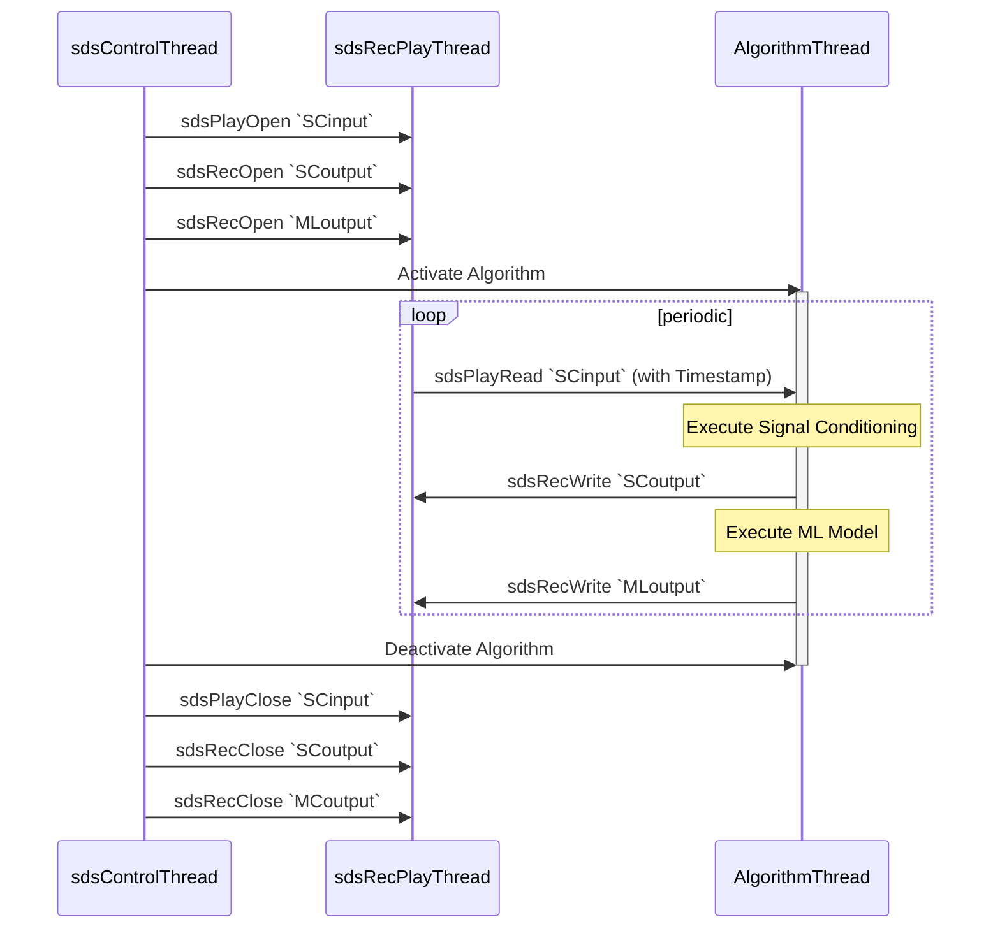

# Theory of Operation

<!-- markdownlint-disable MD013 -->
<!-- markdownlint-disable MD036 -->

The SDS Framework enables to record and playback one or more data streams to an application that is under development as shown in the diagram below. With the SDSIO Interface the data streams are connected to SDS data files. The file storage can be either embedded within the system and access by a file system or external on a host computer and accessed by a communication interface such as Ethernet or USB.

The DSP or ML algorithms that are tested operate on blocks and are executed periodically. This documentation uses these terms:

- **Data Block**: is a set of input or output data which is processed in one step by a DSP or ML compute note.
- **Block size**: is the number of bytes of a data block. 
- **Interval**: is the periodic time interval that the compute node executes.


The core of the SDS-Framework is a circular buffer handling (`sds.c/h`) that is controlled by the Recorder/Player interface functions (`sdsRec.c/h`/`sdsPlay.c/h`). This circular buffer is the queue for the file I/O communication (`sdsio.c/h`). Using the Recorder/Player functions, the data stream under development may read and write data streams as shown in the diagram above.


## Usage

The following diagram shows the usage of the SDS Recorder and Player functions (executed in `sdsRecPlayThread`).  The `sdsControlThread` controls the overall execution. `AlgorithmThread` is the thread that executes Signal Conditioning (SC) and ML Model.



## SDS Data Files

Each data stream is stored in a separate SDS data file. In the diagram below `SCinput.0.sds` is the input to Signal Conditioning, `SCoutput.0.sds` is the output of Signal Conditioning, and `MLoutput.0.sds` is the output of the ML Model. Each execution of the algorithm is represented in a data block with a `timestamp`. The `timestamp` allows to correlate the blocks of different streams. In the above example, all blocks of one algorithm execution have the same timestamp value.


- Each call to the [function `sdsRecWrite`](../SDS_API/group___s_d_s___recorder___player) writes one data block.
- Each call to the [function `sdsPlayRead`](../SDS_API/group___s_d_s___recorder___player) reads one data block.

### Filenames

SDS data filenames use the following file format: `<name>.<file-index>.sds`. `<name>` is the base file name of the SDS data file. The `<file-index>` is a sequential number starting from `0`.

- The [function `sdsRecOpen`](../SDS_API/group___s_d_s___recorder___player) gets the `<name>` as a parameter. When connected to a file system (for example the [SDSIO-Server](utilities.md#sdsio-server)), existing files starting with `<file-index>="0"` are iterated. The first available `<file-index>` that does not exist will used as filename to record data. For example, if the file `SensorX.10.sds` already exists, the filename `SensorX.11.sds` will be used.

- The [function `sdsPlayOpen`](../SDS_API/group___s_d_s___recorder___player) gets the `<name>` as a parameter. When connected to a file system (for example using the [SDSIO-Server](utilities.md#sdsio-server)), the first call uses the `<file-index>="0"`. Each call to [`sdsPlayOpen`](../SDS_API/group___s_d_s___recorder___player) increments the `<file-index>`.

### Timestamp

The timestamp is a 32-bit unsigned value and is used for:

- Alignment of different data streams that have the same timestamp value.
- Order of the SDS data files captured during execution.
- Combining multiple SDS file records with the same timestamp value.

The same timestamp connects different SDS file records. It is therefore useful to
use the same timestamp for the recording of one iteration of a DSP or ML algorithm.
In most cases the granularity of an RTOS tick (typically 1ms) is a good choice for a timestamp value.

#### File Format

The **SDS Framework** uses a binary data file format to store the individual data streams. It supports the recording and playback of multiple data streams that may have jitters.  Therefore each stream contains timestamp information that allows to correlate the data streams as it is for example required in a sensor fusion application.

The binary data format (stored in `*.<n>.sds` data files) has a record structure with a variable size. Each record has the following format:

1. **timestamp**: record timestamp in tick-frequency (32-bit unsigned integer, little endian)
2. **data size**: number of data bytes in the record (32-bit unsigned integer, little endian)
3. **binary data**: SDS stream (little endian, no padding) as described with the `*.sds.yml` file.

#### YAML Metadata Format

The content of each data stream may be described in a [YAML](https://en.wikipedia.org/wiki/YAML) metadata file that is created by the user. The following section defines the YAML format of this metadata file. The file `sds.schema.json` is a schema description of the SDS Format Description.

`sds:`                               | Start of the SDS Format Description
:------------------------------------|---------------------------------------------------
&nbsp;&nbsp;&nbsp; `name:`           | Name of the Synchronous Data Stream (SDS)
&nbsp;&nbsp;&nbsp; `description:`    | Additional descriptive text (optional)
&nbsp;&nbsp;&nbsp; `frequency:`      | Capture frequency of the SDS
&nbsp;&nbsp;&nbsp; `tick-frequency:` | Tick frequency of the timestamp value (optional); default: 1000 for 1 milli-second interval
&nbsp;&nbsp;&nbsp; `content:`        | List of values captured (see below)

`content:`                           | List of values captured (in the order of the data file)
:------------------------------------|---------------------------------------------------
`- value:`                           | Name of the value
&nbsp;&nbsp;&nbsp; `type:`           | Data type of the value
&nbsp;&nbsp;&nbsp; `offset:`         | Offset of the value (optional); default: 0
&nbsp;&nbsp;&nbsp; `scale:`          | Scale factor of the value (optional); default: 1.0
&nbsp;&nbsp;&nbsp; `unit:`           | Physical unit of the value (optional); default: no units

**Example**

This example defines a data stream with the name "sensorX" that contains the values of a gyroscope, temperature sensor, and additional raw data (that are not further described).


The binary data that are coming form this sensors are stored in data files with the following file format: `<sensor-name>.<file-index>.sds`. In this example the files names could be:

```yml
   sensorX.0.sds   # capture 0
   sensorX.1.sds   # capture 1
```

The following `sensorX.sds.yml` provides the format description of the SDS `sensorX` binary data files and maybe used by data conversion utilities and data viewers.

```yml
sds:                   # describes a synchronous data stream
  name: sensorX        # user defined name
  description: Gyroscope stream with 1KHz, plus additional user data
  frequency: 1000
  content:
  - value: x           # Value name is 'x'
    type:  uint16_t    # stored using a 16-bit unsigned int
    scale: 0.2         # value is scaled by 0.2
    unit: dps          # base unit of the value
  - value: y
    type: uint16_t
    scale: 0.2
    unit: dps
  - value: z
    type: uint16_t
    unit: dps          # scale 1.0 is default
  - value: temp
    type: float
    unit: degree Celsius
  - value: raw
    type: uint16_t     # raw data, no scale or unit given
  - value: flag
    type: uint32_t:1   # a single bit stored in a 32-bit int
```


## Code Example

The following code snippets show the usage of the **Recorder Interface**. In this case an accelerometer data stream is recorded.

```c
// *** variable definitions ***
struct {                          // sensor data stream format
  uint16_t x;
  uint16_t y;
  uint16_t z;
} accelerometer [30];             // number of samples in one data stream record

sdsRecId_t *accel_id,             // data stream id
uint8_t accel_buf[(sizeof(accel_buf)*2)+0x800];      // data stream buffer for circular buffer handling
     :
// *** function calls ***
   sdsRecInit(NULL);              // init SDS Recorder  
     :
   // open data stream for recording
   accel_id = sdsRecOpen("Accel", accel_buf, sizeof(accel_buf), 2*(sizeof(accelerometer));
     :
   // write data in accelerometer buffer with timestamp from RTOS kernel.
   timestamp = osKernelGetTickCount();
   n = sdsRecWrite(accel_id, timestamp, accelerometer, sizeof(accelerometer));
   if (n != sizeof(accelerometer)) {
     ... // unexpected size returned, error handling
   }
     :
  sdsRecClose (accel_id);         // close data stream 
```

## Buffer Size

The size of the data stream buffer depends on several factors such as:

- the communication interface used as the technology may impose certain buffer sizes to maximize the transfer rate.
- the size of the data stream as it is recommended that the buffer is at least three the size of a single data stream.
- the frequency of the algorithm execution. Fast execution speeds may require a larger buffer.

A a guideline, the buffer size should be 2 times the **block size** + 2KB. As a minimum 0x1000 (4 KB) is recommended.

## SDSIO Server Protocol

The SDSIO Server uses a simple protocol for data exchange between a Host computer and the embedded target that integrates an [SDSIO Interface](sds_interface.md).  The protocol assumes that the correct communication to the server is already ensured by the underlying technology (TCP/IP or USB) and therefore no extra check is implemented.

The following conventions describe the command semantic used in the following documentation"

Symbol     | Description
:----------|:----------------------
\>         | Prefix indicating the direction: Command from target to Host.
<          | Prefix indicating the direction: Response from Host to target.
WORD       | 32-bit value (low byte first).
****       | The field above has exactly one occurrence.
++++       | The field above has a variable length.

**Commands:**

Commands are send from the embedded target to the Host computer that is running the SDSIO Server.

ID  | Name               | Description
:--:|:-------------------|:------------------------
1   | SDSIO_CMD_OPEN     | Open a SDS data file
2   | SDSIO_CMD_CLOSE    | Close a SDS data file
3   | SDSIO_CMD_WRITE    | Write to SDS data file
4   | SDSIO_CMD_READ     | Read from SDS data file
5   | SDSIO_CMD_EOS      | End of Stream

Each Command starts with a Header (4 Words) and optional data with variable length. Depending on the Command, the SDSIO Server replies with a Response that repeats the Header and delivers additional data.

**SDSIO_CMD_OPEN**

The Command ID=1 **SDSIO_CMD_OPEN** opens an SDS data file on the Host computer.

SDS data filenames use the following file format: `<name>.<file-index>.sds`. `Name` is the base file name of the SDS data file. `Len of Name` is the size of the string in bytes. `<file-index>` is a sequential number starting from `0`.

`Mode` defines `read` (value=0) or `write` (value=1) operation. For `write`, the server inserts the next available `<file-index>` number that does not exist yet (if `Name.3.sds` exists, the server creates `Name.4.sds`). For `read` the server maintains a list of `Names` that where previously used. When a Name was not used before it opens `<file-index>=0`, i.e. `Name.0.sds`.

```txt
| WORD | WORD **| WORD | WORD *******|++++++|
>  1   |   0    | Mode | Len of Name | Name |
|******|********|******|*************|++++++|
```

The Response ID=1 **SDSIO_CMD_OPEN** provides a `Handle` that is used to identify the file in subsequent commands.

```txt
| WORD | WORD **| WORD | WORD *******|
<  1   | Handle | Mode | 0           |
|******|********|******|*************|
```

**SDSIO_CMD_CLOSE**

The Command ID=2 **SDSIO_CMD_CLOSE** closes an SDS data file on the Host computer. The `Handle` is the identifier obtained with **SDSIO_CMD_OPEN**. There is no Response from the SDSIO Server on this command.

```txt
| WORD |  WORD  | WORD | WORD |
>  2   | Handle |  0   |  0   |
|******|********|******|******|
```

**SDSIO_CMD_WRITE**

The Command ID=3 **SDSIO_CMD_WRITE** writes data to an SDS data file on the Host computer. The `Handle` is the identifier obtained with **SDSIO_CMD_OPEN**. `Size` is the `Data` size in bytes.  There is no Response from the SDSIO Server on this command.

```txt
| WORD |  WORD  | WORD | WORD |++++++|
>  3   | Handle |  0   | Size | Data |
|******|********|******|******|++++++|
```

**SDSIO_CMD_READ**

The Command ID=4 **SDSIO_CMD_READ** reads data from an SDS data file on the Host computer. The `Handle` is the identifier obtained with **SDSIO_CMD_OPEN**. `Size` are the number of bytes that should be read.

```txt
| WORD |  WORD  | WORD | WORD |
>  4   | Handle | Size |   0  |
|******|********|******|******|
```

The Response ID=4 **SDSIO_CMD_READ** provides the data read from an SDS data file on the HOST computer.
`Size` is the `Data` size in bytes that is read.

```txt
| WORD |  WORD  | WORD | WORD |++++++|
<  4   | Handle |  0   | Size | Data |
|******|********|******|******|++++++|
```

**SDSIO_CMD_EOS**

The Command ID=5 **SDSIO_CMD_EOS** checks if the end of file is reached. The `Handle` is the identifier obtained with **SDSIO_CMD_OPEN**.

```txt
| WORD |  WORD  | WORD | WORD |
>  5   | Handle |  0   |   0  |
|******|********|******|******|
```

The Response ID=5 **SDSIO_CMD_EOS** returs the `Status` with nonzero = end of stream, else 0

```txt
| WORD |  WORD  | WORD   | WORD |
<  5   | Handle | Status |   0  |
|******|********|********|******|
```

ToDo: I don't understand why this command is needed as **SDSIO_CMD_READ** returns indirectly this status already.  Also the `nonzero` above needs work.

## SDSIO Message Sequence

This is the message sequence of the SDS DataTest example when connected to MDK-Middleware Ethernet.
It contains the following threads that executes on the target.

- Control: Overall execution Control
- Algorithm: Algorithm under test
- Recorder: SDS Recorder thread (sdsRecThread)
- Playback: SDS Playback thread (sdsPlayThread)

The Server is the SDSIO Server executing on the target system.

ToDo rework this diagram


ToDo:

- create similar diagram for Playback
- should Playback and Record use the same Thread?
- How is the buffer filled on PlayOpen?
- document control blocks in sds.c, sds_rec.c, and sds_play.c (comments might be sufficient)

How does Threshold work?

- when Threshold is reach, the write operation writes the whole buffer.  The transport layer (TCP/IP) may need to split this into multiple packs. Should size be optimized for transport layer?
- This writes all buffers https://github.com/ARM-software/SDS-Framework/blob/main/sds/source/sds_rec.c#L157 until empty. When Recorder is same priority as Algorithm, Algorithm might not be executed for quite a while.

sds.c generates detailed events (are they documented?)
but sds_rec.c does not really use this information

- Threshold event is only set when complete write was possible, is this correct? https://github.com/ARM-software/SDS-Framework/blob/main/sds/source/sds_rec.c#L298 

-----

ToDo review this section

## Guidelines for Stream Buffer sizing and Threshold settings

### Overview

The **SDS Recorder/Player** uses memory buffers to manage data recording and playback efficiently.
Proper buffer and threshold configurations optimize performance by balancing data production, consumption, and system resource utilization.

### Stream Buffer Size

The size of memory buffers affects the balance between data production and consumption.

The **absolute minimum stream buffer size** should be large enough to store **one maximum record along with its header (8 bytes)**.

The **recommended stream buffer size** should be large enough to store **at least two maximum records along with headers (8 bytes per record)** and
can be rounded up for convenience.

The record size generally corresponds to the data size used by the underlying technology.
For example, in typical **ML applications**, the record size should ideally match the **data slice required by the DSP process**.

If sufficient RAM is available, increasing the buffer size can improve performance.

### Threshold Settings for SDS Recorder/Player

#### **Function of Thresholds**

- **For the SDS Recorder:** Determines when data writing to the **I/O** begins.
- **For the SDS Player:** Determines when data reading from the **I/O** begins.

The **recommended threshold setting** is **half of the stream buffer size**, enabling a **double-buffering technique** where one half of the buffer is transferred while the other half continues to fill or be consumed.

A well-optimized system ensures timely data transfer over the I/O:

- For the **Recorder**: Previously acquired data must be transferred before the remaining of the buffer fills with new data.
- For the **Player**: New playback data should be transferred before the previously transferred playback data is consumed.

#### **Impact on System Performance**

The threshold setting directly affects system performance, as **I/O transfers temporarily occupy the CPU**.
During these operations, other system processes may experience limited CPU availability.

If the system requires additional CPU resources for other tasks, adjustments can be made by:

1. **Increasing the priority of critical threads**.
2. **Reducing the threshold setting**, which shortens the duration of each transfer but increases the frequency of transfers.

> **Note:** Thresholds operate based on discrete record sizes. A threshold is only triggered when a write or read operation
> surpasses (for write) or falls below (for read) the set limit.
> When handling large records, breaking them into smaller chunks may be necessary to optimize system performance.

### Additional Settings Affecting I/O Bandwidth

Several additional factors influence I/O bandwidth, including:

1. **Temporary Recorder/Player buffer size** (configured in the `sds_rec_config.h` / `sds_play_config.h` files).
2. **I/O low-level buffering**.

#### **Optimizing I/O Buffering**

For **optimal performance**, the **temporary Recorder/Player buffer size should match the I/O low-level buffer size**.

For some interfaces, the I/O low-level buffer size can be configurable, for others, it is fixed.

Example: The **USB Virtual COM interface** allows I/O low-level buffer size configuration.
It is recommended to set this buffer size as a multiple of the **bulk endpoint maximum packet size** (512 bytes for USB high-speed connections).

### Example configurations for typical ML use cases

| **ML Use Case**      | **DSP slice**                       | **Calculation**                                                                      | **Buffer Size**  | **Threshold** |
| -------------------- | ----------------------------------- | ------------------------------------------------------------------------------------ | ---------------- | ------------- |
| **Motion detection** | 125 accelerometer samples           | `2 × [(125 samples × 3 axes × 4 bytes per axis) + 8] = 3016 -> rounded to 3072`      | **3072 bytes**   | **1536**      |
| **Keyword spotting** | 250 ms of audio data samples (16kHz)| `2 × [(4,000 audio samples × 4 bytes per sample) + 8] = 32,016 -> rounded to 32,768` | **32768 bytes**  | **16384**     |
| **Object detection** | 1 picture (320x320)                 | `2 × [(320 × 320 pixels × 4 bytes per pixel) + 8] = 819,216`                         | **819216 bytes** | **409608**    |

### **Best Practices Summary**

- **Ensure buffer sizes align with DSP ata slice sizes** for efficient ML processing.

- **Use double-buffering** to enhance I/O efficiency.

- **Adjust threshold settings** to balance performance and CPU usage.

- **Match temporary buffer sizes to I/O low-level buffer sizes** where possible.

By following these guidelines, the **SDS Recorder/Player** can be configured efficiently to balance **performance, latency, and CPU utilization**,
ensuring smooth data processing and system stability.
