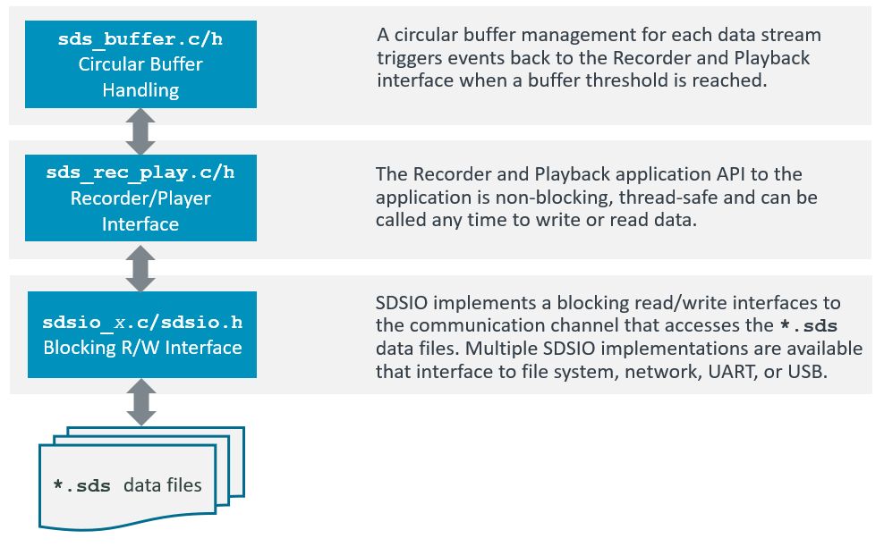

# Theory of Operation

<!-- markdownlint-disable MD013 -->
<!-- markdownlint-disable MD036 -->

The core of the SDS-Framework is a circular buffer handling that is the interface between the Recorder/Playback functions and the file I/O communication as shown in the picture below. The user application may read one data streams and write another data stream.



ToDo:

- When does sdsRecInit require an event handler?

**Example:** Recording of an accelerometer data stream

The following code snippets show the usage of the **Recorder Interface**.

```c
// *** variable definitions ***
struct {                          // sensor data stream format
  uint16_t x;
  uint16_t y;
  uint16_t z;
} accelerometer [30];             // number of samples in one data stream record

sdsRecId_t *accel_id,             // data stream id
uint8_t accel_buf[1500];          // data stream buffer for circular buffer handling
     :
// *** function calls ***
   sdsRecInit(NULL);              // init SDS Recorder  
     :
   // open data stream for recording
   accel_id = sdsRecOpen("Accel", accel_buf, sizeof(accel_buf), 2*(sizeof(accelerometer));
     :
   // write data in accelerometer buffer with timestamp from RTOS kernel.
   timestamp = osKernelGetTickCount();
   n = sdsRecWrite(accel_id, timestamp, accelerometer, sizeof(accelerometer));
   if (n != sizeof(accelerometer)) {
     ... // unexpected size returned, error handling
   }
     :
  sdsRecClose (accel_id);         // close data stream 
```

## Buffer Size

The size of the data stream buffer depends on several factors such as:

- the communication interface used as the technology may impose certain buffer sizes to maximize the transfer rate.
- the size of the data stream as it is recommended that the buffer is at least twice the size of a single data stream.
- the frequency of the algorithm execution. Fast execution speeds may require a larger buffer.

**Recommended Buffer Size:**

The table below contains recommended buffer sizes depending on the communication technology used:

ToDo

Communication  | Buffer Size | Description
:--------------|:------------|:----------------
Network        | 4096        | Default size of Ethernet record is xxxx bytes
USB Device     | xxx         | .
FileSystem     | xxx         | .

## Timestamp

The timestamp is a 32-bit unsigned value and is used for:

- Alignment of different data streams that have the same timestamp value.
- Order of the SDS data files captured during execution.
- Combining multiple SDS file records with the same timestamp value.

The same timestamp connects different SDS file records. It is therefore useful to
use the same timestamp for the recording of one iteration of a DSP or ML algorithm.
In most cases the granularity of an RTOS tick (typically 1ms) is a good choice for a timestamp value.

## SDS File Format

The SDS file format is described [here](https://github.com/ARM-software/SDS-Framework/tree/main/schema).  Each call to 
`sdsRecWrite` creates one record.

## SDSIO Server Protocol

The SDSIO Server uses a simple protocol for data exchange between a Host computer and the embedded target that integrates an [SDSIO Interface](sds_interface.md).  The protocol assumes that the correct communication to the server is already ensured by the underlying technology (TCP/IP or USB) and therefore no extra check is implemented.

The following conventions describe the command semantic used in the following documentation"

Symbol     | Description
:----------|:----------------------
\>         | Prefix indicating the direction: Command from target to Host.
<          | Prefix indicating the direction: Response from Host to target.
WORD       | 32-bit value (low byte first).
****       | The field above has exactly one occurrence.
++++       | The field above has a variable length.

**Commands:**

Commands are send from the embedded target to the Host computer that is running the SDSIO Server.

ID  | Name               | Description
:--:|:-------------------|:------------------------
1   | SDSIO_CMD_OPEN     | Open a SDS data file
2   | SDSIO_CMD_CLOSE    | Close a SDS data file
3   | SDSIO_CMD_WRITE    | Write to SDS data file
4   | SDSIO_CMD_READ     | Read from SDS data file
5   | SDSIO_CMD_EOS      | End of Stream

Each Command starts with a Header (4 Words) and optional data with variable length. Depending on the Command, the SDSIO Server replies with a Response that repeats the Header and delivers additional data.

**SDSIO_CMD_OPEN**

The Command ID=1 **SDSIO_CMD_OPEN** opens an SDS data file on the Host computer.

SDS data filenames use the following file format: `<name>.<file-index>.sds`. `Name` is the base file name of the SDS data file. `Len of Name` is the size of the string in bytes. `<file-index>` is a sequential number starting from `0`.

`Mode` defines `read` (value=0) or `write` (value=1) operation. For `write`, the server inserts the next available `<file-index>` number that does not exist yet (if `Name.3.sds` exists, the server creates `Name.4.sds`). For `read` the server maintains a list of `Names` that where previously used. When a Name was not used before it opens `<file-index>=0`, i.e. `Name.0.sds`.

```txt
| WORD | WORD **| WORD | WORD *******|++++++|
>  1   |   0    | Mode | Len of Name | Name |
|******|********|******|*************|++++++|
```

The Response ID=1 **SDSIO_CMD_OPEN** provides a `Handle` that is used to identify the file in subsequent commands.

```txt
| WORD | WORD **| WORD | WORD *******|
<  1   | Handle | Mode | 0           |
|******|********|******|*************|
```

**SDSIO_CMD_CLOSE**

The Command ID=2 **SDSIO_CMD_CLOSE** closes an SDS data file on the Host computer. The `Handle` is the identifier obtained with **SDSIO_CMD_OPEN**. There is no Response from the SDSIO Server on this command.

```txt
| WORD |  WORD  | WORD | WORD |
>  2   | Handle |  0   |  0   |
|******|********|******|******|
```

**SDSIO_CMD_WRITE**

The Command ID=3 **SDSIO_CMD_WRITE** writes data to an SDS data file on the Host computer. The `Handle` is the identifier obtained with **SDSIO_CMD_OPEN**. `Size` is the `Data` size in bytes.  There is no Response from the SDSIO Server on this command.

```txt
| WORD |  WORD  | WORD | WORD |++++++|
>  3   | Handle |  0   | Size | Data |
|******|********|******|******|++++++|
```

**SDSIO_CMD_READ**

The Command ID=4 **SDSIO_CMD_READ** reads data from an SDS data file on the Host computer. The `Handle` is the identifier obtained with **SDSIO_CMD_OPEN**. `Size` are the number of bytes that should be read.

```txt
| WORD |  WORD  | WORD | WORD |
>  4   | Handle | Size |   0  |
|******|********|******|******|
```

The Response ID=4 **SDSIO_CMD_READ** provides the data read from an SDS data file on the HOST computer.
`Size` is the `Data` size in bytes that is read.

```txt
| WORD |  WORD  | WORD | WORD |++++++|
<  4   | Handle |  0   | Size | Data |
|******|********|******|******|++++++|
```

**SDSIO_CMD_EOS**

The Command ID=5 **SDSIO_CMD_EOS** checks if the end of file is reached. The `Handle` is the identifier obtained with **SDSIO_CMD_OPEN**.

```txt
| WORD |  WORD  | WORD | WORD |
>  5   | Handle |  0   |   0  |
|******|********|******|******|
```

The Response ID=5 **SDSIO_CMD_EOS** returs the `Status` with nonzero = end of stream, else 0

```txt
| WORD |  WORD  | WORD   | WORD |
<  5   | Handle | Status |   0  |
|******|********|********|******|
```

ToDo: I don't understand why this command is needed as **SDSIO_CMD_READ** returns indirectly this status already.  Also the `nonzero` above needs work.

## SDSIO Message Sequence

This is the message sequence of the SDS DataTest example when connected to MDK-Middleware Ethernet.
It contains the following threads that executes on the target.

- Management: Overall execution management
- Algorithm: Algorithm under test
- Recorder: SDS Recorder thread (sdsRecThread)
- Playback: SDS Playback thread (sdsPlayThread)

The Server is the SDSIO Server executing on the target system.


ToDo:

- create similar diagram for Playback
- should Playback and Record use the same Thread?
- How is the buffer filled on PlayOpen?
- document control blocks in sds.c, sds_rec.c, and sds_play.c (comments might be sufficient)

How does Threshold work?

- when Threshold is reach, the write operation writes the whole buffer.  The transport layer (TCP/IP) may need to split this into multiple packs. Should size be optimized for transport layer?
- This writes all buffers https://github.com/ARM-software/SDS-Framework/blob/main/sds/source/sds_rec.c#L157 until empty. When Recorder is same priority as Algorithm, Algorithm might not be executed for quite a while.

sds.c generates detailed events (are they documented?)
but sds_rec.c does not really use this information

- Threshold event is only set when complete write was possible, is this correct? https://github.com/ARM-software/SDS-Framework/blob/main/sds/source/sds_rec.c#L298 

https://github.com/Arm-Examples/SDS-Examples/blob/main/Hardware/DataTest/rec_management.c
- do we really need `recdone`?
