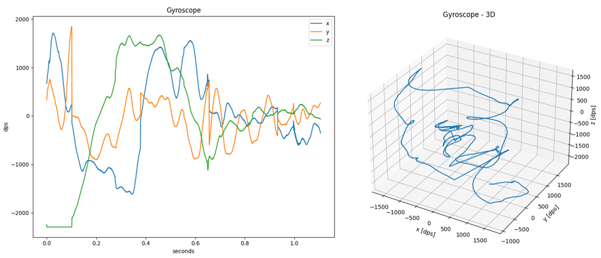

# Utilities

<!-- markdownlint-disable MD013 -->
<!-- markdownlint-disable MD036 -->
<!-- markdownlint-disable MD024 -->

The SDS-Framework includes the following utilities that are implemented in Python.

- [**SDSIO-Server:**](#sdsio-server) enables recording and playback of SDS data files via socket (TCP/IP), USB (Bulk transfer) or serial (UART) connection.
- [**SDS-View:**](#sds-view) graphical data viewer for SDS data files.
- [**SDS-Convert:**](#sds-convert) convert SDS data files into CSV, Qeexo V2 CSV, or WAV format.
- [**SDS-Check:**](#sds-check) check SDS data files for correctness and consistency.

## Requirements

- **Python 3.9** or later with packages:
  - ifaddr
  - matplotlib
  - numpy
  - opencv-python
  - pandas
  - pyyaml
  - pyserial
  - libusb1

## Setup

!!! Note
    - These utilities are located in the SDS-Framework pack installation folder, subfolder `/utilities`. Replace `2.0.0` with the version number of your SDS pack installation.

Perform the following steps to setup the Python environment for using the SDS utilities.

- [Install Python](https://www.python.org/downloads/) or verify the version with:

```bash
>python --version
```

- Navigate in the folder SDS/utilities and install the required Python packages with `pip`:

```bash
>cd %CMSIS_PACK_ROOT%/ARM/SDS/2.0.0/utilities
>pip install -r requirements.txt
```

- Add to the system **Path** environment variable the path to the `%CMSIS_PACK_ROOT%/ARM/SDS/2.0.0/utilities` folder.

!!! Notes
    - `%CMSIS_PACK_ROOT%` is just a placeholder for the Pack location on your local PC. The **Path** variable must be extended by the absolute path to the `utilities` folder.
    - Do not set the variable `PYTHONPATH` as this may conflict with the Python scripts that are used in AVH FVP models. AVH FVP use Python version 3.9 which may create a conflict.

### Windows

- On Windows, ensure that the  environment variable **PATHEXT** contains the extension `.PY`.

!!! Tip
    - When the **Path** environment variable is configured, you may simply start the utilities by using its name. For example entering `>sdsio-server` starts the utility.

## SDSIO-Server

The Python utility [**SDSIO-Server**](https://github.com/ARM-software/SDS-Framework/tree/main/utilities) enables recording and playback of SDS data files via socket (TCP/IP), USB (Bulk transfer), or serial (UART) connection.
It communicates with the target using these [SDSIO Client interfaces](https://github.com/ARM-software/SDS-Framework/tree/main/sds/source/sdsio/client):

- [serial/usart](https://github.com/ARM-software/SDS-Framework/tree/main/sds/source/sdsio/client/serial/usart) for serial communication via CMSIS-Driver USART.
- [socket](https://github.com/ARM-software/SDS-Framework/tree/main/sds/source/sdsio/client/socket) for TCP/IP communication via IoT Socket using MDK-Middleware, LwIP, or CMSIS-Driver WiFi.
- [usb/bulk](https://github.com/ARM-software/SDS-Framework/tree/main/sds/source/sdsio/client/usb/mdk) for communication via USB Bulk transfer using MDK-Middleware.

The SDS data stream is recorded to files with the following naming convention:

`<name>.<index>.sds`

- `<name>` is the name of the I/O stream specified with the function `sdsRecOpen` or `sdsPlayOpen` on the target.
- `<index>` is the zero-based index which is incremented for each subsequent recording.
- For more details see [Filenames section](theory.md#filenames)

The data content of the `<name>.<index>.sds` is described with metadata file `<name>.sds.yml` in [YAML format](https://github.com/ARM-software/SDS-Framework/tree/main/schema).

### Usage

- [Setup](#setup) the Python environment.
- Depending on the SDS interface used on the target use either [Serial Mode](#serial-mode), [Socket Mode](#socket-mode) or [USB Mode](#usb-mode) as described below.
- The SDSIO_Server terminates with `Ctrl+C`.

#### Serial Mode

```txt
usage: sdsio-server.py serial [-h]  
                              -p <Serial Port>  
                              [--baudrate <Baudrate>]  
                              [--parity <Parity>]  
                              [--stopbits <Stop bits>]  
                              [--connect-timeout <Timeout>]  
                              [--workdir <Work dir>]

optional arguments:
  -h, --help                   show this help message and exit

required:
  -p <Serial Port>             Serial port

optional:
  --baudrate <Baudrate>        Baudrate (default: 115200)
  --parity <Parity>            Parity: N=None, E=Even, O=Odd, M=Mark, S=Space (default: N)
  --stopbits <Stop bits>       Stop bits: 1, 1.5, 2 (default: 1)
  --connect-timeout <Timeout>  Serial port connection timeout in seconds (default: no timeout)
  --workdir <Work dir>         Directory for SDS files (default: current directory)
```

**Example:**

```bash
python sdsio-server.py serial -p COM0 --baudrate 115200 --workdir ./work_dir
```

#### Socket Mode

```txt
usage: sdsio-server.py socket [-h]  
                              [--ipaddr <IP> | --interface <Interface>]  
                              [--port <TCP Port>]  
                              [--workdir <Work dir>]

optional arguments:
  -h, --help               show this help message and exit

optional:
  --ipaddr <IP>            Server IP address (cannot be used with --interface)
  --interface <Interface>  Network interface (cannot be used with --ipaddr)
  --port <TCP Port>        TCP port (default: 5050)
  --workdir <Work dir>     Directory for SDS files (default: current directory)
```

!!! Note
    - The `--ipaddr` and `--interface` options are mutually exclusive.
    - SDSIO Server only supports IPv4 addresses.

**Example:**

For Microsoft Windows (using default computer IP):

```bash
python sdsio-server.py socket --workdir ./work_dir
```

For Linux:

```bash
python sdsio-server.py socket --interface eth0 --workdir ./work_dir
```

#### USB Mode

```txt
usage: sdsio-server.py usb [-h]  
                           [--workdir <Work dir>]  
                           [--high-priority]

optional arguments:
  -h, --help            show this help message and exit

optional:
  --workdir <Work dir>  Directory for SDS files (default: current directory)
  --high-priority       Enable high-priority threading for USB server (default: off)
```

!!! Note
    - For more reliable operation at higher data transfer rates, it is recommended to enable the `--high-priority` option. This increases the thread priority of the SDSIO-Server process.
    - When using `--high-priority`, elevated privileges are required depending on your operating system:
        - **Windows**: Run the Python script as an administrator.
        - **macOS/Linux**: Execute the script with `sudo` or ensure the user has sufficient permissions.

**Example:**

```bash
python sdsio-server.py usb --workdir ./work_dir
```

## SDS-View

The Python utility [**SDS-View**](https://github.com/ARM-software/SDS-Framework/tree/main/utilities) outputs a time-based plot of SDS data files (`<name>.<index>.sds`) based on the meta-data file (`<name>.sds.yml`).

The horizontal time scale is derived from the number of data points in a recording and frequency provided in the metadata description. All plots form a single recording will be displayed on the same figure (shared vertical scale).

If there are 3 values described in the metadata file, an optional 3D view may be displayed.  

### Limitations

- Data in recording must all be of the same type (float, uint32_t, uint16_t, ...)

### Usage

- [Setup](#setup) the Python environment.
- Invoke the tool as explained below.

```txt
usage: sds-view.py [-h]  
                   -y <yaml_file>  
                   -s <sds_file> [<sds_file> ...]  
                   [--3D]

View SDS data

options:
  -h, --help                      show this help message and exit

required:
  -y <yaml_file>                  YAML sensor description file
  -s <sds_file> [<sds_file> ...]  SDS data recording file

optional:
  --3D                            Plot 3D view in addition to normal 2D
```

**Example:**

```bash
python sds-view.py -y test/Gyroscope.sds.yml -s test/Gyroscope.0.sds
```

**Example display:**



## SDS-Convert

The Python utility [**SDS-Convert**](https://github.com/ARM-software/SDS-Framework/tree/main/utilities) converts SDS data files to selected format based on description in metadata (YAML) files.  

### Usage

- [Setup](#setup) the Python environment.
- Depending on the required format use the tool as shown below.

#### Audio WAV

The `audio_wav` mode converts raw microphone data from `.sds` files into a standard RIFF/WAV file using linear
PCM encoding. The conversion process involves appending a WAV header, generated from parameters specified in the
associated metadata `.yml` file, to the raw audio data extracted from the `.sds` stream. The metadata defines
essential audio parameters such as channel configuration (mono or stereo), sample rate (frame rate), and sample
width (bit depth).

```txt
usage: sds-convert.py audio_wav [-h]  
                                -i <input_file>  
                                -o <output_file>  
                                -y <yaml_file>

Convert SDS files to audio WAV format

options:
  -h, --help        show this help message and exit

required:
  -i <input_file>   Input file
  -o <output_file>  Output file
  -y <yaml_file>    YAML metadata file
```

!!! Note
    - The tool expects the SDS stream to be strictly audio - no header markers or custom formatting.

**Example of metadata yml file for mono microphone:**

```yml
sds:
  name: Microphone
  description: Mono microphone with 16kHz sample rate
  frequency: 16000
  content:
  - value: Mono
    type: int16_t
```

**Example of metadata yml file for stereo microphone:**

```yml
sds:
  name: Microphone
  description: Stereo microphone with 16kHz sample rate
  frequency: 16000
  content:
  - value: Left channel
    type: int16_t
  - value: Right channel
    type: int16_t
```

**Example:**

```bash
python sds-convert.py audio_wav -i Microphone.0.sds -o microphone.wav -y Microphone.sds.yml
```

#### Simple CSV

The `simple_csv` mode converts sensor data from `.sds` files into a human-readable CSV format.
This mode is designed for exporting data from a single sensor. If the sensor has multiple
channels, each channel will appear as a separate column in the output CSV.

Timestamps are represented in floating-point format, in seconds. Using the `--normalize` flag causes
all timestamps in the input file to be offset so that the first timestamp is `0`.

Users may specify a time range selection of the input data to be processed using the following flags:

- `--start-timestamp <timestamp>`: Starting input data timestamp in floating-point format, in seconds.
- `--stop-timestamp <timestamp>`: Stopping input data timestamp in floating-point format, in seconds.

```txt
usage: sds-convert.py simple_csv [-h]  
                                 -i <input_file>  
                                 -o <output_file>  
                                 -y <yaml_file>  
                                 [--normalize]  
                                 [--start-timestamp <timestamp>]  
                                 [--stop-timestamp <timestamp>]

Convert SDS files to CSV format with timestamps and data columns

options:
  -h, --help                     show this help message and exit

required:
  -i <input_file>                Input file
  -o <output_file>               Output file
  -y <yaml_file>                 YAML metadata file

optional:
  --normalize                    Normalize timestamps so they start with 0
  --start-timestamp <timestamp>  Starting input data timestamp, in seconds (default: None)
  --stop-timestamp <timestamp>   Stopping input data timestamp, in seconds (default: None)
```

!!! Note
    - Current implementation assumes that the tick frequency is `1000 Hz` and does not use the `tick-frequency` value from the metadata file.

**Example of metadata yml file for gyroscope:**

```yml
sds:
  name: Gyroscope
  description: Gyroscope with 1667Hz sample rate
  frequency: 1667
  content:
  - value: x
    type: int16_t
    scale: 0.07
    unit: dps
  - value: y
    type: int16_t
    scale: 0.07
    unit: dps
  - value: z
    type: int16_t
    scale: 0.07
    unit: dps
```

**Example:**

```bash
python sds-convert.py simple_csv -i Gyroscope.0.sds -o gyroscope_simple.csv -y Gyroscope.sds.yml --normalize --start-tick 0.2 --stop-tick 0.3
```

#### Qeexo V2 CSV

The `qeexo_v2_csv` mode converts sensor data from .sds files into a Qeexo V2 CSV format.

Link to [Qeexo V2 CSV format specification](https://docs.qeexo.com/guides/userguides/data-management#2-1-Data-format-specification).

Timestamps are represented in integer format, in milliseconds. Using the `--normalize` flag causes
all timestamps in the input file to be offset so that the first timestamp is `0`.

Users may specify a time range selection of the input data to be processed using the following flags:

- `--start-timestamp <timestamp>`: Starting input data timestamp in integer format, in milliseconds.
- `--stop-timestamp <timestamp>`: Stopping input data timestamp in integer format, in milliseconds.

By default, the output file will have raw timestamps in integer format, in milliseconds.
The default output timestamp interval is set to `50 ms`.
To override this setting use the `--interval <ms>` flag, where `<ms>` is the desired interval in milliseconds.

An optional label can be added to the output by providing a string argument to the `--label <text>` flag.
This `<text>` will populate the label column in the output file.

```txt
usage: sds-convert.py qeexo_v2_csv [-h] -i <input_file> [<input_file> ...]  
                                   -o <output_file>  
                                   [-y <yaml_file> [<yaml_file> ...]]  
                                   [--normalize]  
                                   [--start-timestamp <timestamp>]  
                                   [--stop-timestamp <timestamp>]  
                                   [--label 'label']  
                                   [--interval <interval>]  
                                   [--sds_index <sds_index>]

Convert SDS files to Qeexo AutoML V2 CSV format (supports multiple sensors)

options:
  -h, --help                          show this help message and exit

required:
  -i <input_file> [<input_file> ...]  Input file
  -o <output_file>                    Output file

optional:
  -y <yaml_file> [<yaml_file> ...]    YAML metadata file
  --normalize                         Normalize timestamps so they start with 0
  --start-timestamp <timestamp>       Starting input data timestamp, in ms (default: None)
  --stop-timestamp <timestamp>        Stopping input data timestamp, in ms (default: None)
  --label 'label'                     Qeexo class label for sensor data (default: None)
  --interval <interval>               Qeexo timestamp interval, in ms (default: 50)
  --sds_index <sds_index>             SDS file index to write (default: <sensor>.0.sds)
```

!!! Note
    - The metadata and SDS data file pairs must be passed as arguments in the same order to decode the data correctly.
    - Current implementation assumes that the tick frequency is `1000 Hz` and does not use the `tick-frequency` value from the metadata file.

**Example of metadata yml file for accelerometer:**

```yml
sds:
  name: Accelerometer
  description: Accelerometer with 1667Hz sample rate
  frequency: 1667
  content:
  - value: x
    type: int16_t
    scale: 0.000061
    unit: G
  - value: y
    type: int16_t
    scale: 0.000061
    unit: G
  - value: z
    type: int16_t
    scale: 0.000061
    unit: G
```

**Examples:**

Convert **SDS data** files to **Qeexo V2 CSV** files:

```bash
python sds-convert.py qeexo_v2_csv -i Gyroscope.0.sds Accelerometer.0.sds -o sensor_fusion.csv -y Gyroscope.sds.yaml Accelerometer.sds.yaml --normalize --start-tick 200 --stop-tick 300
```

Convert **Qeexo V2 CSV** files to **SDS data** files:

```bash
python sds-convert.py qeexo_v2_csv -i accelerometer_data.csv -o accelerometer.sds
```

#### Video

The `video` mode converts the stream of video frames from the `.sds` file into a standard MP4 (H.264)
video file. Video frame format shall be specified in the `.yml` metadata file, where pixel format,
resolution and frame stride shall be properly specified.

```txt
usage: sds-convert.py video [-h]
                            -i <input_file>
                            -o <output_file>
                            -y <yaml_file>

Convert SDS video recordings to MP4 format (requires video metadata)

options:
  -h, --help        show this help message and exit

required:
  -i <input_file>   Input file
  -o <output_file>  Output file
  -y <yaml_file>    YAML metadata file
```

!!! Note
    - The tool expects the SDS stream to be strictly video frames - no header markers or custom formatting.

**Example of metadata yml file for RGB888 video stream:**

```yml
sds:
  name: Video Stream - RGB888
  description: 192 x 192 RGB888 video frames
  frequency: 30
  content:
    - value: Frame
      type: uint8_t
      image:
        pixel_format: RGB888
        width: 192
        height: 192
        stride_bytes: 576   # 3 bytes per pixel
```

**Example:**

```bash
python sds-convert.py video -i Camera.0.sds -o Camera.0.mp4 -y Camera.sds.yml
```

## SDS-Check

The Python utility [**SDS-Check**](https://github.com/ARM-software/SDS-Framework/tree/main/utilities) checks SDS data files for correctness and consistency.  

The following checks are performed:

- [Size consistency check](#size-consistency-check): The data size of all records should match the size of the SDS file.
- [Timestamp consistency check](#timestamp-consistency-check): Verifies that the timestamps of the records are in ascending order.
- [Jitter check](#jitter-check): Prints the record with the largest deviation from the average timestamp interval.
- [Delta time check](#delta-time-check): Finds the record with the largest timestamp difference from the following record.
- [Duplicate timestamp check](#duplicate-timestamp-check): Finds records with identical timestamps.

### Usage

- [Setup](#setup) the Python environment.
- Invoke the tool as explained below.

```txt
usage: sds-check.py [-h] -s <sds_file> [-t <tick_rate>]

SDS data validation

options:
  -h, --help      show this help message and exit

required:
  -s <sds_file>   SDS data recording file

optional:
  -t <tick_rate>  Timestamp tick rate in Hz (default: 1000 for 1 ms tick interval)
```

**Example:**

```txt
python sds-check.py -s Accelerometer.0.sds
File Name         : Accelerometer.0.sds
File Size         : 156.020 bytes
Number of Records : 289
Recording Time    : 14 s
Recording Interval: 50 ms
Data Size         : 153.748 bytes
Largest Block     : 552 bytes
Smallest Block    : 462 bytes
Average Block     : 532 bytes
Data Rate         : 10.640 byte/s
Jitter            : Not detected
Validation passed
```

!!! Note
    The default tick frequency is 1000 Hz.

### Summary Report

After processing the SDS data file, the SDS-Check utility prints a summary report with statistics:

- **File Name**         : Name of the SDS data file
- **File Size**         : Size of the file in bytes
- **Number of Records** : Total number of records
- **Recording Time**    : Duration of the recording in seconds or milliseconds
- **Recording Interval**: Time interval of the recording in milliseconds
- **Data Size**         : Size of the data w/o record headers in bytes
- **Largest Block**     : Largest block size, if different from the average block size
- **Smallest Block**    : Smallest block size, if different from the average block size
- **Average Block**     : Average block size of a data record
- **Data Rate**         : Recorded data rate in bytes per second
- **Max Jitter**        : Maximum deviation from the expected timestamps, if detected (optional)
- **Max Delta Time**    : Largest difference of the neighboring timestamps, if deviating from the recording interval (optional)
- **Duplicate Tstamps** : Number of duplicated timestamps, if found

### Size consistency check

This check processes the SDS data records and calculates the total size of the SDS data.
It is the sum of all data records (header + data). This data size should match the size of
the SDS file.

If the sizes do not match this error is printed:

```txt
Error: File size mismatch. Expected 360 bytes, but file contains 363 bytes.
```

### Timestamp consistency check

This check processes the SDS records and ensures that the timestamps recorded in the records
are arranged in ascending order. If the utility detects that the timestamp of the subsequent
data record is lower than the current one, this error is printed:

```txt
Error: Timestamp not in ascending order in record 23.
```

### Jitter check

This check processes the SDS data records and searches for the maximum deviation of the recorded
timestamps from the expected ones. If a deviation is found, the maximum deviation is 
evaluated as **jitter** and, together with the record number, is printed in the summary report.

```txt
File Name         : Gyroscope.0.sds
File Size         : 153.334 bytes
Number of Records : 284
Recording Time    : 14 s
Recording Interval: 50 ms
Data Size         : 151.088 bytes
Largest Block     : 606 bytes
Smallest Block    : 444 bytes
Average Block     : 532 bytes
Data Rate         : 10.640 byte/s
Jitter            : Not detected
Validation passed
```

### Delta time check

This check processes the SDS records and finds the largest difference in timestamps
between two neighboring records, called **Max Delta Time**.

For normally recorded files, the delta time and the recording interval are identical, so no information
about the delta time status is printed. If the delta time and the recording interval are not identical,
that is, a difference is detected, the **Max Delta Time** together with the record number is printed
in the summary report.

```txt
File Name         : Temperature.0.sds
File Size         : 360 bytes
Number of Records : 30
Recording Time    : 30 s
Recording Interval: 1.024 ms
Data Size         : 120 bytes
Data Block        : 4 bytes
Data Rate         : 4 byte/s
Max Jitter        : 59 ms, in record 19
Max Delta Time    : 1.050 ms, in record 2
Validation passed
```

This is not an error, but a report of an anomaly. If the time delta is significantly larger than the
sampling interval, for example many times longer, this may indicate that one or more data records are
missing from the recorded file.

### Duplicate timestamp check

This check processes the SDS records to identify duplicated timestamps. This means that the same timestamp
is used in several consecutive data records.

This may indicate that the recording loop in an embedded application is not set up correctly. It is also
possible that duplicate timestamps are caused by unexpected thread delays in the embedded application.

Duplicate timestamps are unusual in typical recording files. If multiple timestamps with the same value
are found in the SDS file, **Duplicate Tstamps** will be added to the summary report.

```txt
File Name         : DataInput.0.sds
File Size         : 164.075.008 bytes
Number of Records : 445.856
Recording Time    : 446 s
Recording Interval: 1 ms
Data Size         : 160.508.160 bytes
Data Block        : 360 bytes
Data Rate         : 360.000 byte/s
Max Jitter        : 26 ms, in record 273.884
Max Delta Time    : 35 ms, in record 277.863
Duplicate Tstamps : 4, found at record 1
Validation passed
```

This is not an error, but a report of an anomaly. The report contains the number of records with
the same timestamp and the position in the SDS file where the anomaly was detected (record number).

!!! Note
    Only the first occurrence of a duplicate timestamp is reported.
