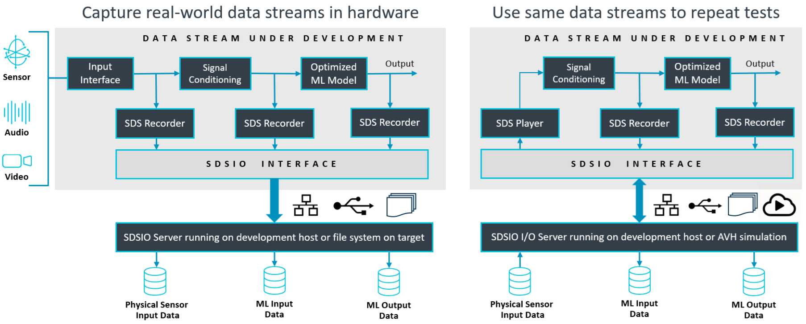
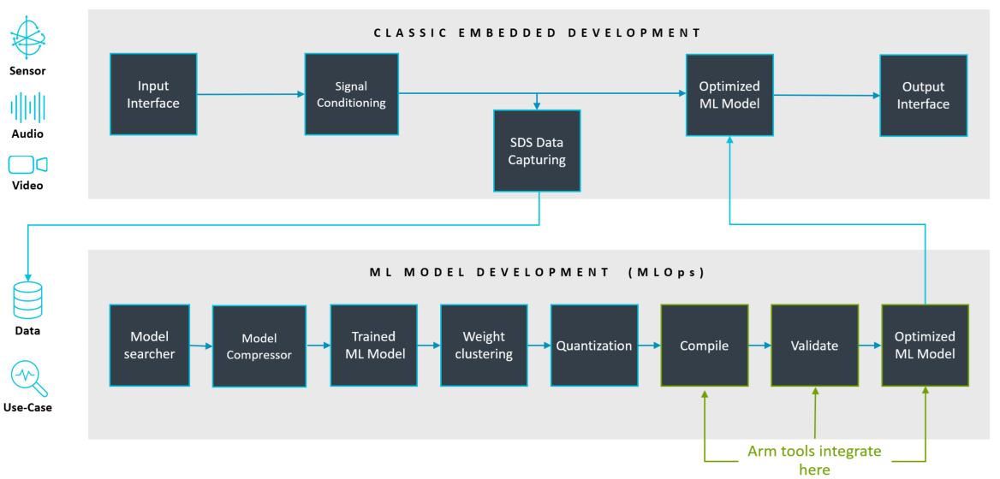

# Overview

The **Synchronous Data Stream (SDS) Framework** streamlines the development of DSP algorithms, ML models, and Edge AI applications that process periodic data streams, typically fixed-size data blocks captured at regular time intervals. SDS also supports variable-sized data blocks and irregular timing required for applications with sensor fusion. These data streams are stored in [SDS data files](https://arm-software.github.io/SDS-Framework/main/theory.html#sds-data-files).

By deploying the [SDS template application](https://arm-software.github.io/SDS-Framework/main/template.html) to hardware (e.g., evaluation boards or custom products), you can record and playback multiple data streams during application development. This enables real-time capture of sensor, audio, and video inputs, alongside algorithm outputs, directly on target hardware. Ready-to-use SDSIO implementations use the MDK-Middleware for SDS data file storage on a development host computer or on a memory card in the embedded target.

The [SDS template application](https://arm-software.github.io/SDS-Framework/main/template.html) supports two deployment targets: physical hardware or simulation via [Arm Virtual Hardware - FVP](https://github.com/ARM-software/AVH). Simulation enables cost-effective, automated regression testing on desktops or in cloud-based CI/MLOps pipelines.

Captured data streams simplify many stages of development:

- Validate input data streams or algorithm output data streams.
- Feed data streams to DSP tools (e.g., filter design) or MLOps systems (for training).
- Provide reproducible inputs for simulations via [Arm Virtual Hardware](https://github.com/Arm-software/AVH) , including CI environments.

With MLOps integration, SDS enables efficient dataset handling for classification, training, and performance tuning of ML/AI models.

## Features

- Flexible data stream handling for sensor, audio, and video interfaces.
- Multi-interface stream support with time drift compensation (e.g., for sensor fusion).
- Record real-world target data for analysis and development.
- Replay data on hardware or [AVH-FVP simulation](https://github.com/arm-software/avh) for algorithm validation.

The content of SDS data files may be described with a [YAML metadata file](https://arm-software.github.io/SDS-Framework/main/theory.html#yaml-metadata-format) for use cases such as:

- Input for DSP tools (e.g., filter designers).
- Input for ML training, testing, and optimization.
- Offline validation of DSP/ML models.

[Python-based utilities](https://arm-software.github.io/SDS-Framework/main/utilities.html) are provided for recording, playback, visualization, data conversion, and verification of the SDSIO communication.

## Links

- [Documentation](https://arm-software.github.io/SDS-Framework/main/index.html)
- [Examples](https://github.com/Arm-Examples/SDS-Examples)
- [Repository](https://github.com/ARM-software/SDS-Framework)
- [Issues](https://github.com/ARM-software/SDS-Framework/issues)
