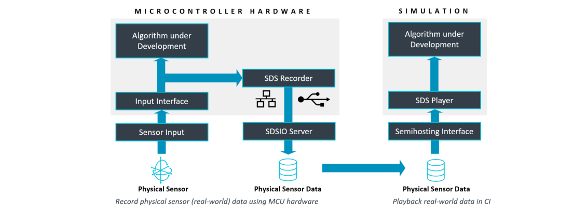

# Introduction

The Synchronous Data Stream (SDS) Framework manages data streams and provides tools for developing and optimizing embedded applications using DSP, ML, or Edge AI algorithms. It enables real-time capture of multiple data streams—such as sensor, audio, and video inputs—alongside algorithm outputs directly on target hardware. Using the [MDK-Middleware](https://www.keil.arm.com/packs/mdk-middleware-keil), these streams may be stored in files on a host computer or on memory cards in the embedded system.

The captured data streams are useful in various steps of the development cycle, for example to:

- Validate physical input signals from sensors or output of algorithms.
- Provide input data to Digital Signal Processing (DSP) development tools (such as filter designers) or MLOps systems (for AI model training).
- Provide input data for simulation using [Arm Virtual Hardware (AVH-FVP)](https://github.com/Arm-software/AVH) models for testing and validation, for example in CI systems.

With integration into MLOps systems, the SDS Framework can be used to provide input data to ML/AI development systems for model classification, training, and performance optimization.

## Links

- [Documentation](https://arm-software.github.io/SDS-Framework/main/index.html)
- [Examples](https://github.com/Arm-Examples/SDS-Examples)
- [Repository](https://github.com/ARM-software/SDS-Framework)
- [Issues](https://github.com/ARM-software/SDS-Framework/issues)
